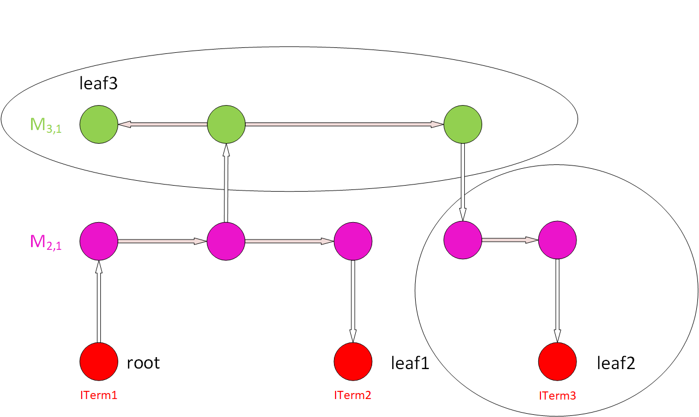

# Antenna Rule Checker

This tool checks antenna violations and generates a report to indicate
violated nets. See LEF/DEF 5.8 Language Reference, Appendix C,
"Calculating and Fixing Process Antenna Violations" (p.389) 
for a [description](https://coriolis.lip6.fr/doc/lefdef/lefdefref/lefdefref.pdf) of antenna violations.

This is an example of the detailed and simple reports of the antenna checker:

|  |

Abbreviations Index:

-   `PAR`: Partial Area Ratio
-   `CAR`: Cumulative Area Ratio
-   `Area`: Gate Area
-   `S. Area`: Side Diffusion Area
-   `C. Area`: Cumulative Gate Area
-   `C. S. Area`: Cumulative Side (Diffusion) Area

Antenna violations can be repaired after global routing with the `repair_design` command.

## Commands

```{note}
- Parameters in square brackets `[-param param]` are optional.
- Parameters without square brackets `-param2 param2` are required.
```

### Check Antennas

The `check_antennas` command will check for antenna violations.

```tcl
check_antennas 
    [-net net] 
    [-verbose]
```

#### Options

| Switch Name | Description |
| ----- | ----- |
| `-verbose` | Report all antenna calculations for violating nets. |
| `-net` | Check antennas on the specified net. |

## Regression tests

There are a set of regression tests in `./test`. For more information, refer to this [section](../../README.md#regression-tests).

Simply run the following script:

```shell
./test/regression
```

## Limitations

## FAQs

Check out [GitHub discussion](https://github.com/The-OpenROAD-Project/OpenROAD/discussions/categories/q-a?discussions_q=category%3AQ%26A+antenna+in%3Atitle)
about this tool.

## Algorithm

|  |  |
| --- | --- |
| **Antenna Checker Algorithm**: WireGraph Example | **Step 1**: (a) Start from the root node (ITerm) using upper Via to find a node for a new wire. (b) Save the ITerm area for cumulative gate/diffusion area. |
|  |  |
| **Step 2**: From the node of the wire, find all the nodes in the wire through segment wires and find the "root" node of this wire. | **Step 3**: (a) From the "root" node of the wire, along the outgoing segment edge that goes to other nodes belonging to this wire, calculate the area of this wire. (b) Then, find all the ITerms below these nodes, except for the root node (directly use an ITerm or lower Vias to find ITerms for lower metals). (c) Sum up the areas of all the ITerms found with the cumulative areas and calculate the PAR of this wire. (d) Add the PAR value and the wire info (layer, Index) into the PAR table. Add the new area to the cumulative areas. |
|  |  |
| **Step 4**: Find all the upper Vias on this wire (for all the nodes on this wire), and go to the higher-level metal. | **Step 5**: Repeat Steps 2 and 3 for new-found upper-level wires. |
|  |  |
| **Step 6**: Repeat Steps 4 and 5 until we reach a wire that cannot have upper Vias for its nodes (highest-level metal). | **Step 7**: Pick up another ITerm as a root node and repeat Steps 1 to 6, skipping the wires already in the PAR table. Repeat this for all the ITerms to get a whole PAR table. |
|  |
| **Step 8**: (a) Pick up a gate ITerm and a node of a wire (e.g., M4,1). Find possible paths that connect them, look up the PAR value of the wires along these paths, and add them up to get the CAR of the (gate, wire) pair. (b) Compare to the AntennaRule to see if the CAR violates the rules. (c) Check this for all (gate, wire) pairs. |

## License

BSD 3-Clause License. See [LICENSE](../../LICENSE) file.
