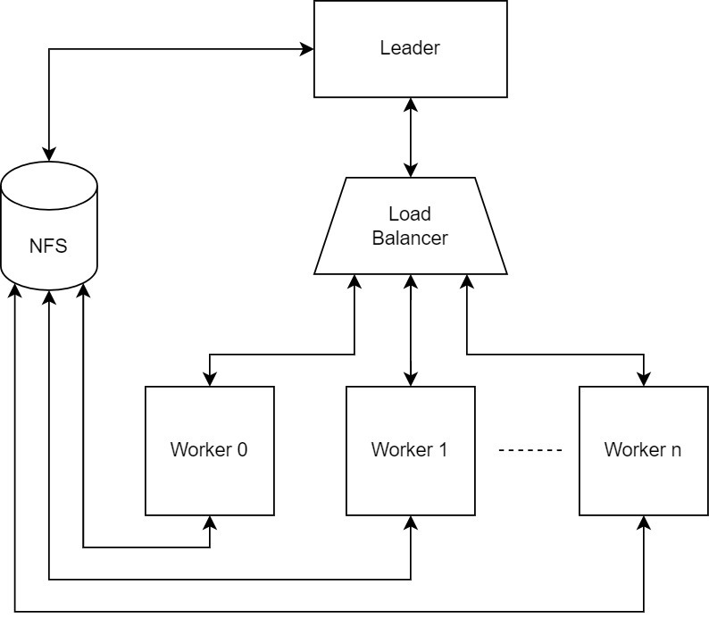
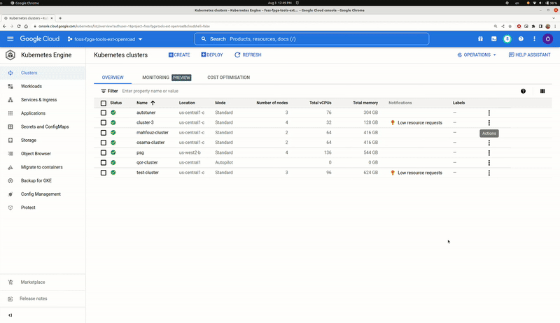

# Documentation for distributed detailed routing with Kubernetes and Google cloud.

In this tutorial, we introduce how to use distributed detailed routing with a Kubernetes cluster. We will be using a cluster running in google cloud, but the process is similar to using any Kubernetes cluster.


## General System Design





The Diagram above shows four main components to run distributed routing:

* The leader: responsible for orchestrating the detailed routing process through creating the routing jobs that the workers need to handle and aggregating the routed chunks.
* The load balancer: the leader sends the needed jobs to the load balancer which is responsible for balancing the jobs fairly among the workers and handle failed ones.
* The workers: are the components that actually do the detailed routing for the jobs assigned by the leader through the balancer.
* Network File System (NFS): has a shared directory accessible by all the other components of the system allowing them to exchange routing data.

 


## Setting up the cluster on Google Cloud


* Sign in to your Google cloud console dashboard.
* At the top left, select the navigation menu represented by the three lines icon.
* Click “Kubernetes Engine” from the menu. 
* Click the “Create” icon at the top.
* From the pop-up, select “Configure” for a GKE standard.
* Select the “Cluster basics” section from the leftside menu, then:
    * Choose the name of the cluster. 
    * Choose the location type as zonal and select the appropriate zone[^1].


* Under the “default-pool” section from the leftside menu select “Nodes”, then:
    * You can configure the type of the machine that your Kuberenets pods would be running on. It is worth noting that a pod (worker/balancer) can acquire a number of CPUs  &lt;= the number of cpus available in the machine selected at this stage. This also applies for the memory.
* This is all we need, now click “Create” at the bottom of the page.
* As the cluster is being created, we move on to setting up a shared folder on a NFS.


## Setting up a shared folder in a Network File System (NFS)

A shared folder on a NFS is used to share routing updates between the leader and the workers. There are multiple tutorials for setting up a network shared folder; the link below shows how to create such folder. Two things to consider at this step:


1. The IP of the NFS server must be kept to be used in further steps.
2. The folder will be mounted to the leader’s machine. Mounting is also explained in the tutorial.
3. The machine should be in the same zone of the cluster[^1].

[https://www.digitalocean.com/community/tutorials/how-to-set-up-an-nfs-mount-on-ubuntu-20-04](https://www.digitalocean.com/community/tutorials/how-to-set-up-an-nfs-mount-on-ubuntu-20-04)

The main steps on the NFS server machine are:

1. run ` sudo apt install nfs-kernel-server ` and ` sudo apt install nfs-common `
1. In the etc/exports file, add the following line replacing \${PATH} with the actual shared directory path you choose and the 10.128 portion with the actual subnet portion of the network you set up: ` ${PATH} 10.128.0.0/255.255.0.0(rw,no_subtree_check,no_root_squash) `
2. Run ` sudo systemctl restart nfs-kernel-server ` on the server macine.

Now your NFS server machine is ready and the shared directory can be accessed.


**N.B:** Since we are using google cloud, we set up our shared folder on a VM instance and record its internal IP to be used in later steps. 


## Configuring the cluster

In the first step, we created a cluster on Google cloud. In this step we connect to this cluster and configure it.



1. Go to your google cloud console.

2. On the top right to the left of the notification icon, click the “Activate cloud shell” icon. 

3. Right above the terminal on the right, click the “Open editor” button and wait for it to load.

3. When it is done loading use the following command to autogenerate the kubeconfig that will allow you to access your cluster using “kubectl” commands: 

       gcloud container clusters get-credentials <cluster name> --zone <cluster zone>

5. Now your cluster is connected to your Google cloud CLI.

4. The file [k8s-drt.yaml](../test/Distributed/k8s-drt.yaml) is an example configuration file. **However**, you need to replace *${SHARED_FOLDER_PATH}* and *${NFS_SERVER_IP}* with the actual values.


### Explaining configuration file:

* Every section of the configuration file is separated by “---” 
* The first section of the file is a service with the name “workers”, this service is responsible for creating the domain name for the auto discovery of the workers by the loadbalancer node. The domain name is the exact same name of the service, in this case “workers”. Furthermore, the port of the domain server is the same as the port of the service, in this case “1111”.
* The second section of the configuration creates a StatefulSet of workers. This section has many important configurations listed below:
    1. The value of “replicas” under “spec” represents the number of workers that will be created in the cluster.
    2. The value of “serviceName” under “spec” must match the value of the service name in the first section.
    3.  Under “spec” / “template” / “spec” / “containers”:
        1. “image” must have the value of openroad docker image on docker hub.
        2. Under “command”, you can find two commands, the first runs openroad. The second runs the tcl file in the shared directory. It’s necessary to change the directory to match your shared folder directory.
        3. Under “volumeMounts”, the value of “mountPath” must match the path of the shared directory.
        4. Under “env” for the “value” under the name: “MY_POD_CPU” determines the thread count that openroad will be using.
        5. Under “resources” / “requests” the value of “cpu” determines the number of cpus assigned to the worker pod. Note that this value should at least match the number provide for the thread count. Further, this value must not exceed the maximum number of cpus of the machines used for the cluster.
        6. Under “lifecycle” / “preStop” / “exec” / “command” you should change the directory of the shared folder to match yours.
    4. Under “volumes” / “nfs”:
        7. The value of “server” must match the value of the IP of the machine that has your NFS. Since we are making the tutorial for google cloud, we use the internal IP of the NFS machine. 
        8. For the value of “path”, change the directory of the shared folder to match yours.
* The third section of the configuration file creates the pod that runs the loadbalancer. The configuration of this section is very similar to what is explained for the second section; therefore, no further explanation is needed.
* The fourth section creates the service that connects the pods with the distributed routing leader. The important value in this section is “nodePort” under “spec” / “ports”. This value should be kept to be used later in the leader TCL file. 
* After editing the file, run the following command in Google cloud console terminal:

    ```
    kubectl apply -f k8s-drt.yaml
    ```

### Communicating with the cluster

For the leader to communicate with the cluster, we need to supply:

1. The value of the nodePort as discussed in the configuration file section.
2. The IP of any of the virtual machines that carries the workers. The easiest method to obtain that is to enter the following command in the Google cloud console shell:

    ```
    kubectl get pods -o wide
    ```
    The output will carry the IPs of all the up workers and the balancer. Get any of the IPs of the workers and keep it for the next step.

## Leader TCL file

An example of the leader tcl file could found at this [link](../test/Distributed/example_leader.tcl). The important parameters to change are the following in the detailed_route command:

* remote_host: the IP that you obtained in the previous section.
* remote_port: the value of the nodePort from the previous section.
* cloud_size: the number of workers as been determined in the yaml script.
* shared_volume: the mount path of the nfs shared folder in the leader machine.

**N.B:** It is important to make sure that the leader is the last node in the system to run. You can check that the Kubernetes nodes are all running using the following command in the Google cloud terminal:

```
kubectl get pods
```

The output will contain all the pods with their status. Make sure that they are all running.


## Notes

<!-- . -->

[^1]: It is important to note that in this tutorial, we make the router leader, the shared NFS folder, and the cluster all use the same zone on google cloud.
