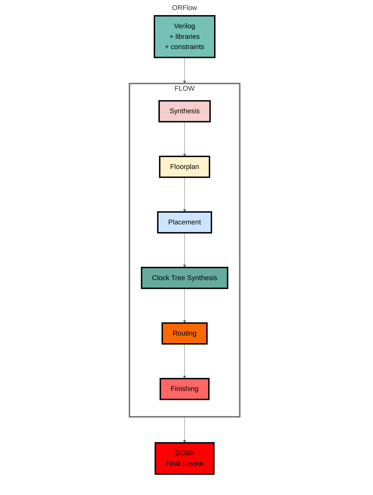
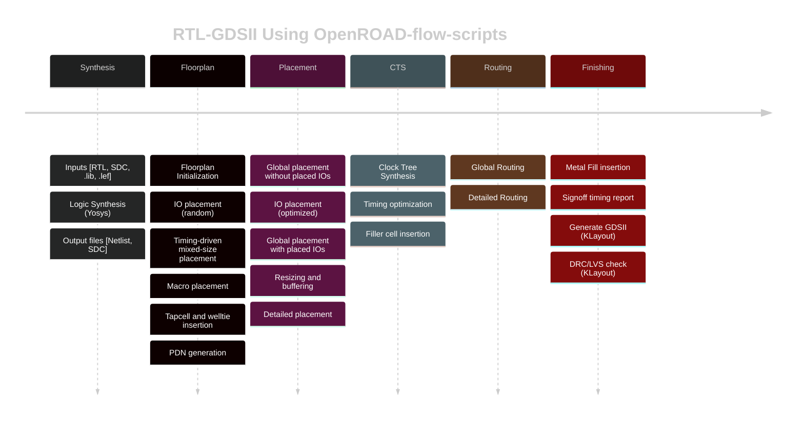
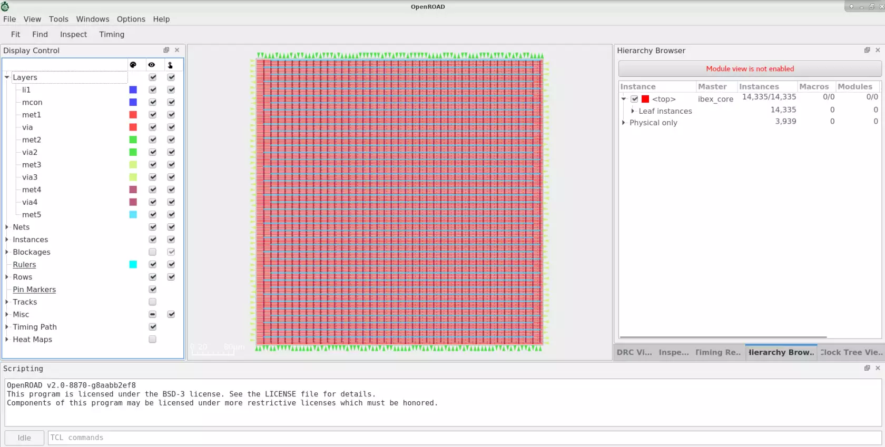
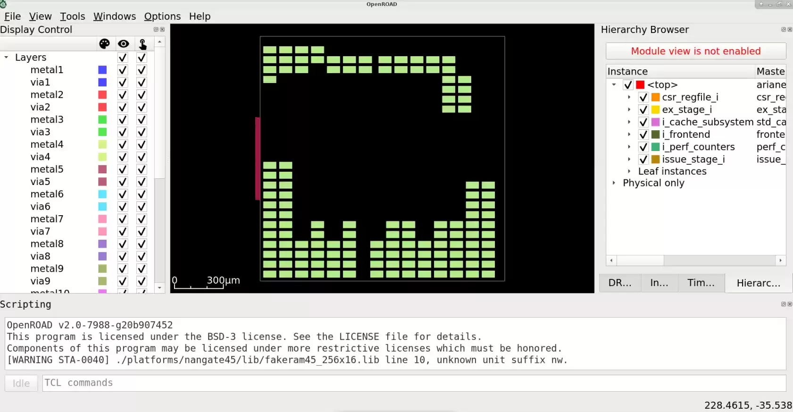
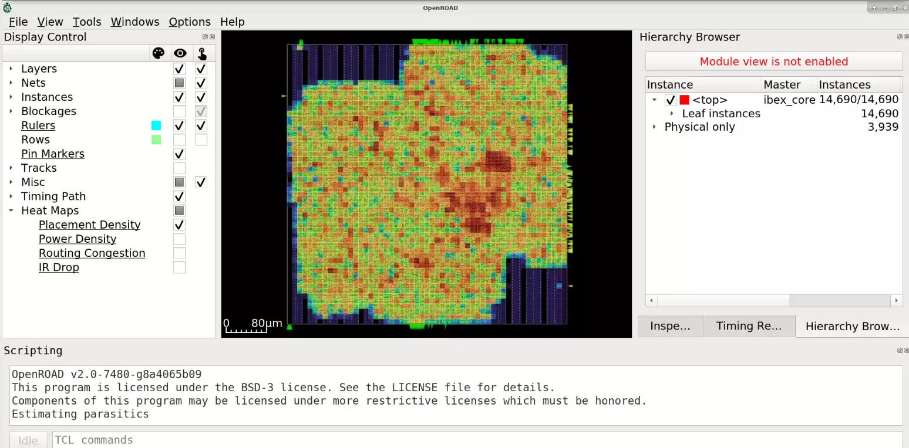
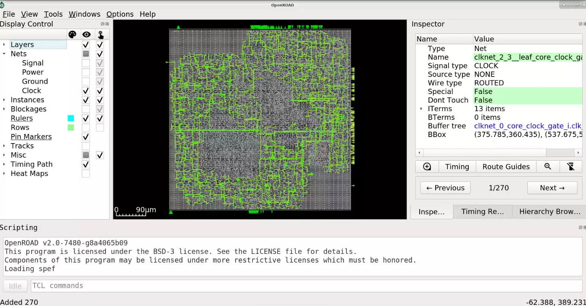
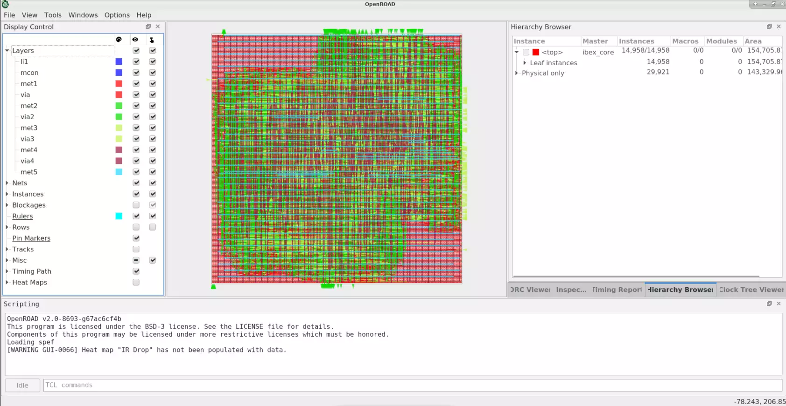
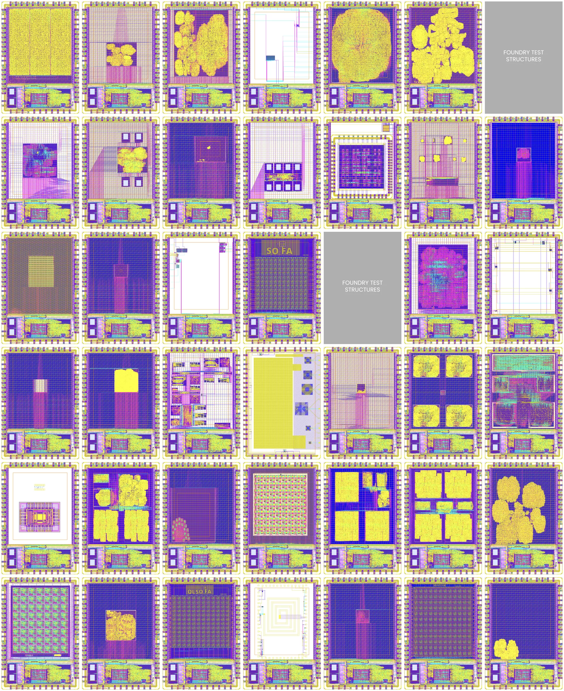
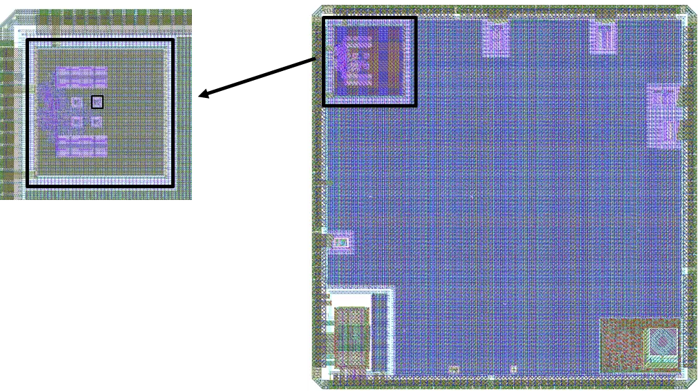

# OpenROAD

[](https://jenkins.openroad.tools/job/OpenROAD-Public/job/master/)
[](https://scan.coverity.com/projects/the-openroad-project-openroad)
[](https://openroad.readthedocs.io/en/latest/?badge=latest)
[](https://bestpractices.coreinfrastructure.org/en/projects/5370)

## About OpenROAD

OpenROAD is the leading open-source, foundational application for
semiconductor digital design. The OpenROAD flow delivers an
Autonomous, No-Human-In-Loop (NHIL) flow, 24 hour turnaround from
RTL-GDSII for rapid design exploration and physical design implementation.




## OpenROAD Mission

[OpenROAD](https://theopenroadproject.org/) eliminates the barriers
of cost, schedule risk and uncertainty in hardware design to promote
open access to rapid, low-cost IC design software and expertise and
system innovation. The OpenROAD application enables flexible flow
control through an API with bindings in Tcl and Python.

OpenROAD is used in research and commercial applications such as,
- [OpenROAD-flow-scripts](https://github.com/The-OpenROAD-Project/OpenROAD-flow-scripts)
  from [OpenROAD](https://theopenroadproject.org/)
- [OpenLane](https://github.com/The-OpenROAD-Project/OpenLane) from
  [Efabless](https://efabless.com/)
- [Silicon Compiler](https://github.com/siliconcompiler/siliconcompiler)
  from [Zero ASIC](https://www.zeroasic.com/)
- [Hammer](https://docs.hammer-eda.org/en/latest/Examples/openroad-nangate45.html)
  from [UC Berkeley](https://github.com/ucb-bar)
- [OpenFASoC](https://github.com/idea-fasoc/OpenFASOC) from
  [IDEA-FASoC](https://github.com/idea-fasoc) for mixed-signal design flows

OpenROAD fosters a vibrant ecosystem of users through active
collaboration and partnership through software development and key
alliances. Our growing user community includes hardware designers,
software engineers, industry collaborators, VLSI enthusiasts,
students and researchers.

OpenROAD strongly advocates and enables IC design-based education
and workforce development initiatives through training content and
courses across several global universities, the Google-SkyWater
[shuttles](https://platform.efabless.com/projects/public) also
includes GlobalFoundries shuttles, design contests and IC design
workshops. The OpenROAD flow has been successfully used to date
in over 600 silicon-ready tapeouts for technologies up to 12nm.

## Getting Started with OpenROAD-flow-scripts

OpenROAD provides [OpenROAD-flow-scripts](https://github.com/The-OpenROAD-Project/OpenROAD-flow-scripts)
as a native, ready-to-use prototyping and tapeout flow. However,
it also enables the creation of any custom flow controllers based
on the underlying tools, database and analysis engines. Please refer to the flow documentation [here](https://openroad-flow-scripts.readthedocs.io/en/latest/).

OpenROAD-flow-scripts (ORFS) is a fully autonomous, RTL-GDSII flow
for rapid architecture and design space exploration, early prediction
of QoR and detailed physical design implementation. However, ORFS
also enables manual intervention for finer user control of individual
flow stages through Tcl commands and Python APIs.

Figure below shows the main stages of the OpenROAD-flow-scripts:



Here are the main steps for a physical design implementation
using OpenROAD;

- `Floorplanning`
  - Floorplan initialization - define the chip area, utilization
  - IO pin placement (for designs without pads)
  - Tap cell and well tie insertion
  - PDN- power distribution network creation
- `Global Placement` 
  - Macro placement (RAMs, embedded macros)
  - Standard cell placement
  - Automatic placement optimization and repair for max slew,
    max capacitance, and max fanout violations and long wires
- `Detailed Placement`
  - Legalize placement - align to grid, adhere to design rules
  - Incremental timing analysis for early estimates
- `Clock Tree Synthesis` 
  - Insert buffers and resize for high fanout nets
- `Optimize setup/hold timing`
- `Global Routing`
  - Antenna repair
  - Create routing guides
- `Detailed Routing`
  - Legalize routes, DRC-correct routing to meet timing, power
    constraints
- `Chip Finishing`
  - Parasitic extraction using OpenRCX
  - Final timing verification
  - Final physical verification
  - Dummy metal fill for manufacturability
  - Use KLayout or Magic using generated GDS for DRC signoff

### GUI

The OpenROAD GUI is a powerful visualization, analysis, and debugging
tool with a customizable Tcl interface. The below figures show GUI views for
various flow stages including floorplanning, placement congestion,
CTS and post-routed design.

#### Floorplan



#### Automatic Hierarchical Macro Placement



#### Placement Congestion Visualization



#### CTS



#### Routing



### PDK Support

The OpenROAD application is PDK independent. However, it has been tested
and validated with specific PDKs in the context of various flow
controllers.

OpenLane supports SkyWater 130nm and GlobalFoundries 180nm.

OpenROAD-flow-scripts supports several public and private PDKs
including:

#### Open-Source PDKs

-   `GF180` - 180nm
-   `SKY130` - 130nm
-   `Nangate45` - 45nm
-   `ASAP7` - Predictive FinFET 7nm

#### Proprietary PDKs

These PDKS are supported in OpenROAD-flow-scripts only. They are used to
test and calibrate OpenROAD against commercial platforms and ensure good
QoR. The PDKs and platform-specific files for these kits cannot be
provided due to NDA restrictions. However, if you are able to access
these platforms independently, you can create the necessary
platform-specific files yourself.

-   `GF55` - 55nm
-   `GF12` - 12nm
-   `Intel22` - 22nm
-   `Intel16` - 16nm
-   `TSMC65` - 65nm

## Tapeouts

OpenROAD has been used for full physical implementation in over
600 tapeouts in SKY130 and GF180 through the Google-sponsored,
Efabless [MPW shuttle](https://efabless.com/open_shuttle_program)
and [ChipIgnite](https://efabless.com/) programs.



### OpenTitan SoC on GF12LP - Physical design and optimization using OpenROAD



### Continuous Tapeout Integration into CI

The OpenROAD project actively adds successfully taped out MPW shuttle
designs to the [CI regression
testing](https://github.com/The-OpenROAD-Project/OpenLane-MPW-CI).
Examples of designs include Open processor cores, RISC-V based SoCs,
cryptocurrency miners, robotic app processors, amateur satellite radio
transceivers, OpenPower-based Microwatt etc.

## Build OpenROAD

To build OpenROAD tools locally in your machine, follow steps
from [here](docs/user/Build.md).

## Regression Tests

There are a set of executable regression test scripts in `./test/`.

``` shell
# run tests for all tools
./test/regression

# run all flow tests
./test/regression flow

# run <tool> tests
./test/regression <tool>

# run all <tool>-specific unit tests
cd src/<tool>
./test/regression

# run only <TEST_NAME> for <tool>
cd src/<tool>
./test/regression <TEST_NAME>
```

The flow tests check results such as worst slack against reference values.
Use `report_flow_metrics [test]...` to see all of the metrics.

``` text
% report_flow_metrics gcd_nangate45
                       insts    area util slack_min slack_max  tns_max clk_skew max_slew max_cap max_fanout DPL ANT drv
gcd_nangate45            368     564  8.8     0.112    -0.015     -0.1    0.004        0       0          0   0   0   0
```

To update a failing regression, follow the instructions below:

```tcl
# update log files (i.e. *ok)
save_ok <TEST_NAME>

# update "*.metrics" for tests that use flow test
save_flow_metrics <TEST_NAME> 

# update "*.metrics_limits" files
save_flow_metrics_limits <TEST_NAME>
```

## Run

``` text
openroad [-help] [-version] [-no_init] [-exit] [-gui]
         [-threads count|max] [-log file_name] cmd_file
  -help              show help and exit
  -version           show version and exit
  -no_init           do not read .openroad init file
  -threads count|max use count threads
  -no_splash         do not show the license splash at startup
  -exit              exit after reading cmd_file
  -gui               start in gui mode
  -python            start with python interpreter [limited to db operations]
  -log <file_name>   write a log in <file_name>
  cmd_file           source cmd_file
```

OpenROAD sources the Tcl command file `~/.openroad` unless the command
line option `-no_init` is specified.

OpenROAD then sources the command file `cmd_file` if it is specified on
the command line. Unless the `-exit` command line flag is specified, it
enters an interactive Tcl command interpreter.

A list of the available tools/modules included in the OpenROAD app
and their descriptions are available [here](docs/contrib/Logger.md#openroad-tool-list).

## Git Quickstart
OpenROAD uses Git for version control and contributions. 
Get familiarised with a quickstart tutorial to contribution [here](docs/contrib/GitGuide.md).


## Understanding Warning and Error Messages
Seeing OpenROAD warnings or errors you do not understand? We have compiled a table of all messages
and you may potentially find your answer [here](https://openroad.readthedocs.io/en/latest/user/MessagesFinal.html).

## License

BSD 3-Clause License. See [LICENSE](LICENSE) file.
