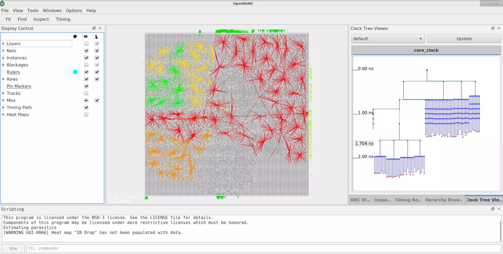

# OpenROAD

[](https://jenkins.openroad.tools/job/OpenROAD-Public/job/master/) [](https://scan.coverity.com/projects/the-openroad-project-openroad) [](https://openroad.readthedocs.io/en/latest/?badge=latest) [](https://bestpractices.coreinfrastructure.org/projects/5370)

OpenROAD is an integrated chip physical design tool that takes a
design from synthesized Verilog to routed layout.

An outline of steps used to build a chip using OpenROAD is shown below:

* Initialize floorplan - define the chip size and cell rows
* Place pins (for designs without pads )
* Place macro cells (RAMs, embedded macros)
* Insert substrate tap cells
* Insert power distribution network
* Macro Placement of macro cells
* Global placement of standard cells
* Repair max slew, max capacitance, and max fanout violations and long wires
* Clock tree synthesis
* Optimize setup/hold timing
* Insert fill cells
* Global routing (route guides for detailed routing)
* Antenna repair
* Detailed routing
* Parasitic extraction
* Static timing analysis

OpenROAD uses the OpenDB database and OpenSTA for static timing analysis.

Documentation is also available [here](https://openroad.readthedocs.io/en/latest/main/README.html).

## Getting Started with OpenROAD

[OpenROAD](https://theopenroadproject.org/) is the leading
open-source, foundational application for semiconductor digital design.
It eliminates the barriers of cost, risk and uncertainty in hardware
design to foster open access, expertise, rapid innovation, and faster
design turnaround. The OpenROAD application enables flexible flow
control through an API with bindings in Tcl and Python.

OpenROAD is a foundational building block in open-source digital flows like
[OpenROAD-flow-scripts](https://github.com/The-OpenROAD-Project/OpenROAD-flow-scripts),
[OpenLane](https://github.com/The-OpenROAD-Project/OpenLane) from
[Efabless](https://efabless.com/), Silicon Compiler Systems; as
well as [OpenFASoC](https://github.com/idea-fasoc/OpenFASOC) for
mixed-signal design flows.

OpenROAD users span hardware designers, industry collaborators,
enthusiasts, academics, and researchers.

Two main flow controllers are supported by the
[OpenROAD](https://github.com/The-OpenROAD-Project/OpenROAD)
project repository:

-   [OpenROAD-flow-scripts](https://github.com/The-OpenROAD-Project/OpenROAD-flow-scripts) -
     Supported by the OpenROAD project

-   [OpenLane](https://github.com/The-OpenROAD-Project/OpenLane) -
     Supported by [Efabless](https://efabless.com/)

The OpenROAD flow delivers an autonomous, no-human-in-the-loop, 24 hour
turnaround from RTL to GDSII for design exploration and physical design
implementation.


### GUI

The OpenROAD GUI is a powerful visualization, analysis, and debugging
tool with a customizable Tcl interface. The below figures show GUI views for
various flow stages including post-routed timing, placement congestion, and
CTS.


### Placement Congestion View:


### CTS:



### PDK Support

The OpenROAD application is PDK independent. However, it has been tested
and validated with specific PDKs in the context of various flow
controllers.

OpenLane supports Skywater130.

OpenROAD-flow-scripts supports several public and private PDKs
including:

#### Open-Source PDKs

-   `GF180` - 180nm
-   `Skywater130` - 130nm
-   `Nangate45` - 45nm
-   `ASAP7` - Predictive FinFET 7nm

#### Proprietary PDKs

These PDKS are supported in OpenROAD-flow-scripts only. They are used to
test and calibrate OpenROAD against commercial platforms and ensure good
QoR. The PDKs and platform-specific files for these kits cannot be
provided due to NDA restrictions. However, if you are able to access
these platforms independently, you can create the necessary
platform-specific files yourself.

-   `GF55` - 55nm
-   `GF12` - 12nm
-   `Intel22` - 22nm
-   `Intel16` - 16nm
-   `TSMC65` - 65nm

## Tapeouts

OpenROAD has been used for full physical implementation in over 240 tapeouts
in Sky130 through the Google-sponsored, Efabless [MPW
shuttle](https://efabless.com/open_shuttle_program) and
[ChipIgnite](https://efabless.com/) programs.


### OpenTitan SoC on GF12LP - Physical design and optimization using OpenROAD


### Continuous Tapeout Integration into CI

The OpenROAD project actively adds successfully taped out MPW shuttle
designs to the [CI regression
testing](https://github.com/The-OpenROAD-Project/OpenLane-MPW-CI).
Examples of designs include Open processor cores, RISC-V based SoCs,
cryptocurrency miners, robotic app processors, amateur satellite radio
transceivers, OpenPower-based Microwatt etc.

## Install dependencies

To install dependencies to develop or build and run OpenROAD locally,
follow [this procedure](https://openroad-flow-scripts.readthedocs.io/en/latest/user/BuildLocally.html).

> WARNING
>
> `etc/DependencyInstaller.sh` is an implementation detail of
> the setup procedures and can be harmful if invoked incorrectly.
> Do not invoke it directly.

## Build

The first step, independent of the build method, is to download the repository:

``` shell
git clone --recursive https://github.com/The-OpenROAD-Project/OpenROAD.git
cd OpenROAD
```

OpenROAD git submodules (cloned by the `--recursive` flag) are located in `src/`.

The default build type is RELEASE to compile optimized code.
The resulting executable is in `build/src/openroad`.

Optional CMake variables passed as `-D<var>=<value>` arguments to CMake are show below.

| Argument               | Value                     |
|------------------------|---------------------------|
| `CMAKE_BUILD_TYPE`     | DEBUG, RELEASE            |
| `CMAKE_CXX_FLAGS`      | Additional compiler flags |
| `TCL_LIBRARY`          | Path to Tcl library       |
| `TCL_HEADER`           | Path to `tcl.h`           |
| `ZLIB_ROOT`            | Path to `zlib`            |
| `CMAKE_INSTALL_PREFIX` | Path to install binary    |
| `GPU`                  | true, false               |

> **Note:** There is a `openroad_build.log` file that is generated with every build in the build directory. In case of filing issues, it can be uploaded in the "Relevant log output" section of OpenROAD [issue forms](https://github.com/The-OpenROAD-Project/OpenROAD-flow-scripts/issues/new/choose).

### Build by hand

``` shell
mkdir build
cd build
cmake ..
make
```

The default install directory is `/usr/local`.
To install in a different directory with CMake use:

``` shell
cmake .. -DCMAKE_INSTALL_PREFIX=<prefix_path>
```

Alternatively, you can use the `DESTDIR` variable with make.

``` shell
make DESTDIR=<prefix_path> install
```

### Build using support script

``` shell
./etc/Build.sh
# To build with debug option enabled and if the Tcl library is not on the default path
./etc/Build.sh -cmake="-DCMAKE_BUILD_TYPE=DEBUG -DTCL_LIB=/path/to/tcl/lib"
```

The default install directory is `/usr/local`.
To install in a different directory use:

``` shell
./etc/Build.sh -cmake="-DCMAKE_INSTALL_PREFIX=<prefix_path>"
```

### LTO Options
By default, OpenROAD is built with link time optimizations enabled. This adds
about 1 minute to compile times and improves the runtime by about 11%. If
you would like to disable LTO pass `-DLINK_TIME_OPTIMIZATION=OFF` when
generating a build.

### GPU acceleration
The default solver for initial placement is single threaded. If you would like
to enable GPU and use the CUDA solver, set `-DGPU=true` at cmake time.

Also, remember to install CUDA Toolkit and proper driver manually. See https://docs.nvidia.com/cuda/cuda-installation-guide-linux/index.html

## Regression Tests

There are a set of regression tests in `test/`.

``` shell
# run all tool unit tests
test/regression
# run all flow tests
test/regression flow
# run <tool> tests
test/regression <tool>
# run <tool> tool tests
src/<tool>/test/regression
```

The flow tests check results such as worst slack against reference values.
Use `report_flow_metrics [test]...` to see all of the metrics.
Use `save_flow_metrics [test]...` to add margins to the metrics and save them to <test>.metrics_limits.

``` text
% report_flow_metrics gcd_nangate45
                       insts    area util slack_min slack_max  tns_max clk_skew max_slew max_cap max_fanout DPL ANT drv
gcd_nangate45            368     564  8.8     0.112    -0.015     -0.1    0.004        0       0          0   0   0   0
```

## Run

``` text
openroad [-help] [-version] [-no_init] [-exit] [-gui]
         [-threads count|max] [-log file_name] cmd_file
  -help              show help and exit
  -version           show version and exit
  -no_init           do not read .openroad init file
  -threads count|max use count threads
  -no_splash         do not show the license splash at startup
  -exit              exit after reading cmd_file
  -gui               start in gui mode
  -python            start with python interpreter [limited to db operations]
  -log <file_name>   write a log in <file_name>
  cmd_file           source cmd_file
```

OpenROAD sources the Tcl command file `~/.openroad` unless the command
line option `-no_init` is specified.

OpenROAD then sources the command file `cmd_file` if it is specified on
the command line. Unless the `-exit` command line flag is specified, it
enters an interactive Tcl command interpreter.

Below is a list of the available tools/modules included in the OpenROAD app:

| Tool | Purpose |
|-|-|
| [OpenROAD](./src/README.md) | OpenROAD (global commands) |
| [OpenDB](./src/odb/README.md) | Database |
| [OpenRCX](./src/rcx/README.md) | Parasitics extraction |
| [Restructure](./src/rmp/README.md) | Synthesis |
| [Floorplan](./src/ifp/README.md) | Initialize floorplan |
| [ioPlacer](./src/ppl/README.md) | Pin placement |
| [ICeWall](./src/pad/README.md) | Chip-level connections |
| [TritonMacroPlacer](./src/mpl/README.md) | Macro placement |
| [Tapcell](./src/tap/README.md) | Tapcell insertion |
| [PDN](./src/pdn/README.md), [PDNSim](./src/psm/README.md) | PDN analysis |
| [RePlAce](./src/gpl/README.md) | Global placement |
| [OpenSTA](src/sta/README.md) | Timing analysis |
| [Resizer](./src/rsz/README.md) | Gate resizer |
| [OpenDP](./src/dpl/README.md) | Detailed placement |
| [TritonCTS 2.0](./src/cts/README.md) | Clock tree synthesis |
| [FastRoute](./src/grt/README.md), [Antenna Checker](./src/ant/README.md) | Global routing |
| [TritonRoute](./src/drt/README.md) | Detailed routing |
| [Metal Fill](./src/fin/README.md) | Metal fill |
| [GUI](./src/gui/README.md) | Graphical user interface |

## License

BSD 3-Clause License. See [LICENSE](LICENSE) file.
