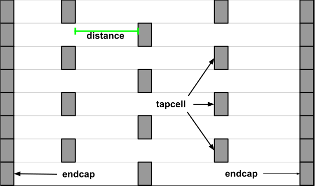

# OpenROAD Flow Scripts Tutorial

## Table of Contents

- [Table of Contents](#Table-of-Contents)
- [Introduction](#Introduction)
- [User Guide](#User-Guide)
- [Getting Started](#Getting-Started)
  - [Setting Up The Environment](#Setting-Up-The-Environment)
    - [Building OpenROAD Locally](#Building-OpenROAD-Locally)
- [Configuring The Design](#Configuring-The-Design)
  - [Platform Configuration](#Platform-Configuration)
  - [Design Configuration](#Design-Configuration)
  - [Timing Constraints](#Timing-Constraints)
  - [Design Input Verilog](#Design-Input-Verilog)
- [Running The Automated RTL-to-GDS Flow](#Running-The-Automated-RTL-to-GDS-Flow)
  - [Design Goals](#Design-Goals)
  - [Viewing ORFS Directory Structure And Results](#Viewing-ORFS-Directory-Structure-And-Results)
- [Viewing Results And Logs](#Viewing-Results-And-Logs)
  - [Area](#Area)
  - [Timing](#Timing)
  - [Power](#Power)
- [OpenROAD GUI](#OpenROAD-GUI)
  - [Viewing Layout Results](#Viewing-Layout-Results)
  - [Visualizing Design Objects And Connectivity](#Visualizing-Design-objects-And-Connectivity)
  - [Tracing The Clock Tree](#Tracing-The-Clock-Tree)
  - [Using Heat Maps](#Using-Heat-Maps)
  - [Viewing Timing Report](#Viewing-Timing-Report)
  - [Using Rulers](#Using-Rulers)
  - [DRC Viewer](#DRC-Viewer)
  - [Tcl Command Interface](#Tcl-Command-Interface)
  - [Customizing The GUI](#Customizing-The-GUI)
- [Understanding and Analyzing OpenROAD Flow Stages and Results](#Understanding-and-Analyzing-OpenROAD-Flow-Stages-and-Results)
  - [Synthesis Explorations](#Synthesis-Explorations)
    - [Area And Timing Optimization](#Area-And-Timing-Optimization)
  - [Floorplanning](#Floorplanning)
    - [Floorplan Initialization Based On Core And Die Area](#Floorplan-Initialization-Based-On-Core-And-Die-Area)
    - [Floorplan Based On Core Utilization](#Floorplan-Based-On-Core-Utilization)
  - [IO Pin Placement](#IO-Pin-Placement)
  - [Chip Level IO Pad Placement](#Chip-Level-IO-Pad-Placement)
  - [Power Planning And Analysis](#Power-Planning-And-Analysis)
  - [Macro or Cell Placement](#Macro-or-Cell-Placement)
    - [Macro Placement](#Macro-Placement)
      - [Macro Placement With Halo Spacing](#Macro-Placement-With-Halo-Spacing)
      - [Macro placement With Channel Spacing](#Macro-Placement-With-Channel-Spacing)
    - [Defining Placement Density](#Defining-Placement-Density)
  - [Timing Optimizations](#Timing-Optimizations)
    - [Timing Optimization Using repair_design](#Timing-Optimization-Using-repair_design)
    - [Timing Optimization Using repair_timing](#Timing-Optimization-Using-repair_timing)
    - [Timing Optimization Based On Multiple Corners](#Timing-Optimization-Based-On-Multiple-Corners)
    - [Fixing Setup Violations](#Fixing-Setup-Violations)
    - [Fixing Hold Violations](#Fixing-Hold-Violations)
  - [Clock Tree Synthesis](#Clock-Tree-Synthesis)
    - [Reporting Clock Skews](#Reporting-Clock-Skews)
    - [Reporting CTS Metrics](#Reporting-CTS-Metrics)
  - [Adding Filler Cells](#Adding-Filler-Cells)
  - [Global Routing](#Global-Routing)
  - [Antenna Checker](#Antenna-Checker)
  - [Detail Routing](#Detail-Routing)
  - [Metal Fill](#Metal-Fill)
  - [Parasitics Extraction](#Parasitics-Extraction)
- [Troubleshooting Problems](#Troubleshooting-Problems)
  - [Debugging Problems in Global Routing](#Debugging-Problems-in-Global-Routing)

## Introduction

This document describes a tutorial to run the complete
OpenROAD based flow from RTL-to-GDS using [OpenROAD Flow
Scripts](https://github.com/The-OpenROAD-Project/OpenROAD-flow-scripts).
This tutorial also includes examples of useful design explorations and
manual usage in key flow stages to help users gain a good understanding of
the [OpenROAD](https://openroad.readthedocs.io/en/latest/main/README.html)
application flow, data organization, GUI and commands.

This is intended for:

-   Beginners or new users with some understanding of basic VLSI
    design flow. Users will learn the basics of installation to use
    [OpenROAD-flow-scripts](https://openroad.readthedocs.io/en/latest/user/GettingStarted.html)
    for the complete RTL-to-GDS flow.
-   Users already familiar with the OpenROAD application and flow but would
    like to learn more about specific features and commands.

## User Guide

-   This tutorial requires a specific directory structure built by
    OpenROAD-flow-scripts (ORFS). Do not modify this structure or
    underlying files since this will cause problems in the flow execution.
-   User can run the full RTL-to-GDS flow and learn specific flow
    sections independently. This allows users to learn the flow and tool
    capabilities at their own pace, time and preference.
-   Results shown, such as images or outputs of reports and logs, could
    vary based on release updates. However, the main flow and command
    structure should generally apply.

Note: Please submit any problem found under Issues in the GitHub repository
[here](https://github.com/The-OpenROAD-Project/OpenROAD-flow-scripts/issues).

## Getting Started

This section describes the environment setup to build ORFS and get ready
to execute the RTL-to-GDS flow of the open-source design `ibex` using the
`sky130hd` technology.

`ibex` is a 32 bit RISC-V CPU core (`RV32IMC/EMC`) with a two-stage
pipeline.

### Setting Up The Environment

Use the `bash` shell to run commands and scripts.

Install OpenROAD Flow Scripts. Refer to the [Getting Started with
OpenROAD Flow](../user/GettingStarted.md#Setup) documentation.

If ORFS is already installed but needs updating, run the
following commands:

```
cd OpenROAD-flow-scripts
git checkout master
git pull
git submodule update
```

#### Building OpenROAD Locally

Only the ` --local` build option is used in the tutorial. For further
details refer to the [Build Locally](../user/BuildLocally.md) documentation.

Alternatively, the user may build using the docker installation by referring
to [Build With Docker](../user/BuildWithDocker.md) documentation.

```
./build_openroad.sh --local
source setup_env.sh
```

You will see the following message:

```
OPENROAD: <path>/OpenROAD-flow-scripts/tools/OpenROAD
```

ORFS installation is complete.

## Configuring The Design

This section shows how to set up the necessary platform and design
configuration files to run the complete RTL-to-GDS flow using
`OpenROAD-flow-scripts`.

```
cd flow
```

### Platform Configuration

View the platform configuration file setup for default variables for
`sky130hd`.

```
less ./platforms/sky130hd/config.mk
```

The `config.mk` file has all the required variables for the `sky130`
platform and hence it is not recommended to change any variable
definition here. You can view the `sky130hd` platform configuration
[here](https://github.com/The-OpenROAD-Project/OpenROAD-flow-scripts/blob/master/flow/platforms/sky130hd/config.mk).

Refer to the [Flow variables](../user/FlowVariables.md) document for
details on how to use platform and design specific environment variables
in OpenROAD-flow-scripts to customize and configure your design flow.

### Design Configuration

View the default design configuration of `ibex` design:

```
less ./designs/sky130hd/ibex/config.mk
```

You can view `ibex` design `config.mk`
[here](https://github.com/The-OpenROAD-Project/OpenROAD-flow-scripts/blob/master/flow/designs/sky130hd/ibex/config.mk).

Note: The following design-specific configuration variables are required
to specify main design inputs such as platform, top-level design name and
constraints. We will use default configuration variables for this tutorial.

| Variable Name      | Description                                                                                                                              |
|--------------------|------------------------------------------------------------------------------------------------------------------------------------------|
| `PLATFORM`         | Specifies Process design kit.                                                                                                            |
| `DESIGN_NAME`      | The name of the top-level module of the design                                                                                           |
| `VERILOG_FILES`    | The path to the design Verilog files                                                                                                     |
| `SDC_FILE`         | The path to design `.sdc` file                                                                                                           |
| `CORE_UTILIZATION` | The core utilization percentage.                                                                                                         |
| `PLACE_DENSITY`    | The desired placement density of cells. It reflects how spread the cells would be on the core area. 1 = closely dense. 0 = widely spread |

### Timing Constraints

View timing constraints specified in the `.sdc` file
[here](https://github.com/The-OpenROAD-Project/OpenROAD-flow-scripts/blob/master/flow/designs/sky130hd/ibex/constraint.sdc).

```
less ./designs/sky130hd/ibex/constraint.sdc
```

For `ibex` design, we simply use the clock definition as follows as a
minimum required timing constraint.

```
create_clock -name core_clock -period 17.4 [get_ports {clk_i}]
```

### Design Input Verilog

The Verilog input files are located in `./designs/src/ibex/`

The design is defined in `ibex_core.v` available
[here](https://github.com/The-OpenROAD-Project/OpenROAD-flow-scripts/blob/master/flow/designs/src/ibex/ibex_core.v).

Refer to the `ibex` design `README.md`
[here](https://github.com/The-OpenROAD-Project/OpenROAD-flow-scripts/blob/master/flow/designs/src/ibex/README.md).

## Running The Automated RTL-to-GDS Flow

This section describes the complete execution of the design flow from
RTL-to-GDS. The OpenROAD application executes the entire autonomous flow
using Tcl scripts that invoke open-sourced tools, from synthesis to the final
`.gds` file creation, without requiring human intervention. However, in this
tutorial, the user will learn both the automated and a few interactive ways
to run Tcl commands for important flow stages.

From the OpenROAD-flow-scripts directory, users can access individual flow
stages, respective tools and the corresponding `README.md` for tool commands,
configuration examples using the Tcl interface and other such details.

-   [Synthesis](https://github.com/The-OpenROAD-Project/yosys/blob/master/README.md)
-   [Database](../../src/odb/README.md)
-   [Floorplanning](../../src/ifp/README.md)
-   [Pin Placement](../../src/ppl/README.md)
-   [Chip-level Connections](../../src/pad/README.md)
-   [Macro Placement](../../src/mpl/README.md)
-   [Tapcell insertion](../../src/tap/README.md)
-   [PDN Analysis](../../src/pdn/README.md)
-   [IR Drop Analysis](../../src/psm/README.md)
-   [Global Placement](../../src/gpl/README.md)
-   [Timing Analysis](https://github.com/The-OpenROAD-Project/OpenSTA/blob/master/README.md)
-   [Detailed Placement](../../src/dpl/README.md)
-   [Timing Optimization using Resizer](../../src/rsz/README.md)
-   [Clock Tree Synthesis](../../src/cts/README.md)
-   [Global Routing](../../src/grt/README.md)
-   [Antenna Rule Checker](../../src/ant/README.md)
-   [Detail Routing](../../src/drt/README.md)
-   [Metall Fill](../../src/fin/README.md)
-   [Parasitics Extraction](../../src/rcx/README.md)
-   [Layout Generation](https://www.klayout.de/)

### Design Goals

Run the `ibex` design in ORFS automated flow from RTL-to-GDS using `sky130hd`.
Find `ibex` design details  
[here](https://github.com/The-OpenROAD-Project/OpenROAD-flow-scripts/blob/master/flow/designs/src/ibex/README.md)
and the design goals are:

-   Area

```
Minimum Required Die size: 0 0 798 800 (in micron)
Core size: 2 2 796 798 (in micron)
```

-   Timing

```
Clock period to meet timing: 17.4 (in ns)
```

`ibex` takes approximately 8 minutes on a machine with 8-cores and 16GB RAM.
The runtime will vary based on your configuration.

Change your current directory to the `flow` directory.

```
cd flow
```

Run the complete flow with:

```
make DESIGN_CONFIG=./designs/sky130hd/ibex/config.mk
```

As the flow executes, check out the ORFS directory contents and their
significance.

### Viewing ORFS Directory Structure And Results

Open a new tab in the terminal and explore the directory structure in
`flow` by typing `ls` command to view its contents:

```
designs logs Makefile objects platforms reports results scripts test util
```

Navigate through each of the sub-directories above to understand how
underlying files are organized.

-   `designs/sky130hd/ibex`
    Files include: designs make file and SDC file for the `sky130hd`
    platform and other files for autotuner and metrics.

```
autotuner.json config.mk constraint_doe.sdc constraint.sdc metadata-base-ok.json rules.json
```

-   `platforms`
    Includes public PDKs supported by OpenROAD flow

```
asap7 nangate45 sky130hd sky130hs sky130io sky130ram
```

-   `objects/sky130hd/ibex/base`
    Includes ABC constraints and all the temporary library files used
    for the completion flow

```
abc.constr klayout.lyt klayout_tech.lef lib
```

-   `logs/sky130hd/ibex/base`
    Logs directory, which contains log files for each flow stage.

| `logs`                 |                        |                       |
|------------------------|------------------------|-----------------------|
| `1_1_yosys.log`        | `3_1_place_gp.log`     | `5_2_TritonRoute.log` |
| `2_1_floorplan.log`    | `3_2_place_iop.log`    | `6_1_merge.log`       |
| `2_2_floorplan_io.log` | `3_3_resizer.log`      | `6_report.log`        |
| `2_3_tdms_place.log`   | `3_4_opendp.log`       |                       |
| `2_4_mplace.log`       | `4_1_cts.log`          |                       |
| `2_5_tapcell.log`      | `4_2_cts_fillcell.log` |                       |
| `2_6_pdn.log`          | `5_1_fastroute.log`    |                       |


-   `results/sky130hd/ibex/base`
    Results directory which contains `.v/.sdc/.odb/.def/.spef` files

| `results`                   |                         |                    |
|-----------------------------|-------------------------|--------------------|
| `1_1_yosys.v`               | `3_1_place_gp.odb`      | `5_route.sdc`      |
| `1_synth.sdc`               | `3_2_place_iop.odb`     | `6_1_fill.odb`     |
| `1_synth.v`                 | `3_3_place_resized.odb` | `6_1_fill.sdc`     |
| `2_1_floorplan.odb`         | `3_4_place_dp.odb`      | `6_1_merged.gds`   |
| `2_2_floorplan_io.odb`      | `3_place.odb`           | `6_final.odb`      |
| `2_3_floorplan_tdms.odb`    | `3_place.sdc`           | `6_final.gds`      |
| `2_4_floorplan_macro.odb`   | `4_1_cts.odb`           | `6_final.sdc`      |
| `2_5_floorplan_tapcell.odb` | `4_2_cts_fillcell.odb`  | `6_final.spef`     |
| `2_6_floorplan_pdn.odb`     | `4_cts.odb`             | `6_final.v`        |
| `2_floorplan.odb`           | `4_cts.sdc`             | `output_guide.mod` |
| `2_floorplan.sdc`           | `4_cts.v`               | `route.guide`      |
| `2_floorplan.v`             | `5_route.odb`           | `updated_clks.sdc` |


-   `reports/sky130hd/ibex/base`
    Reports directory, which contains DRC report, design statistics and
    antenna log for reference.

| `reports`         |                     |                        |
|-------------------|---------------------|------------------------|
| `5_route_drc.rpt` | `final_clocks.webp` | `final_placement.webp` |
| `antenna.log`     | `final_clocks.webp` | `final.webp`           |
| `synth_stat.txt`  | `synth_check.txt`   | `final_resizer.webp`   |

The table below briefly describes the reports directory files.

| File Name              | Description                                              |
|------------------------|----------------------------------------------------------|
| `5_route_drc.rpt`      | DRC violations if occurred                               |
| `final_clocks.webp`    | OR extracted image reference after clock tree synthesis. |
| `final_resizer.webp`   | OR extracted image reference after resizer.              |
| `synth_check.txt`      | Synthesis warning/error messages                         |
| `antenna.log`          | Antenna check log report                                 |
| `final_placement.webp` | Extracted image after final placement                    |
| `final.webp`           | Extracted image after routing.                           |
| `synth_stat.txt`       | Post synthesis design statistics log saved here.         |

The flow completes with the message below by creating a merged final GDS file.

```
[INFO] Writing out GDS/OAS
'results/sky130hd/ibex/base/6_1_merged.gds'
cp results/sky130hd/ibex/base/6_1_merged.gds
results/sky130hd/ibex/base/6_final.gds
```

## Viewing Results And Logs

ORFS prepends a prefix to each flow stage, as shown below, to
indicate the position in the RTL-GDS flow. This makes it easier to
understand and debug each flow stage in case of failure.

View `ibex` design logs:

```
ls logs/sky130hd/ibex/base/
```

The log structure is as follows:

| `logs`                 |                        |                       |
|------------------------|------------------------|-----------------------|
| `1_1_yosys.log`        | `3_1_place_gp.log`     | `5_2_TritonRoute.log` |
| `2_1_floorplan.log`    | `3_2_place_iop.log`    | `6_1_merge.log`       |
| `2_2_floorplan_io.log` | `3_3_resizer.log`      | `6_report.log`        |
| `2_3_tdms_place.log`   | `3_4_opendp.log`       |                       |
| `2_4_mplace.log`       | `4_1_cts.log`          |                       |
| `2_5_tapcell.log`      | `4_2_cts_fillcell.log` |                       |
| `2_6_pdn.log`          | `5_1_fastroute.log`    |                       |

### Area

View design area and its core utilization:

```
make gui_final
report_design_area
```

View the resulting area as:

```
Design area 191262 u^2 30% utilization.
```

### Timing

Users can view flow results using the command interface from the shell or
the OpenROAD GUI to visualize further and debug. Learn more about the
[GUI](../../src/gui/README.md).

```
make gui_final
```

Use the following commands in the `Tcl Commands` section of GUI:

```
report_worst_slack
report_tns
report_wns
```

Note the worst slack, total negative slack and worst negative slack:

```
worst slack -0.99
tns -1.29
wns -0.99
```

Learn more about visualizing and tracing time paths across the design
hierarchy refer to the OpenROAD [GUI](../../src/gui/README.md).

### Power

Use the report command to view individual power components i.e.
sequential, combinational, macro and power consumed by I/O pads.

```
report_power
```

The power output is as follows:

```
--------------------------------------------------------------------------
Group                  Internal  Switching    Leakage      Total
                          Power      Power      Power      Power
----------------------------------------------------------------
Sequential             5.58e-03   6.12e-04   1.67e-08   6.19e-03  19.0%
Combinational          9.23e-03   1.71e-02   4.90e-08   2.63e-02  81.0%
Macro                  0.00e+00   0.00e+00   0.00e+00   0.00e+00   0.0%
Pad                    0.00e+00   0.00e+00   0.00e+00   0.00e+00   0.0%
----------------------------------------------------------------
Total                  1.48e-02   1.77e-02   6.57e-08   3.25e-02 100.0%
                          45.6%      54.4%       0.0%
```

## OpenROAD GUI

The GUI allows users to select, control, highlight and navigate the
design hierarchy and design objects (nets, pins, instances, paths, etc.)
through detailed visualization and customization options. Find details
on how to use the GUI [here](../../src/gui/README.md). All the windows
aside from the layout are docking windows that can be undocked.  Also it
can be close and reopened from the Windows menu.

In this section, learn how to:

1. Visualize design hierarchy
2. Load ODB files for floorplan and layout visualization
3. Trace the synthesized clock tree to view hierarchy and buffers
4. Use heat maps to view congestion and observe the effect of placement
5. View and trace critical timing paths
6. Set display control options
7. Zoom to object from inspector

If you have completed the RTL-GDS flow, then proceed to view the final
GDS file under results directory `./results/sky130hd/ibex/base/`

For the `ibex` design uncomment the `DESIGN_CONFIG`
variable in the `Makefile` available
[here](https://github.com/The-OpenROAD-Project/OpenROAD-flow-scripts/blob/master/flow/Makefile).

```
# DESIGN_CONFIG=./designs/sky130hd/gcd/config.mk
DESIGN_CONFIG=./designs/sky130hd/ibex/config.mk
# DESIGN_CONFIG=./designs/sky130hd/aes/config.mk
```

```
make gui_final
```

### Viewing Layout Results

The `make gui_final` command target successively reads and loads the
technology `.odb` files and the parasitics and invokes the
GUI in these steps:

-   Reads and loads `.odb` files.
-   Loads `.spef` (parasitics).

The figure below shows the post-routed DEF for the `ibex` design.


### Visualizing Design Objects And Connectivity

Note the `Display Control` window on the LHS that shows buttons
for color, visibility and selection options for various design
objects: Layers, Nets, Instances, Blockages, Heatmaps, etc.

The Inspector window on the RHS allows users to inspect details of
selected design objects and the timing report.

Try selectively displaying (show/hide) various design objects through
the display control window and observing their impact on the display.

### Tracing The Clock Tree

View the synthesized clock tree for `ibex` design:
-   From the top Toolbar Click `View` -> `Find`
-   In the Dialog Box `Find Object ` search the clock net using a keyword
    as follows:


Click `Ok` to view the synthesized clock tree of your design.

View clock tree structure below, the user needs to disable the metal
`Layers` section on LHS as shown below.


From the top Toolbar, click on the `Windows` menu to select/hide different
view options of Scripting, Display control, etc.

### Using Heat Maps

From the Menu Bar, Click on `Tools` -> `Heat Maps` -> `Placement Density` to view
congestion selectively on vertical and horizontal layers.

Expand `Heat Maps` -> `Placement Density` from the Display Control window
available on LHS of OpenROAD GUI.

View congestion on all layers between 50-100%:

In the `Placement density` setup pop-up window, Select `Minimum` -> `50.00%`
`Maximum` -> `100.00%`


From `Display Control`, select `Heat Maps` -> `Routing Congestion` as
follows:


From `Display Control`, select `Heat Maps` -> `Power Density` as
follows:


### Viewing Timing Report

Click `Timing` -> `Options` to view and traverse specific timing paths.
From Toolbar, click on the `Timing` icon, View `Timing Report` window added
at the right side (RHS) of GUI as shown below.


In `Timing Report` Select `Paths` -> `Update`, `Paths` should be integer
numbers. The number of timing paths should be displayed in the current
window as follows:


Select `Setup` or `Hold` tabs and view required arrival times and
slack for each timing path segment.

For each `Setup` or `Hold` path group, path details have a specific `pin
name, Time, Delay, Slew and Load` value with the clock to register, register
to register and register to output data path.

### Using Rulers

A ruler can measure the distance between any two objects in the design or
metal layer length and width to be measured, etc.

Example of how to measure the distance between VDD and VSS power grid click on:

`Tools` -> `Ruler K`


Distance between VDD and VSS layer is `11.970`

### DRC Viewer

You can use the GUI to trace DRC violations and fix them.

View DRC violations post routing:

```
less ./reports/sky130hd/ibex/base/5_route_drc.rpt
```

Any DRC violations are logged in the `5_route_drc.rpt` file, which is
empty otherwise.

From OpenROAD GUI, Enable the menu options `Windows` -> `DRC Viewer`. A
`DRC viewer` window is added on the right side (RHS) of the GUI. From
`DRC Viewer` -> `Load` navigate to `5_route_drc.rpt`


By selecting DRC violation details, designers can analyze and fix them. Here
user will learn how a DRC violation can be traced with the `gcd` design. Refer
to the following OpenROAD test case for more details.

```
cd ./flow/tutorials/scripts/drt/
openroad -gui
```

In the `Tcl Commands` section of GUI:

```
source drc_issue.tcl
```

Post detail routing in the log, you can find the number of violations left
in the design:

```
[INFO DRT-0199] Number of violations = 7.
```

Based on `DRC Viewer` steps load `results/5_route_drc.rpt`. GUI as
follows


`X mark` in the design highlights DRC violations.

From `DRC Viewer` on RHS `expand` -> `Short`

This shows the number of `violations` in the design. Zoom the design
for a clean view of the violation:


`output53` has overlaps and this causes the `short violation`.

Open the input DEF file `drc_cts.def` to check the source of the
overlap.

Note the snippet of DEF file where `output51` and `output53` have
the same placed coordinates and hence cause the placement violation.

```
- output51 sky130_fd_sc_hd__clkbuf_1 + PLACED ( 267260 136000 ) N ;
- output53 sky130_fd_sc_hd__clkbuf_1 + PLACED ( 267260 136000 ) N ;
```

Use the test case provided in `4_cts.def` with the changes applied for
updated coordinates as follows:

```
- output51 sky130_fd_sc_hd__clkbuf_1 + PLACED ( 267260 136000 ) N ;
- output53 sky130_fd_sc_hd__clkbuf_1 + PLACED ( 124660 266560 ) N ;
```

Close the current GUI and re-load the GUI with the updated DEF to see
fixed DRC violation in the design:

```
openroad -gui
source drc_fix.tcl
```

In the post detail routing log, the user can find the number of violations
left in the design:

```
[INFO DRT-0199] Number of violations = 0.
```

Routing completed with 0 violations.

### Tcl Command Interface

Execute ORFS Tcl commands from the GUI. Type `help` to view Tcl
Commands available. In OpenROAD GUI, at the bottom, `TCL commands` executable
space is available to run the commands. For example

View `design area`:

```
report_design_area
```

Try the below timing report commands to view timing results interactively:

```
report_wns
report_tns
report_worst_slack
```

### Customizing The GUI

Customize the GUI by creating your own widgets such as menu bars,
toolbar buttons, dialog boxes, etc.

Refer to the GUI [here](../../src/gui/README.md).

Create `Load_LEF` toolbar button in GUI to automatically load
specified `.lef` files.

```
openroad -gui
```


To view `load_lef.tcl`, run the command:

```
less ./flow/tutorials/scripts/gui/load_lef.tcl
```

```
proc load_lef_sky130 {} {
    set FLOW_PATH [exec pwd]
    read_lef $FLOW_PATH/../../../platforms/sky130hd/lef/sky130_fd_sc_hd.tlef
    read_lef $FLOW_PATH/../../../platforms/sky130hd/lef/sky130_fd_sc_hd_merged.lef
}
create_toolbar_button -name "Load_LEF" -text "Load_LEF" -script {load_lef_sky130} -echo
```

From OpenROAD GUI `Tcl commands`:

```
cd ./flow/tutorials/scripts/gui/
source load_lef.tcl
```

`Load_LEF` toolbar button added as follows:


From Toolbar menus, Click on `Load_LEF.` This loads the specified `sky130`
technology `.tlef` and `merged.lef` file in the current OpenROAD GUI
as follows:


## Understanding and Analyzing OpenROAD Flow Stages and Results

The OpenROAD flow is fully automated and yet the user can usefully intervene
to explore, analyze and optimize your design flow for good PPA.

In this section, you will learn specific details of flow stages and
learn to explore various design configurations and optimizations to
target specific design goals, i.e., PPA (area, timing, power).

### Synthesis Explorations

#### Area And Timing Optimization

Explore optimization options using synthesis options: `ABC_AREA` and `ABC_SPEED`.

Set `ABC_AREA=1` for area optimization and `ABC_SPEED=1` for timing optimization.
Update design `config.mk` for each case and re-run the flow to view impact.

To view `ibex` design
[config.mk](https://github.com/The-OpenROAD-Project/OpenROAD-flow-scripts/blob/master/flow/designs/sky130hd/ibex/config.mk).

```
#Synthesis strategies
export ABC_AREA = 1
```

Run `make` command from `flow` directory as follows:

```
make DESIGN_CONFIG=./designs/sky130hd/gcd/config.mk
```

The `gcd` design synthesis results for area and speed optimizations are shown below:

| Synthesis Statistics  | ABC_SPEED                            | ABC_AREA                             |
|-----------------------|--------------------------------------|--------------------------------------|
| `Number of wires`     | 224                                  | 224                                  |
| `Number of wire bits` | 270                                  | 270                                  |
| `Number of cells`     | 234                                  | 234                                  |
| `Chip area`           | 2083.248000                          | 2083.248000                          |
| `Final Design Area`   | Design area 4295 u^2 6% utilization. | Design area 4074 u^2 6% utilization. |

Note: Results for area optimization should be ideally checked after
floorplanning to verify the final impact. First, relax the `.sdc` constraint
and re-run to see area impact. Otherwise, the repair design command will
increase the area to meet timing regardless of the netlist produced earlier.

### Floorplanning

This section describes ORFS floorplanning and placement functions using
the GUI.

#### Floorplan Initialization Based On Core And Die Area

Refer to the following OpenROAD built-in examples
[here](../../src/ifp/test/init_floorplan1.tcl).

Run the following commands in the terminal to build and view the created
floorplan.

```
cd ../../src/ifp/test/
openroad -gui
```

In `Tcl Commands` section GUI:

```
source init_floorplan1.tcl
```

View the resulting die area "0 0 1000 1000" and core area "100 100 900 900"
in microns shown below:


#### Floorplan Based On Core Utilization

Refer to the following OpenROAD built-in examples
[here](../../src/ifp/test/init_floorplan2.tcl).

Run the following commands in the terminal to view how the floorplan
initialized:

```
cd ../../src/ifp/test/
openroad -gui
```

In the `Tcl Commands` section of the GUI:

```
source init_floorplan2.tcl
```

View the resulting core utilization of 30 created following floorplan:


### IO Pin Placement

Place pins on the boundary of the die on the track grid to minimize net
wirelengths. Pin placement also creates a metal shape for each pin using
min-area rules.

For designs with unplaced cells, the net wirelength is computed considering
the center of the die area as the unplaced cells position.

Find pin placement document [here](../../src/ppl/README.md).

Refer to the built-in examples [here](../../src/ppl/test).

Launch openroad GUI:

```
cd ../../src/pad/test/
openroad -gui
```

Run [place_pin4.tcl](../../src/ppl/test/place_pin4.tcl) script to view
pin placement.

From the GUI `Tcl commands` section:

```
source place_pin4.tcl
```

View the resulting pin placement in GUI:


In OpenROAD GUI to enlarge `clk` pin placement, hold mouse right button
as follows and draw sqaure box in specific location:


Now `clk` pin zoom to clear view as follows:


### Chip Level IO Pad Placement

In this section, you will generate an I/O pad ring for the `coyote` design
using a Tcl script.

ICeWall is a utility to place IO cells around the periphery of a design,
and associate the IO cells with those present in the netlist of the
design.

For I/O pad placement using ICeWall refer to the readme file
[here](../../src/pad/README.md).

Refer to the built-in examples [here](../../src/pad/test).

Launch openroad GUI:

```
cd ../../src/pad/test/
openroad -gui
```

Run [coyote_tc_sky130.tcl](../../src/pad/test/coyote_tc_sky130.tcl) script
to view IO pad placement.

From the GUI `Tcl commands` section:

```
source coyote_tc_sky130.tcl
```

View the resulting IO pad ring in GUI:


### Power Planning And Analysis

In this section, you will use the design `gcd` to create a
power grid and run power analysis.

Pdngen is used for power planning. Find the document [here](../../src/pdn/README.md).

Refer to the built-in examples [here](../../src/pdn/test).

Launch openroad GUI:

```
cd ../../src/pdn/test
openroad -gui
```

Run [test_gcd.api.tcl](../../src/pdn/test/test_gcd.api.tcl)
to generate power grid for `gcd` design.

```
source test_gcd.api.tcl
```
View the resulting power plan for `gcd` design:


#### IR Drop Analysis
IR drop is the voltage drop in the metal wires constituting the power
grid before it reaches the power pins of the standard cells. It becomes
very important to limit the IR drop as it affects the speed of the cells
and overall performance of the chip.

PDNSim is an open-source static IR analyzer.

Features:

-   Report worst IR drop.
-   Report worst current density over all nodes and wire segments in
    the power distribution network, given a placed and PDN-synthesized design.
-   Check for floating PDN stripes on the power and ground nets.
-   Spice netlist writer for power distribution network wire segments.

Refer to the built-in examples [here](../../src/psm/test).

Launch openroad:

```
cd ../../src/psm/test
openroad
```

Run [gcd_test_vdd.tcl](../../src/psm/test/gcd_test_vdd.tcl)
to generate IR drop report for `gcd` design.

```
source gcd_test_vdd.tcl
```

Find the IR drop report at the end of the log as follows:
```
########## IR report #################
Worstcase voltage: 1.10e+00 V
Average IR drop  : 1.68e-04 V
Worstcase IR drop: 2.98e-04 V
######################################
```

### Tapcell insertion

Tap cells are non-functional cells that can have a well tie, substrate
tie or both. They are typically used when most or all of the standard
cells in the library contain no substrate or well taps. Tap cells help
tie the VDD and GND levels and thereby prevent drift and latch-up.

The end cap cell or boundary cell is placed at both the ends of each
placement row to terminate the row. They protect the standard cell
gate at the boundary from damage during manufacturing.

Tap cells are placed after the macro placement and power rail creation.
This stage is called the pre-placement stage. Tap cells are placed in a
regular interval in each row of placement. The maximum distance between
the tap cells must be as per the DRC rule of that particular technology library.

The figures below show two examples of tapcell insertion. When only the 
`-tapcell_master` and `-endcap_master` masters are given, the tapcell placement
is similar to Figure 1. When the remaining masters are give, the tapcell
placement is similar to Figure 2.

Refer to the GUI figures to highlight well tap and end cap cells. The image
does not differentiate and just shows a bunch of rectangles.

|  |  |
|:--:|:--:|
| Figure 1: Tapcell insertion representation | Figure 2:  Tapcell insertion around macro representation |

Refer to the following built-in example [here](../../src/tap/test/gcd_nangate45.tcl)
to learn about Tap/endcap cell insertion.

To view this in OpenROAD GUI:

```
cd ../../src/tap/test/
openroad -gui
```

In the `Tcl Commands` section of GUI

```
source gcd_nangate45.tcl
```

View the resulting tap cell insertion as follows:


### Tie Cells

The tie cell is a standard cell, designed specially to provide the high
or low signal to the input (gate terminal) of any logic gate.
Where ever netlist is having any pin connected to 0 logic or 1 logic
(like .A(1'b0) or .IN(1'b1), a tie cell gets inserted there.

Refer to the following built-in example [here](../../src/ifp/test/tiecells.tcl)
to learn about Tie cell insertion.

To check this in OpenROAD tool:

```
cd ../../src/ifp/test/
openroad
source tiecells.tcl
```

Refer the following verilog code which have tie high/low net.
[here](../../src/ifp/test/tiecells.v)
```
AND2_X1 u2 (.A1(r1q), .A2(1'b0), .ZN(u2z0));
AND2_X1 u3 (.A1(u1z), .A2(1'b1), .ZN(u2z1));
```
With following `insert_tiecells` command:
```
insert_tiecells LOGIC0_X1/Z -prefix "TIE_ZERO_"
insert_tiecells LOGIC1_X1/Z
```
During floorplan stage, those nets converted to tiecells as follows
based on library(This is Nangate45 specific):
```
[INFO IFP-0030] Inserted 1 tiecells using LOGIC0_X1/Z.
[INFO IFP-0030] Inserted 1 tiecells using LOGIC1_X1/Z.
```

### Macro or Cell Placement

#### Macro Placement

In this section, you will explore various placement options for macros
and standard cells and study the impact on area and timing.

Refer to the following built-in example [here](../../src/gpl/test/macro01.tcl)
to learn about macro placement.

Placement density impacts how widely standard cells are placed in the
core area. To view this in OpenROAD GUI:

```
cd ../../src/gpl/test/
openroad -gui
```

In the `Tcl Commands` section of GUI

```
source macro01.tcl
```

Read the resulting macro placement with a complete core view:


Zoomed view of cell placement:


Reduce the placement density and observe the impact on placement, by
running below command in `Tcl Commands` section of GUI:

```
global_placement -density 0.6
```

Read the resulting macro placement with a complete core view:


Zoomed view of cell placement:


##### Macro Placement With Halo Spacing

Explore macro placement with halo spacing, refer to the example
[here](../../src/mpl/test/gcd_mem1_02.tcl).

Launch GUI:
```
cd ../../src/mpl/test
openroad -gui
```

In the `Tcl Commands` section of GUI:

```
source helpers.tcl
read_liberty Nangate45/Nangate45_typ.lib
read_liberty Nangate45/fakeram45_64x7.lib
read_lef Nangate45/Nangate45.lef
read_lef Nangate45/fakeram45_64x7.lef
read_def gcd_mem1.def
read_sdc gcd.sdc
```

DEF file without halo spacing


Now increase the halo width for better routing resources.

In the `Tcl Commands` section of GUI:

```
macro_placement -halo {2.0 2.0}
```

DEF file with macro moved 2.0 micron from the left side of the core edge.


Run `global_placement` to align standard cells and macros with updated
macro spacing.

```
global_placement
```

View the resulting DEF file as shown below


##### Macro Placement With Channel Spacing

Now we will study how macro placement with channel spacing works.

If the design has more than one macro, it is important to provide halo and
channel spacing to provide enough space for routing. Refer to the
following example [here](../../src/mpl/test/gcd_mem3_03.tcl).

To view macro placement with channel spacing in OpenROAD GUI:
```
cd ../../src/mpl/test/
openroad -gui
```

Copy and paste the following `Tcl commands` in the GUI Tcl prompt.

```
source helpers.tcl
read_liberty Nangate45/Nangate45_typ.lib
read_liberty Nangate45/fakeram45_64x7.lib
read_lef Nangate45/Nangate45.lef
read_lef Nangate45/fakeram45_64x7.lef
read_def gcd_mem3.def
read_sdc gcd.sdc
```

View the resulting macro placement as shown below:


Observe the ruler distance between each macro. To place each macro with
2-micron channel spacing use below command in `Tcl Commands` section
of GUI:

```
macro_placement -style corner_min_wl -channel {2.0 2.0}
```

View the resulting macro placement with channel spacing as shown below:


The macros are placed with 2-micron channel spacing with a core corner
that has minimum wire length. Try different `-style` options to study
the effect on macro placement.

Run `global_placement` to align standard cells and macros with updated
macro spacing.

#### Defining Placement Density

To learn on placement density strategies for `ibex` design, go to
`OpenROAD-flow-scripts/flow`. Type:

```
openroad -gui
```

Enter the following commands in the `Tcl Commands` section of GUI

```
read_lef ./platforms/sky130hd/lef/sky130_fd_sc_hd.tlef
read_lef ./platforms/sky130hd/lef/sky130_fd_sc_hd_merged.lef
read_def ./results/sky130hd/ibex/base/3_place.def
```


Change `CORE_UTILIZATION` and `PLACE_DENSITY` for the `ibex` design
`config.mk` as follows.

View `ibex` design `config.mk`
[here](https://github.com/The-OpenROAD-Project/OpenROAD-flow-scripts/blob/master/flow/designs/sky130hd/ibex/config.mk).

```
export CORE_UTILIZATION = 40
export CORE_ASPECT_RATIO = 1
export CORE_MARGIN = 2
export PLACE_DENSITY = 0.50
```

Re-run the `ibex` design with the below command:

```
make DESIGN_CONFIG=./designs/sky130hd/ibex/config.mk
```

View the `ibex` design placement density heat map as shown below:


So from above, GUI understood that change in `CORE_UTILIZATION` from 20
to 40 and placement density default 0.60 to 0.50 changes standard cell
placement became widely spread.

### Timing Optimizations

#### Timing Optimization Using repair_design

The `repair_design` command inserts buffers on nets to repair `max
slew, max capacitance and max fanout` violations and on long wires to
reduce RC delay. It also resizes gates to normalize slews. Use
`estimate_parasitics -placement` before `repair_design` to account
for estimated post-routing parasitics.

Refer to the built-in example [here](../../src/rsz/test/repair_slew1.tcl).

Launch GUI:

```
cd ../../src/rsz/test/
openroad -gui
```

Copy and paste the below commands in the `Tcl Commands` section of GUI.

```
source "helpers.tcl"
source "hi_fanout.tcl"
read_liberty Nangate45/Nangate45_typ.lib
read_lef Nangate45/Nangate45.lef
set def_file [make_result_file "repair_slew1.def"]
write_hi_fanout_def $def_file 30
read_def $def_file

create_clock -period 1 clk1
set_wire_rc -layer metal3

estimate_parasitics -placement
set_max_transition .05 [current_design]

puts "Found [sta::max_slew_violation_count] violations"
```

The number of violations log as:

```
Found 31 violations
```

These violations were fixed by:

```
repair_design
```

The log is as follows:

```
[INFO RSZ-0058] Using max wire length 853um.
[INFO RSZ-0039] Resized 1 instance.
```

To view violation counts again:

```
puts "Found [sta::max_slew_violation_count] violations"
```

The log follows:

```
Found 0 violations
```

`repair_design` fixed all 31 violations.

#### Timing Optimization Using repair_timing

The `repair_timing` command repairs setup and hold violations. It was
run after clock tree synthesis with propagated clocks.

While repairing hold violations, buffers are not inserted since that may
cause setup violations unless '-allow_setup_violations' is specified.
Use `-slack_margin` to add additional slack margin.

#### Timing Optimization Based On Multiple Corners

OpenROAD supports multiple corner analysis to calculate worst-case setup
and hold violations.

Setup time optimization is based on the slow corner or the best case when
the launch clock arrives later than the data clock.
Hold time optimization is based on the fast corner or the best case when
the launch clock arrives earlier than the capture clock.

Refer to the following `gcd` design on `repair_timing` with fast and slow
corners.

Refer to the built-in example [here](../../test/gcd_sky130hd_fast_slow.tcl).

Run the following commands in the terminal:
```
cd ../../test/
openroad
source gcd_sky130hd_fast_slow.tcl
```

The resulting `worst slack,` `TNS`:

```
report_worst_slack -min -digits 3
worst slack 0.321
report_worst_slack -max -digits 3
worst slack -16.005
report_tns -digits 3
tns -529.496
```

#### Fixing Setup Violations

To fix setup timing path violations, use `repair_timing -setup.`

Refer to the following built-in example to learn more about fixing setup
timing violations.

Refer to the built-in example [here](../../src/rsz/test/repair_setup4.tcl).

Launch OpenROAD in an interactive mode:

```
cd ../../src/rsz/test/
openroad
```

Copy and paste the following Tcl commands.

```
define_corners fast slow
read_liberty -corner slow Nangate45/Nangate45_slow.lib
read_liberty -corner fast Nangate45/Nangate45_fast.lib
read_lef Nangate45/Nangate45.lef
read_def repair_setup1.def
create_clock -period 0.3 clk
set_wire_rc -layer metal3
estimate_parasitics -placement
report_checks -fields input -digits 3
```

View the generated timing report with the slack violation.

```
Startpoint: r1 (rising edge-triggered flip-flop clocked by clk)
Endpoint: r2 (rising edge-triggered flip-flop clocked by clk)
Path Group: clk
Path Type: max
Corner: slow

   Delay     Time   Description
-----------------------------------------------------------
   0.000    0.000   clock clk (rise edge)
   0.000    0.000   clock network delay (ideal)
   0.000    0.000 ^ r1/CK (DFF_X1)
   0.835    0.835 ^ r1/Q (DFF_X1)
   0.001    0.836 ^ u1/A (BUF_X1)
   0.196    1.032 ^ u1/Z (BUF_X1)
   0.001    1.033 ^ u2/A (BUF_X1)
   0.121    1.154 ^ u2/Z (BUF_X1)
   0.001    1.155 ^ u3/A (BUF_X1)
   0.118    1.273 ^ u3/Z (BUF_X1)
   0.001    1.275 ^ u4/A (BUF_X1)
   0.118    1.393 ^ u4/Z (BUF_X1)
   0.001    1.394 ^ u5/A (BUF_X1)
   0.367    1.761 ^ u5/Z (BUF_X1)
   0.048    1.809 ^ r2/D (DFF_X1)
            1.809   data arrival time

   0.300    0.300   clock clk (rise edge)
   0.000    0.300   clock network delay (ideal)
   0.000    0.300   clock reconvergence pessimism
            0.300 ^ r2/CK (DFF_X1)
  -0.155    0.145   library setup time
            0.145   data required time
-----------------------------------------------------------
            0.145   data required time
           -1.809   data arrival time
-----------------------------------------------------------
           -1.664   slack (VIOLATED)

```

Fix setup violation using:

```
repair_timing -setup
```

The log is as follows:

```
[INFO RSZ-0040] Inserted 4 buffers.
[INFO RSZ-0041] Resized 16 instances.
[WARNING RSZ-0062] Unable to repair all setup violations.
```

Reduce the clock frequency by increasing the clock period to `0.9` and re-run
`repair_timing` to fix the setup violation warnings. Such timing violations
are automatically fixed by the `resizer` `post CTS` and `global routing.`

```
create_clock -period 0.9 clk
repair_timing -setup
```

To view timing logs post-repair timing, type:

```
report_checks -fields input -digits 3
```

The log is as follows:

```
Startpoint: r1 (rising edge-triggered flip-flop clocked by clk)
Endpoint: r2 (rising edge-triggered flip-flop clocked by clk)
Path Group: clk
Path Type: max
Corner: slow

   Delay     Time   Description
-----------------------------------------------------------
   0.000    0.000   clock clk (rise edge)
   0.000    0.000   clock network delay (ideal)
   0.000    0.000 ^ r1/CK (DFF_X1)
   0.264    0.264 v r1/Q (DFF_X1)
   0.002    0.266 v u1/A (BUF_X4)
   0.090    0.356 v u1/Z (BUF_X4)
   0.003    0.359 v u2/A (BUF_X8)
   0.076    0.435 v u2/Z (BUF_X8)
   0.003    0.438 v u3/A (BUF_X8)
   0.074    0.512 v u3/Z (BUF_X8)
   0.003    0.515 v u4/A (BUF_X8)
   0.077    0.592 v u4/Z (BUF_X8)
   0.005    0.597 v u5/A (BUF_X16)
   0.077    0.674 v u5/Z (BUF_X16)
   0.036    0.710 v r2/D (DFF_X1)
            0.710   data arrival time

   0.900    0.900   clock clk (rise edge)
   0.000    0.900   clock network delay (ideal)
   0.000    0.900   clock reconvergence pessimism
            0.900 ^ r2/CK (DFF_X1)
  -0.172    0.728   library setup time
            0.728   data required time
-----------------------------------------------------------
            0.728   data required time
           -0.710   data arrival time
-----------------------------------------------------------
            0.019   slack (MET)
```

#### Fixing Hold Violations

To fix hold violation for the design, command to use `repair_timing
-hold`

Refer to the example [here](../../src/rsz/test/repair_hold10.tcl)
to learn more about fixing hold violations.

Check hold violation post-global routing using the following Tcl
commands. Run below steps in terminal

```
cd ../../src/rsz/test/
openroad -gui
```

Copy and paste the below commands in the `Tcl Commands` section of GUI.

```
source helpers.tcl
read_liberty sky130hd/sky130hd_tt.lib
read_lef sky130hd/sky130hd.tlef
read_lef sky130hd/sky130hd_std_cell.lef
read_def repair_hold10.def
create_clock -period 2 clk
set_propagated_clock clk
set_wire_rc -resistance 0.0001 -capacitance 0.00001
set_routing_layers -signal met1-met5
global_route
estimate_parasitics -global_routing
report_worst_slack -min
```

Read the resulting worst slack as:

```
worst slack -1.95
```

The above worst slack was fixed with:

```
repair_timing -hold
```

The log is as follows:

```
[INFO RSZ-0046] Found 2 endpoints with hold violations.
[INFO RSZ-0032] Inserted 5 hold buffers.
```

Re-check the slack value after repair_timing. Type:

```
report_worst_slack -min
```

The result worst slack value is as follows:

```
worst slack 0.16
```

Note that the worst slack is now met and the hold violation was fixed by
the resizer.

### Clock Tree Synthesis

To perform clock tree synthesis `clock_tree_synthesis` flow command used.
The ORFS automatically generates a well-balanced clock tree post-placement.
In this section, you will learn details about the building and visualize the
clock tree.

Refer to the built-in example [here](../../src/cts/test/simple_test.tcl).

Launch OpenROAD GUI:

```
cd ../../src/cts/test/
openroad -gui
```

To build the clock tree, run the following commands in `Tcl Commands` of
GUI:

```
read_lef Nangate45/Nangate45.lef
read_liberty Nangate45/Nangate45_typ.lib
read_def "16sinks.def"
create_clock -period 5 clk
set_wire_rc -clock -layer metal3
clock_tree_synthesis -root_buf CLKBUF_X3 \
                     -buf_list CLKBUF_X3 \
                     -wire_unit 20
```

Layout view before CTS as follows:


Layout view after CTS can be viewed via `Find` -> `Find Object`.


Here we explore how clock tree buffers are inserted to balance the clock
tree structure.

Refer to the built-in example [here](../../src/cts/test/balance_levels.tcl).

Generate a clock- tree that is unbalanced first, then explore the
creation of a well-balanced clock tree.

Launch OpenROAD GUI:

```
cd ../../src/cts/test/
openroad -gui
```

Use the following commands in the `TCL commands` section of GUI:

```
source balance_levels.tcl
```

The clock tree structure is as follows with unbalanced mode.


Use the `clock_tree_synthesis` command to balance this clock tree structure
with buffers. See the format as follows.

```
clock_tree_synthesis -root_buf CLKBUF_X3 \
                     -buf_list CLKBUF_X3 \
                     -wire_unit 20 \
                     -post_cts_disable \
                     -sink_clustering_enable \
                     -distance_between_buffers 100 \
                     -sink_clustering_size 10 \
                     -sink_clustering_max_diameter 60 \
                     -balance_levels \
                     -num_static_layers 1
```

To view the balanced clock tree after CTS, in GUI Toolbar, select.

```
Find -> Find Object
Find: clk*
Type: Net
Press OK
```

View the resulting clock tree in GUI as follows:


#### Reporting Clock Skews

The ORFS flow automatically fixes any skew issues that could potentially
cause hold violations downstream in the timing path.

```
report_clock_skew
```

For the `ibex` design, refer to the following logs to view clock skew reports.

```
less logs/sky130hd/ibex/base/4_1_cts.log
```

```
cts pre-repair report_clock_skew
--------------------------------------------------------------------------
Clock core_clock
Latency      CRPR       Skew
_28453_/CLK ^
   5.92
_29312_/CLK ^
   1.41      0.00       4.51
```

```
cts post-repair report_clock_skew
--------------------------------------------------------------------------
Clock core_clock
Latency      CRPR       Skew
_28453_/CLK ^
   5.92
_29312_/CLK ^
   1.41      0.00       4.51
```

```
cts final report_clock_skew
--------------------------------------------------------------------------
Clock core_clock
Latency      CRPR       Skew
_27810_/CLK ^
   5.97
_29266_/CLK ^
   1.41      0.00       4.56
```

#### Reporting CTS Metrics

Run `report_cts` command to view useful metrics such as number of clock
roots, number of buffers inserted, number of clock subnets and number of
sinks.

Refer to the built-in examples [here](../../src/cts/test).

Run these Tcl commands:

```
cd ../../src/cts/test/
openroad
source post_cts_opt.tcl
report_cts
```

CTS metrics are as follows for the current design.

```
[INFO CTS-0003] Total number of Clock Roots: 1.
[INFO CTS-0004] Total number of Buffers Inserted: 35.
[INFO CTS-0005] Total number of Clock Subnets: 35.
[INFO CTS-0006] Total number of Sinks: 301.
```

### Adding Filler Cells

Filler cells fills gaps between detail-placed instances to connect the
power and ground rails in the rows. Filler cells have no logical 
connectivity. These cells are provided continuity in the rows for VDD
and VSS nets and it also contains substrate nwell connection to improve
substrate biasing.

`filler_masters` is a list of master/macro names to use for
filling the gaps.

Refer to the following built-in example [here](../../src/dpl/test/fillers1.tcl)
to learn about filler cell insertion.

To view this in OpenROAD GUI:

```
cd ../../src/grt/test/
openroad -gui
```

In the `Tcl Commands` section of GUI,run following commands:

```
source "helpers.tcl"
read_lef "Nangate45/Nangate45.lef"
read_def "gcd.def"
```

Loaded DEF view without filler insertion:


Run following commands for filler cell insertion:
```
set filler_master [list FILLCELL_X1 FILLCELL_X2 FILLCELL_X4 FILLCELL_X8 FILLCELL_X16]
filler_placement $filler_master
```

View the resulting fill cell insertion as follows:


Zoomed view of filler cells:


Filler cells removed with `remove_fillers` command.

### Global Routing

The global router analyzes available routing resources and automatically
allocates them to avoid any H/V overflow violations for optimal routing. 
It generates a congestion report for GCells showing total resources, demand, 
utilization, location and the H/V violation status. If there are no violations 
reported then the design can proceed to detail routing.

Refer to the built-in example [here](../../src/grt/test/gcd.tcl).

Launch OpenROAD GUI:

```
cd ../../src/grt/test/
openroad -gui
```

To run the global routing, run the following commands in `Tcl Commands` of
GUI:

```
source "helpers.tcl"
read_lef "Nangate45/Nangate45.lef"
read_def "gcd.def"

set guide_file [make_result_file gcd.guide]

global_route -verbose

write_guides $guide_file
```

Routing resource and congestion analysis done with below log:
```
[INFO GRT-0096] Final congestion report:
Layer         Resource        Demand        Usage (%)    Max H / Max V / Total Overflow
---------------------------------------------------------------------------------------
metal1           32148          1743            5.42%             0 /  0 /  0
metal2           24581          1642            6.68%             0 /  0 /  0
metal3           33028             0            0.00%             0 /  0 /  0
metal4           15698             0            0.00%             0 /  0 /  0
metal5           15410             0            0.00%             0 /  0 /  0
metal6           15698             0            0.00%             0 /  0 /  0
metal7            4370             0            0.00%             0 /  0 /  0
metal8            4512             0            0.00%             0 /  0 /  0
metal9            2162             0            0.00%             0 /  0 /  0
metal10           2209             0            0.00%             0 /  0 /  0
---------------------------------------------------------------------------------------
Total           149816          3385            2.26%             0 /  0 /  0

[INFO GRT-0018] Total wirelength: 10306 um
[INFO GRT-0014] Routed nets: 563
```

View the resulting global routing in GUI as follows:


### Detail Routing

TritonRoute is an open-source detailed router for modern industrial designs.
The router consists of several main building blocks, including pin access 
analysis, track assignment, initial detailed routing, search and repair, and a DRC engine.

Refer to the built-in example [here](../../src/drt/test/gcd_nangate45.tcl).

Launch OpenROAD GUI:

```
cd ../../src/drt/test/
openroad -gui
```

To run the detail routing, run the following commands in `Tcl Commands` of
GUI:

```
read_lef Nangate45/Nangate45_tech.lef
read_lef Nangate45/Nangate45_stdcell.lef
read_def gcd_nangate45_preroute.def
read_guides gcd_nangate45.route_guide
set_thread_count [expr [exec getconf _NPROCESSORS_ONLN] / 4]
detailed_route -output_drc results/gcd_nangate45.output.drc.rpt \
               -output_maze results/gcd_nangate45.output.maze.log \
               -verbose 1 
write_db gcd_nangate45.odb
```

For successful routing, DRT will end with 0 violations. 

Log as follows:

```
[INFO DRT-0199]   Number of violations = 0.
[INFO DRT-0267] cpu time = 00:00:00, elapsed time = 00:00:00, memory = 674.22 (MB), peak = 686.08 (MB)
Total wire length = 5680 um.
Total wire length on LAYER metal1 = 19 um.
Total wire length on LAYER metal2 = 2798 um.
Total wire length on LAYER metal3 = 2614 um.
Total wire length on LAYER metal4 = 116 um.
Total wire length on LAYER metal5 = 63 um.
Total wire length on LAYER metal6 = 36 um.
Total wire length on LAYER metal7 = 32 um.
Total wire length on LAYER metal8 = 0 um.
Total wire length on LAYER metal9 = 0 um.
Total wire length on LAYER metal10 = 0 um.
Total number of vias = 2223.
Up-via summary (total 2223):.

---------------
 active       0
 metal1    1151
 metal2    1037
 metal3      22
 metal4       7
 metal5       4
 metal6       2
 metal7       0
 metal8       0
 metal9       0
---------------
           2223


[INFO DRT-0198] Complete detail routing.
```

View the resulting detail routing in GUI as follows:


### Antenna Checker

Antenna Violation occurs when the antenna ratio exceeds a value specified 
in a Process Design Kit (PDK). The antenna ratio is the ratio of the gate
area to the gate oxide area. The amount of charge collection is determined
by the area/size of the conductor (gate area).

This tool checks antenna violations and generates a report to indicate violated nets.

Refer to the built-in example [here](../../src/ant/test/ant_check.tcl).

Launch OpenROAD:

```
cd ../../src/ant/test/
openroad
```

To extract antenna violations, run the following commands:

```
read_lef ant_check.lef
read_def ant_check.def

check_antennas -verbose
puts "violation count = [ant::antenna_violation_count]"

# check if net50 has a violation
set net "net50"
puts "Net $net violations: [ant::check_net_violation $net]"
```

The log as follows:

```
[INFO ANT-0002] Found 1 net violations.
[INFO ANT-0001] Found 2 pin violations.
violation count = 1
Net net50 violations: 1
```

### Metal Fill

Metal fill is a mandatory step at advanced nodes to ensure manufacturability
and high yield. It involves filling the empty or white spaces near the
design with metal polygons to ensure regular planarization of the wafer.

This module inserts floating metal fill shapes to meet metal density
design rules while obeying DRC constraints. It is driven by a json 
configuration file.

Command used as follows:
```
% density_fill -rules <json_file> [-area <list of lx ly ux uy>]
```
If -area is not specified, the core area will be used.

To run metal fill post route, run the following:
```
cd flow/tutorials/scripts/metal_fill
openroad -gui
source "helpers.tcl"
read_db ./5_route.odb
```
Layout before adding metal fill is as follows:


To add metal fill, run the command:
```
density_fill -rules ../../../platforms/sky130hd/fill.json
```

Layout after adding metal fill insertion is as follows:


Metal fill  view circled with `pink` color.


### Parasitics Extraction

OpenRCX is a Parasitic Extraction (PEX, or RCX) tool that works on OpenDB design APIs.
It extracts routed designs based on the LEF/DEF layout model.

OpenRCX stores resistance, coupling capacitance and ground (i.e., grounded) capacitance
on OpenDB objects with direct pointers to the associated wire and via db
objects. Optionally, OpenRCX can generate a `.spef` file.

Refer to the built-in example [here](../../src/rcx/test/45_gcd.tcl).

Launch OpenROAD tool:

```
cd ../../src/rcx/test/
openroad
```

To run parasitics for gcd design:
```
source 45_gcd.tcl
```

The log as follows:
```
[INFO ODB-0222] Reading LEF file: Nangate45/Nangate45.lef
[INFO ODB-0223]     Created 22 technology layers
[INFO ODB-0224]     Created 27 technology vias
[INFO ODB-0225]     Created 135 library cells
[INFO ODB-0226] Finished LEF file:  Nangate45/Nangate45.lef
[INFO ODB-0127] Reading DEF file: 45_gcd.def
[INFO ODB-0128] Design: gcd
[INFO ODB-0130]     Created 54 pins.
[INFO ODB-0131]     Created 1820 components and 4618 component-terminals.
[INFO ODB-0132]     Created 2 special nets and 3640 connections.
[INFO ODB-0133]     Created 350 nets and 978 connections.
[INFO ODB-0134] Finished DEF file: 45_gcd.def
[INFO RCX-0431] Defined process_corner X with ext_model_index 0
[INFO RCX-0029] Defined extraction corner X
[INFO RCX-0008] extracting parasitics of gcd ...
[INFO RCX-0435] Reading extraction model file 45_patterns.rules ...
[INFO RCX-0436] RC segment generation gcd (max_merge_res 0.0) ...
[INFO RCX-0040] Final 2656 rc segments
[INFO RCX-0439] Coupling Cap extraction gcd ...
[INFO RCX-0440] Coupling threshhold is 0.1000 fF, coupling capacitance less than 0.1000 fF will be grounded.
[INFO RCX-0043] 1954 wires to be extracted
[INFO RCX-0442] 48% completion -- 954 wires have been extracted
[INFO RCX-0442] 100% completion -- 1954 wires have been extracted
[INFO RCX-0045] Extract 350 nets, 2972 rsegs, 2972 caps, 2876 ccs
[INFO RCX-0015] Finished extracting gcd.
[INFO RCX-0016] Writing SPEF ...
[INFO RCX-0443] 350 nets finished
[INFO RCX-0017] Finished writing SPEF ...
```

`45_gcd.spef` viewed in `results` directory.

## Troubleshooting Problems

This section shows you how to troubleshoot commonly occurring problems
with the flow or any of the underlying application tools.

### Debugging Problems in Global Routing

The global router has a few useful functionalities to understand
high congestion issues in the designs.

Congestion heatmap can be used on any design, whether it has 
congestion or not. Viewing congestion explained [here](#Using-Heat-Maps).
If the design has congestion issue, it ends with the error;
```
[ERROR GRT-0118] Routing congestion too high.
```

Refer to the built-in example [here](../../src/grt/test/congestion5.tcl).

Launch OpenROAD GUI:

```
cd ../../src/grt/test/
openroad -gui
```

To run the global routing, run the following commands in `Tcl Commands` of
GUI:

```
source congestion5.tcl
```

The design fail with routing congestion error as follows:


In the GUI, you can go under `Heat Maps` and mark the
`Routing Congestion` checkbox to visualize the congestion map.


#### Dump congestion information to a text file

You can create a text file with the congestion information of the 
GCells for further investigation on the GUI. To do that, add the
`-congestion_report_file file_name` to the `global_route` command, as shown below:
```
global_route -guide_file out.guide -congestion_report_file congest.rpt
```

#### Visualization of overflowing GCells as markers

With the file created with the command described above, you can see more 
details about the congested GCell, like the total resources, utilization,
location, etc. You can load the file following these steps:

-   step 1: In the `DRC Viewer` window, click on `Load` and select the
    file with the congestion report.
-   step 2: A summary of the GCells with congestion is shown in the
    `DRC Viewer` window. Also, the markers are added to the GUI.

-   step 3: For details on the routing resources information, use the `Inspector` window.


By Clicking `zoom_to` options, you can enlarge the view as follows:

