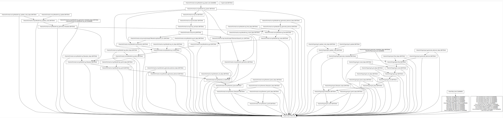
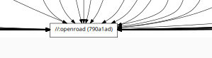

# Bazel targets

Bazel is a cross compilation system where `cfg=exec` is host and `cfg=target` is the microcontroller in a host compiler targeting a microcontroller scenario. Although there is no clear host and target scenario for OpenROAD, it is all host, the host/target concetps of Bazel brings some [surprises](https://en.wikipedia.org/wiki/Principle_of_least_astonishment) now and then when working with OpenROAD.

## What is host and what is target in an OpenROAD context?

`cfg=exec` is reserved for tools that run during the build: swig, bison,
the Tcl encoders, the man page generator. Everything that *is* OpenROAD,
including the binary the tests run, is `cfg=target`.

So these share one build of OpenROAD:

    bazelisk build :openroad
    bazelisk test src/...

## Visualizing configurations and dependencies

This command will visualize the dependencies on `:openroad`:

    bazelisk cquery -c opt --output=graph 'allpaths(//..., //:openroad)' | xdot /dev/stdin

To list configurations, noting `cfg=exec` are denoted with `(exec)`:

    $ bazelisk config
    Available configurations:
    0f80209fc7e3c0c40539... k8-opt-exec-ST-6f5a6fb95be7 (exec)
    3a4b806bae496300ade4... k8-opt
    790a1ad93f643dd7c565... k8-opt-exec-ST-d57f47055a04 (exec)
    8472fe4754a50f76910e... k8-opt
    f37096aa0a6acd138bec... fastbuild-noconfig