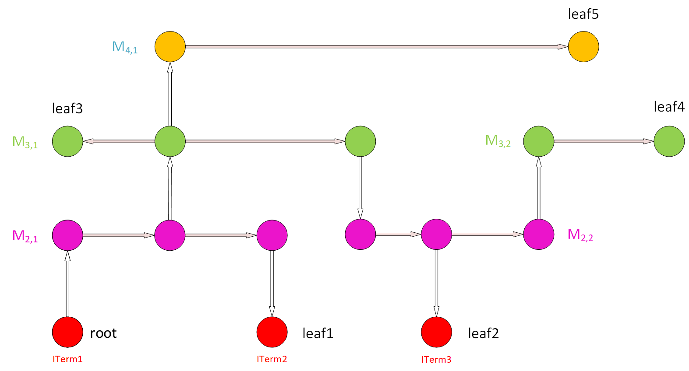
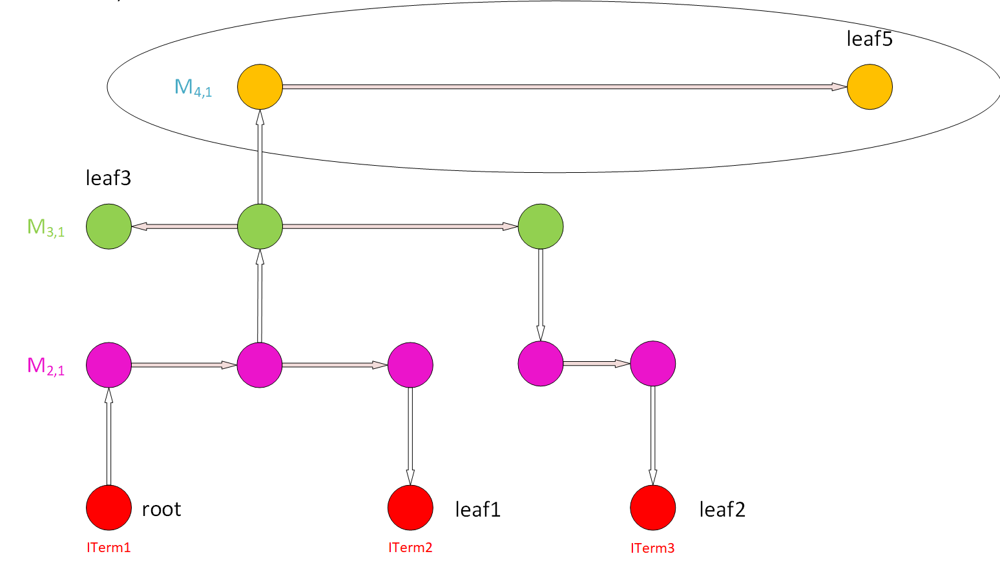

# Antenna Rule Checker

This tool checks antenna violations based on an input LEF and DEF file loaded in opendb, a report
will be generated to indicate violated nets. APIs are provided to help fix antenna violation during the diode insertion flow in globalroute:

## Antenna Check Commands

---

 - `load_antenna_rules`: import antenna rules to ARC, must be called before other commands
 - `check_antennas`: check antenna violations on all nets and generate a report
   - -report_filename: specify the file name path where to save the report
   - -simple_report: provides a summary of the violated nets 

## Antenna Report Example
---

This is an example of the detailed and simple reports of the antenna checker:

|  |  
|:--:|

Abbreviations Index:
  - `PAR`: Partial Area Ratio
  - `CAR`: Cumulative Area Ratio
  - `Area`: Gate Area
  - `S. Area`: Side Diffusion Area
  - `C. Area`: Cumulative Gate Area
  - `C. S. Area`: Cumulative Side (Diffusion) Area

### Commands

 - `check_net_violation`: check if an input net is violated, return 1 if the net is violated
   - -net_name: set the net name for checking
 - `find_max_wire_length`: print the longest wire in the design

|  |  | 
|:--:|:--:|
|  |  | 
|  |  | 
|  |  | 
|  |  

