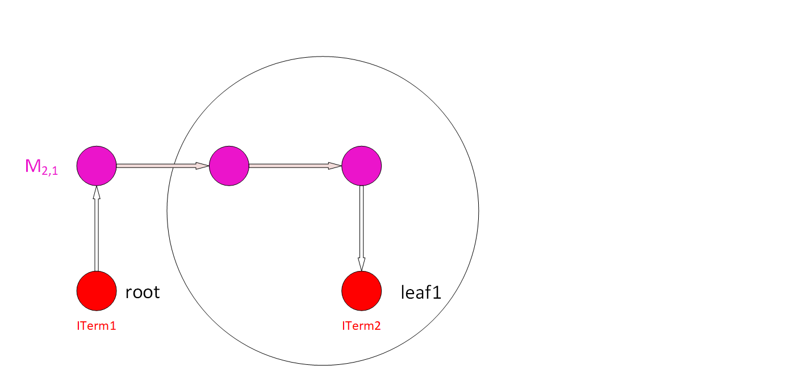
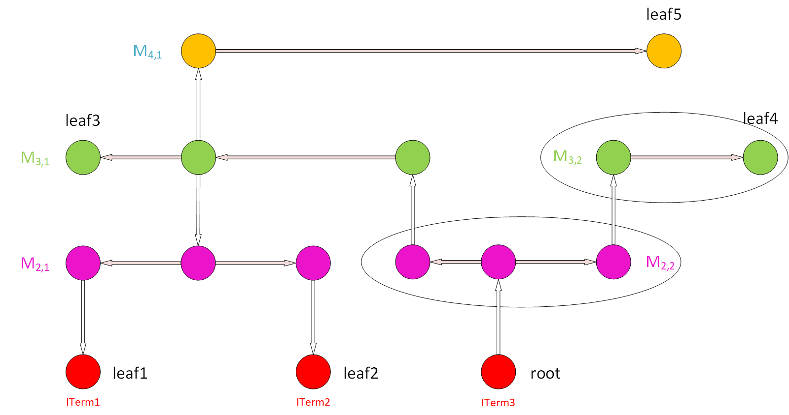

# Antenna Rule Checker

This tool checks antenna violations of a design in OpenDB, a report
will be generated to indicate violated nets. APIs are provided to help fix antenna violation during the diode insertion flow in global route:

## Antenna Check Commands

- `check_antennas`: check antenna violations on all nets and generate a report
- -report_filename: specify the file name path where to save the report
- -report_violating_nets: provides a summary of the violated nets

## Antenna Report Example

This is an example of the detailed and simple reports of the antenna checker:

```{image} ./doc/images/ant_report_print.png
:alt: Antenna checker report
:class: bg-primary
:width: 500px
:align: center
```
Abbreviations Index:
  - `PAR`: Partial Area Ratio
  - `CAR`: Cumulative Area Ratio
  - `Area`: Gate Area
  - `S. Area`: Side Diffusion Area
  - `C. Area`: Cumulative Gate Area
  - `C. S. Area`: Cumulative Side (Diffusion) Area


|  |  |
|:--:|:--:|
| *Antenna Checker Algorithm: #WireGraph Example* | *Step 1: #Start from the root node (ITerm) using upper Via to find a node for a new wire. #Save the ITerm area for cumulative gate/diffusion area* |
|  |  |
| *Step 2: #From the node of the wire, find all the nodes in the wire through segment wires and find the "root" node of this wire* | *Step 3: #From the "root" node of the wire, along the out segment edge that goes to other nodes belong to this wire, calculate the area of this wire. #Then, find all the ITerms below these nodes, except the root node (directly an ITerm or lower Vias to find ITerms for lower metals). # Finally, sum-up the areas of all the ITerms found with the cumulative areas and calculate the PAR of this wire. #Add the PAR value and the wire info (layer, Index) into the PAR table. Add the new area to the cumulative areas.* |
|  |  |
| *Step 4: #Find all the upper Vias on this wire (for all the nodes on this wire), go to the higher level metal.* | *Step 5: #Repeat Step 2 and 3 for new found upper level wires.* |
|  |  |
| *Step 6: #Repeat Step 4 and 5 until we reach a wire that cannot have upper Vias for its nodes (highest level metal)* | *Step 7: #Pick up another ITerm as a root node and repeat Step 1 to 6, skip the wires already in the PAR table. And repeat this for all the ITerms to get a whole PAR table.* |
|  |
| *Step 8: #Pick-up a gate ITerm and a node of a wire (e.g. M4,1). Find possible paths that connects them, look-up the PAR value of the wires along these paths and add them up to get the CAR of the (gate, wire) pair. #Compare to the AntennaRule to see if the CAR violate the rules. #Check for all (gate, wire) pairs* |
