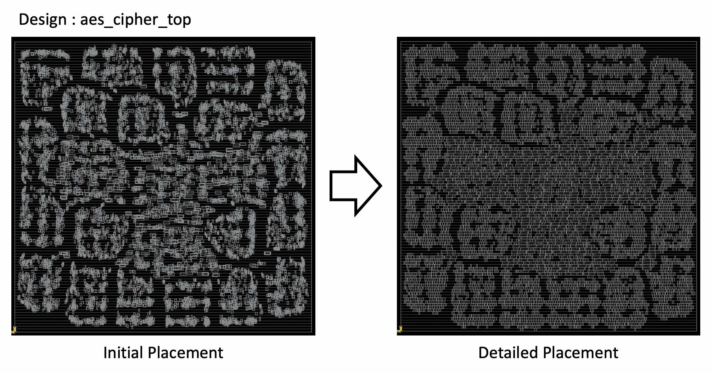

# OpenDP

OpenDP: Open-Source Detailed Placement Engine

|  |
|:--:|
| Visualized detailed placement result using `aes_cipher_top` design with Innovus initial placement; doc/OpenDP.jpg |

Features:

-   Fence region and multi-height cells. (ICCAD 2017 Contest benchmarks)
-   Fragmented ROWs.
-   Macro blocks.

## Commands

The `detailed_placement` command performs detailed placement of instances
to legal locations after global placement.

```
set_placement_padding -global|-instances insts|-masters masters
                      [-left pad_left] [-right pad_right]
detailed_placement [-max_displacement disp|{disp_x disp_y}]
check_placement [-verbose]
filler_placement [-prefix prefix] filler_masters
optimize_mirroring
```

The `set_placement_padding` command sets left and right padding in multiples
of the row site width. Use the `set_placement_padding` command before
legalizing placement to leave room for routing. Use the `-global` flag
for padding that applies to all instances. Use  `-instances`
for instance-specific padding.  The instances `insts` can be a list of instance
names, or an instance object returned by the SDC `get_cells` command. To
specify padding for all instances of a common master, use the `-filter`
"ref_name == <name>" option to `get_cells`.

The `set_power_net` command is used to set the power and ground special
net names. The defaults are `VDD` and `VSS`.

The `-max_displacement` argument to `detailed_placement` specifies how
far an instance can be moved when finding a site where it can be placed. The default values are
`{500 100}` sites. The x/y displacement arguments are in microns.

The `check_placement` command checks the placement legality. It returns
`0` if the placement is legal.

The `filler_placement` command fills gaps between detail-placed instances
to connect the power and ground rails in the rows. `filler_masters` is a
list of master/macro names to use for filling the gaps. Wildcard matching
is supported, so `FILL*` will match, e.g., `FILLCELL_X1 FILLCELL_X16 FILLCELL_X2
FILLCELL_X32 FILLCELL_X4 FILLCELL_X8`.  To specify a different naming prefix
from `FILLER_` use `-prefix <new prefix>`.

The `optimize_mirroring` command mirrors instances about the Y axis in
a weak attempt to reduce total wirelength (HPWL).

## Example scripts

## Regression tests

## Limitations

## FAQs

Check out [GitHub discussion](https://github.com/The-OpenROAD-Project/OpenROAD/discussions/categories/q-a?discussions_q=category%3AQ%26A+opendp+in%3Atitle)
about this tool.

## Authors

-   SangGi Do and Mingyu Woo (respective Ph. D. advisors: Seokhyeong Kang,
    Andrew B. Kahng).
-   Rewrite and port to OpenDB/OpenROAD by James Cherry, Parallax Software
-   Paper reference: S. Do, M. Woo and S. Kang, "Fence-Region-Aware
    Mixed-Height Standard Cell Legalization", Proc. Great Lakes Symposium on VLSI,
    2019, pp. 259-262. [(link)](https://dl.acm.org/doi/10.1145/3299874.3318012)

## License

BSD 3-Clause License. See [LICENSE](LICENSE) file.
