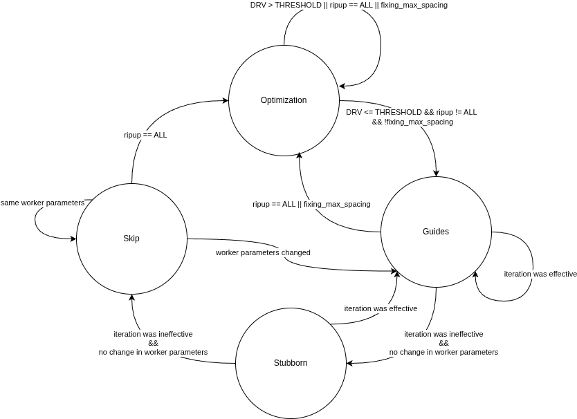

# Detailed Router (DR) State Machine

## Overview

This document describes the state machine that controls the detailed routing flow in TritonRoute. The state machine manages the iterative routing process, dynamically switching between different optimization strategies based on the current design rule violations (DRVs) and the effectiveness of recent iterations.



## Configuration

**THRESHOLD** = 100 (DRV threshold for switching between Optimization and Guides states)

## State Machine Architecture

The detailed router uses a four-state machine to manage the routing optimization process. Each state represents a different routing strategy, and transitions between states are triggered by specific conditions related to routing quality, iteration effectiveness, and worker parameter changes.

## States

### 1. Optimization State

**Purpose**: Aggressive optimization mode for designs with high DRV counts or requiring comprehensive rerouting.

**Characteristics**:
- Focuses on reducing design rule violations through intensive optimization
- Handles cases requiring complete ripup and reroute (`ripup == ALL`)
- Addresses spacing violations that need special handling (`fixing_max_spacing`)

### 2. Guides State

**Purpose**: Targeted violation resolution using guide-based worker boundaries to address track assignment and boundary pin issues.

**Characteristics**:
- Creates worker boundaries based on the guides covering the violations
- Uses long thin workers (unlike the typical cubic workers) that follow the guide geometry
- Specifically designed to resolve violations caused by:
  - Bad track assignment solutions
  - Boundary pin involvement
- Provides focused rerouting in problematic regions identified by the routing guides

### 3. Stubborn State

**Purpose**: Persistent routing mode for difficult-to-route regions that require repeated attempts.

**Characteristics**:
- Continues routing attempts on challenging areas
- Uses more aggressive rerouting strategies
- Helps break deadlocks in routing convergence

### 4. Skip State

**Purpose**: Temporary bypass mode that skips certain routing operations when worker parameters remain unchanged and no progress is expected.

**Characteristics**:
- Avoids redundant routing attempts
- Waits for meaningful changes before resuming active routing
- Improves overall routing efficiency by skipping futile iterations

## Key Decision Variables

### Design Rule Violations (DRV)
- **DRV > THRESHOLD**: High violation count, requires aggressive optimization
- **DRV <= THRESHOLD**: Lower violation count, allows standard guide-based routing

### Ripup Strategy
- **`ripup == ALL`**: Complete ripup and reroute mode
- **`ripup != ALL`**: Incremental ripup mode

### Iteration Effectiveness
- **Effective iteration**: Routing improved (e.g., DRV count decreased)
- **Ineffective iteration**: No routing improvement observed

### Worker Parameters
- Worker parameters control routing behavior (e.g., cost functions, search parameters)
- Changes in worker parameters may unlock new routing solutions
- Unchanged parameters suggest no new solutions available

### Fixing Max Spacing
- Special mode for handling maximum spacing violations
- Requires specific optimization strategies

## State Machine Flow

### Typical Convergence Path

1. **Initial Phase** (High DRV):
   ```
   Optimization (DRV reduction) → Optimization → ... → Optimization
   ```

2. **Mid-convergence** (DRV decreasing):
   ```
   Optimization → Guides (effective iterations) → Guides → Guides
   ```

3. **Fine-tuning** (Low DRV, some stubborn violations):
   ```
   Guides → Stubborn (difficult regions) → Guides
   ```

4. **Deadlock handling** (No progress):
   ```
   Stubborn → Skip (waiting for parameter changes)
   Skip → Guides (parameter change triggers retry)
   ```

5. **Escalation** (Aggressive ripup is required):
   ```
   Guides → Optimization (ripup all triggered)
   ```

### Key Code Locations

- State machine implementation: `src/drt/src/dr/FlexDRFlow.cpp`
