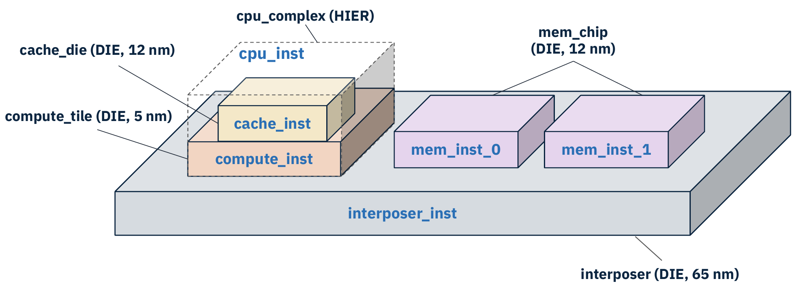
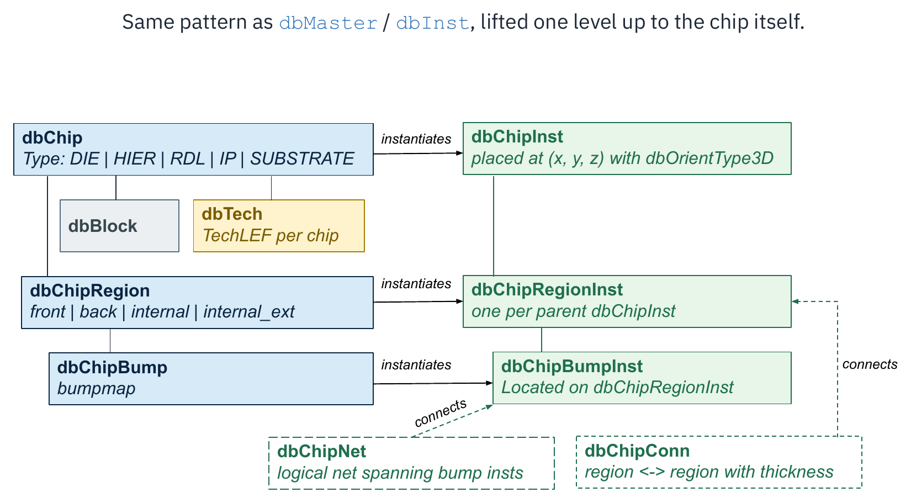
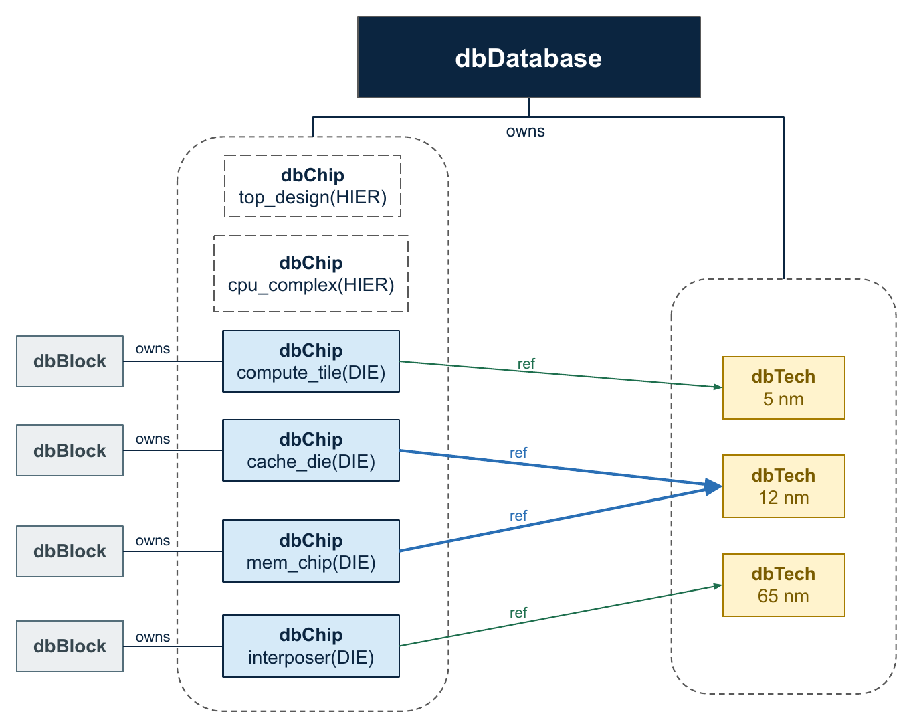
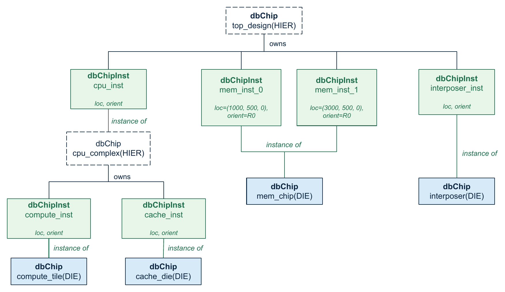
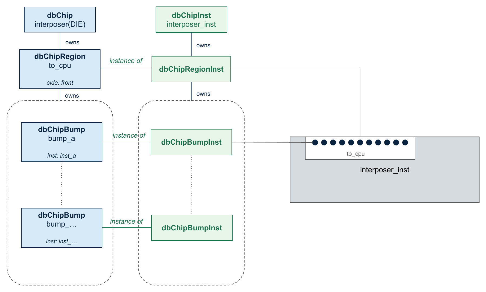
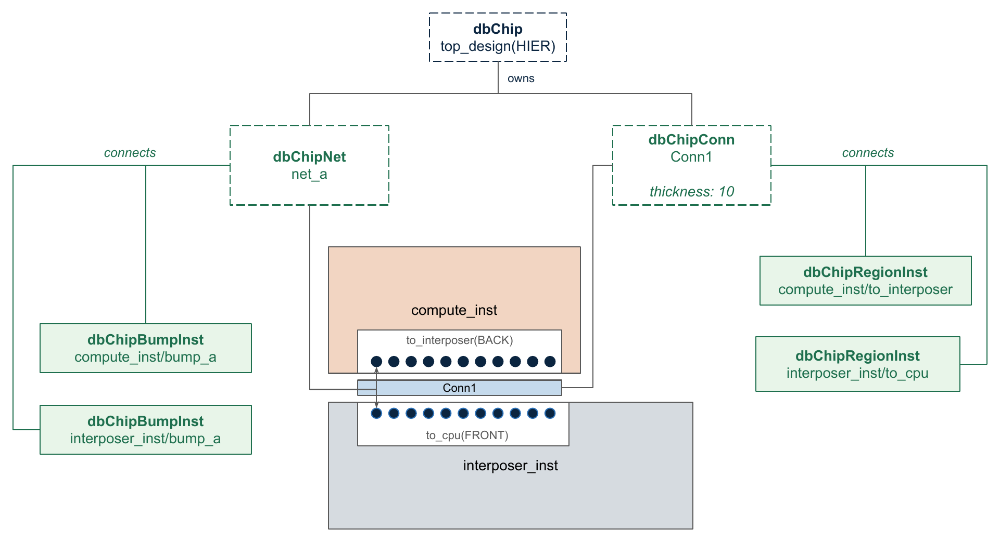
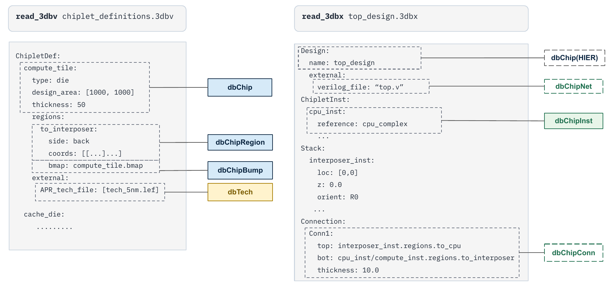
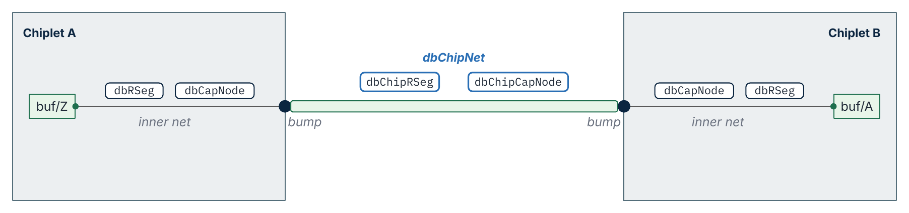

# 3D-IC Support in OpenROAD ODB

3D-IC and chiplet-based designs need a first-class data model, not an
afterthought bolted onto a 2D flow. In such designs, one design is
composed of multiple dies, potentially fabricated in multiple process
nodes, bonded together into a stack. ODB models this end to end: the
chip hierarchy, the bonding interfaces, the cross-chip connectivity,
and everything persists to the `.odb` file alongside the familiar 2D
data model.

This document describes that data model: the classes, how they relate
to each other and to the classic single-die ODB classes, and how the
database is populated from 3DBlox files.

---

## Running example

The sections below use a single example throughout: a small system on
an interposer.



The system consists of:

- `interposer`, a 65 nm die that everything else sits on, instantiated
  as `interposer_inst`.
- `mem_chip`, a 12 nm memory die, instantiated twice as `mem_inst_0`
  and `mem_inst_1`.
- `cpu_complex`, a hierarchical grouping (it has no layout of its own)
  that stacks `cache_die` (12 nm) on top of `compute_tile` (5 nm). It
  is instantiated once as `cpu_inst`.
- `top_design`, the hierarchical top that instantiates `cpu_inst`,
  `mem_inst_0`, `mem_inst_1`, and `interposer_inst`.

Note the two key modeling requirements this example exercises: the
same die (`mem_chip`) is instantiated more than once, and chips from
different process nodes coexist in one design.

---

## The core pattern: chip masters and chip instances

ODB already separates the definition of a cell (`dbMaster`) from its
placements (`dbInst`). The 3D-IC model applies the same pattern one
level up, to the chip itself.



Every "master" class on the definition side has an "instance"
counterpart on the composition side:

| Definition (per chip type) | Instance (per placement) |
|---|---|
| `dbChip` | `dbChipInst` |
| `dbChipRegion` | `dbChipRegionInst` |
| `dbChipBump` | `dbChipBumpInst` |

Two more classes describe how instances relate to each other:
`dbChipConn` (physical bonding between two region instances) and
`dbChipNet` (logical connectivity between bump instances).

---

## Chip definitions: `dbChip`

A `dbChip` is the master definition of one chip type. Chips are owned
by `dbDatabase` and created with:

```cpp
dbChip* chip = dbChip::create(db, tech, "compute_tile",
                              dbChip::ChipType::DIE);
```

The chip type is one of:

| Type | Meaning |
|---|---|
| `DIE` | a regular die with its own layout |
| `RDL` | a redistribution layer |
| `IP` | a hard IP |
| `SUBSTRATE` | a package substrate |
| `HIER` | a pure grouping of other chips, with no layout of its own |

A `dbChip` carries the intrinsic physical properties of the chip type:
its dimensions (`width`, `height`, `thickness`, `offset`, available
together as a `Cuboid` via `getCuboid()`), an optional `shrink`
factor, per-side seal-ring and scribe-line widths, and a `tsv` flag
indicating the presence of through-silicon vias.

Two references tie a chip into the rest of the database:

- **`getBlock()`** returns the chip's top `dbBlock`, the ordinary 2D
  layout (instances, nets, routing) of that die. `HIER` chips have no
  block.
- **`getTech()`** returns the chip's `dbTech`. Each chip references
  its own technology, which is what allows mixing process nodes in one
  design.

In the running example, the database owns four `DIE` chips, each with
its own block, referencing three different techs, plus two `HIER`
chips that only exist to group and place other chips:



---

## Chip composition: `dbChipInst`

A `dbChipInst` places one chip inside another. It is created with a
parent chip (the container, typically a `HIER` chip), a master chip
(what is being placed), and a name:

```cpp
dbChipInst* inst = dbChipInst::create(top_design, mem_chip, "mem_inst_0");
inst->setLoc(Point3D(1000, 500, 0));
inst->setOrient(dbOrientType3D("R0"));
```

The placement is a full 3D transform: a `Point3D` location and a
`dbOrientType3D` orientation, which combines a standard 2D orientation
(`R0`, `R90`, `MX`, ...) with an optional Z-axis mirror for flipped
dies. `getTransform()` returns the resulting `dbTransform` and
`getCuboid()` the placed bounding volume.

Chip instances form a tree. The root of the tree is the top chip,
registered on the database with `dbDatabase::setTopChip()` and
retrieved with `dbDatabase::getChip()`. For the running example:



Because `mem_inst_0` and `mem_inst_1` are two instances of the same
`mem_chip` master, the memory die's layout exists once but is placed
twice, exactly like a `dbMaster` placed by two `dbInst`s.

---

## Bonding interfaces: regions and bumps

### `dbChipRegion`

A `dbChipRegion` defines an area on a chip's surface where that chip
mates with another chip. A region has a name, a rectangular footprint
(`getBox()`), an optional `dbTechLayer` identifying the mating layer,
and a side:

| Side | Meaning |
|---|---|
| `FRONT` | on the front (BEOL) surface of the die |
| `BACK` | on the back surface of the die |
| `INTERNAL` | inside the die |
| `INTERNAL_EXT` | inside the die, but connectable from outside |

### `dbChipBump`

A `dbChipBump` defines one bump inside a region. Rather than
introducing a new geometric primitive, a bump wraps a `dbInst` placed
in the chip's block; the bump cell is a real placed instance with a
master, pins, and physical geometry:

```cpp
dbChipBump* bump = dbChipBump::create(region, bump_inst);
bump->setNet(internal_net);   // the dbNet it terminates inside the die
bump->setBTerm(bterm);        // the boundary terminal it exposes
```

This is the bridge between the chip-level model and the classic
block-level model: `getInst()`, `getNet()`, and `getBTerm()` all
return ordinary block-level objects.

### Region and bump instances

When a `dbChipInst` is created, ODB automatically creates one
`dbChipRegionInst` for every region of the master, and one
`dbChipBumpInst` for every bump of every region. No explicit creation
is needed or possible.



This second layer of instances is what gives every physical bump in
the system a distinct identity: `mem_inst_0` and `mem_inst_1` share
one set of `dbChipBump` definitions, but each has its own
`dbChipBumpInst`s at its own location in space.

---

## Inter-chip connectivity: `dbChipConn` and `dbChipNet`



### `dbChipConn`

A `dbChipConn` asserts that two region instances are physically bonded
face to face. It is owned by the parent chip in whose scope the
connection is made, and identifies each side by a `dbChipRegionInst`
plus the path of `dbChipInst`s leading to it:

```cpp
dbChipConn* conn = dbChipConn::create(
    "Conn1", top_design,
    {interposer_inst}, interposer_to_cpu_region,          // top side
    {cpu_inst, compute_inst}, compute_to_interposer_region,  // bottom side
    );
conn->setThickness(10);
```

The path is required because a region instance alone is ambiguous: the
same `dbChipRegionInst` object of `mem_chip` exists under both
`mem_inst_0` and `mem_inst_1` only in the sense that each memory
instance has its own, but a connection made two or more levels above
the region must spell out which chain of instances it descends
through. The `thickness` is the physical gap between the two mating
surfaces (the bonding layer).

### `dbChipNet`

A `dbChipNet` is the logical counterpart: a net that connects bump
instances across chips, owned by a parent chip. Like connections, it
identifies each bump by a `(path, dbChipBumpInst)` pair:

```cpp
dbChipNet* net = dbChipNet::create(top_design, "net_a");
net->addBumpInst(compute_bump_a, {cpu_inst, compute_inst});
net->addBumpInst(interposer_bump_a, {interposer_inst});
```

`dbChipNet` is to bump instances what `dbNet` is to `dbITerm`s, one
hierarchy level up. Inside each die the signal continues as an
ordinary `dbNet`, reachable through the bump's `getNet()`.

### `dbChipPath`

A `dbChipPath` names an ordered set of regions that a signal path is
expected to traverse. Each entry is a `(chip-inst path, region
instance)` pair with a `negated` flag; a negated entry means the path
must be connected without crossing that region. These are consumed by
the connectivity checks.

---

## The unfolded view

The chip-instance tree is compact (each master exists once) but many
consumers want the opposite: a flat list of every physical die in the
system with its absolute position. Region- and bump-level analyses
(alignment checks, the 3D viewer, future cross-chip timing) need this
constantly.

`dbDatabase::constructUnfoldedModel()` builds this derived view. It
walks the tree from the top chip, accumulates transforms through every
level, and produces one *unfolded* object per physical occurrence:

| Class | One per | Key accessors |
|---|---|---|
| `dbUnfoldedChipInst` | leaf chip occurrence | `getChipInstPath()`, `getTransform()`, `getCuboid()` |
| `dbUnfoldedChipRegionInst` | region occurrence | `getEffectiveSide()`, `getSurfaceZ()`, `getCuboid()` |
| `dbUnfoldedChipBumpInst` | bump occurrence | `getGlobalPosition()` |
| `dbUnfoldedChipConn` | resolved connection | `getTopRegion()`, `getBottomRegion()` |
| `dbUnfoldedChipNet` | materialized net | `getConnectedBumps()` |

For the running example, `dbDatabase::getUnfoldedChipInsts()` yields
five leaves:

```text
path: top_design / cpu_inst / compute_inst   master: compute_tile   world: loc=(0, 0, 100)     orient=R0
path: top_design / cpu_inst / cache_inst     master: cache_die      world: loc=(0, 0, 150)     orient=R0
path: top_design / mem_inst_0                master: mem_chip       world: loc=(2000, 500, 100) orient=R0
path: top_design / mem_inst_1                master: mem_chip       world: loc=(4000, 500, 100) orient=R0
path: top_design / interposer_inst           master: interposer     world: loc=(0, 0, 0)       orient=R0
```

Note two things: the `HIER` chip `cpu_complex` has disappeared except
as a path segment (hierarchy is flattened away), and the two memory
instances appear as two separate leaves with different world
transforms even though they share a master.

Each unfolded object keeps a pointer back to its folded source
(`getChipBumpInst()`, `getChipRegionInst()`, ...), so analyses can
cross back into the folded model at any time.

Two properties worth remembering:

- The unfolded view resolves orientation effects. For instance, a
  region defined as `FRONT` on a die that is placed flipped reports
  `getEffectiveSide() == BOTTOM` in world space.
- The view is derived, never edited, and never serialized. It is
  rebuilt from the folded model on demand.

---

## 3DBlox: populating the database

The primary way the 3D model gets populated is by reading 3DBlox
files, an open standard for describing chiplet systems. Two file kinds
matter:

- **`.3dbv`** (definitions): declares chiplet types, their dimensions,
  regions, bump maps (`.bmap` files), and technology files.
- **`.3dbx`** (design): declares the design top, chiplet instances,
  the stack (locations, z, orientations), connections, and an external
  Verilog netlist for system-level connectivity.

The mapping to ODB objects is direct:



| 3DBlox construct | ODB object |
|---|---|
| `ChipletDef` (`.3dbv`) | `dbChip` + its `dbBlock` |
| `regions:` on a def | `dbChipRegion` |
| `bmap:` file | `dbChipBump` per bump cell |
| `APR_tech_file:` | `dbTech` |
| `Design:` (`.3dbx`) | top-level `HIER` `dbChip` |
| `ChipletInst:` | `dbChipInst` |
| `Stack:` entries | `dbChipInst` location and orientation |
| `Connection:` | `dbChipConn` |
| external Verilog netlist | `dbChipNet`s |

The Tcl commands:

| Command | Purpose |
|---|---|
| `read_3dbv <file>` | read chiplet definitions |
| `read_3dbx <file>` | read the design and stack |
| `read_3dblox_bmap <file>` | read a standalone bump map |
| `write_3dbv <file>` / `write_3dbx <file>` | write the model back out |
| `check_3dblox` | run the 3D design checks |
| `add_3dblox_alignment_marker_rule` | declare an alignment-marker rule |

The implementation lives in `src/odb/src/3dblox/` (`ThreeDBlox` is the
entry point; per-format parsers and writers sit next to it).

Reading 3DBlox is not required: the same model can be built directly
through the C++ or Python/Tcl APIs shown in the earlier sections, and
whatever the source, the model persists through the standard
`.odb` write and read paths. Only the unfolded view is skipped and
rebuilt after load.

---

## Design checks

`check_3dblox` runs the 3D linter (`Checker` in
`src/odb/src/3dblox/checker.h`) over the unfolded model. Current
checks include:

- logical connectivity (chip paths are honored)
- floating chips (every chip is connected to the stack)
- overlapping chips
- `INTERNAL_EXT` region usage
- connection regions (bonded regions actually face each other and
  overlap)
- bump physical alignment (bumps of bonded regions line up within
  tolerance)
- net connectivity
- alignment markers

Alignment-marker rules are `dbAlignmentMarkerRule` objects on the
database: given two cell masters, wherever one appears in each of two
bonded chips, the pair must be within a tolerance distance and in one
of the allowed relative orientations.

Violations are reported as standard `dbMarker`s grouped under marker
categories, so they show up in the GUI like any DRC result.

---

## Planned: cross-chip timing

The next step is extending parasitics across the chip boundary, so
timing paths can traverse the stack. The intent is to mirror the
per-block extraction model (`dbRSeg` / `dbCapNode` on a `dbNet`) at
the chip level: `dbChipRSeg` / `dbChipCapNode` on a `dbChipNet`,
stitched to the inner nets at the bumps.



These classes are not in the database yet; this section describes
direction, not shipped functionality.

---

## Source map

| What | Where |
|---|---|
| Public API | `src/odb/include/odb/db.h` (`dbChip*`, `dbUnfoldedChip*` classes) |
| Implementation | `src/odb/src/db/dbChip*.{h,cpp}`, `dbUnfoldedChip*.{h,cpp}` |
| Unfolded builder | `src/odb/src/db/dbUnfoldedBuilder.{h,cpp}` |
| Schema definitions | `src/odb/src/codeGenerator/schema/chip/*.json` |
| 3DBlox parsers/writers | `src/odb/src/3dblox/` |
| 3D checks | `src/odb/src/3dblox/checker.{h,cpp}` |
| Tcl commands | `src/OpenRoad.tcl` (`read_3dbv`, `read_3dbx`, `check_3dblox`, ...) |
| Tests | `src/odb/test/` (`check_3dblox.tcl`, ...) |
