# DEF Grammar Railroad Diagrams

The DEF (Design Exchange Format) grammar defines the syntax for the
design description files read and written by OpenROAD's ODB module.  The grammar is
implemented as a Bison parser in
[`src/odb/src/def/def/def.y`](../src/def/def/def.y).

Railroad diagrams (also called syntax diagrams) give an at-a-glance visual
summary of each grammar rule.  The SVGs below are generated directly from
`def.y` by [`generate_railroad_diagrams.py`](generate_railroad_diagrams.py)
and are regenerated automatically via CI whenever `def.y` changes.

## Contents

- [File structure](#file-structure)
- [Design Attributes](#design-attributes)
- [Properties](#properties)
- [Components](#components)
- [Nets](#nets)
- [Net Routing](#net-routing)
- [Net Subnets](#net-subnets)
- [Special Nets](#special-nets)
- [Pins](#pins)
- [Virtual Pins](#virtual-pins)
- [Pin Properties](#pin-properties)
- [Blockages](#blockages)
- [Regions](#regions)
- [Groups](#groups)
- [Via Definitions](#via-definitions)
- [Non-default Rules](#non-default-rules)
- [Fills](#fills)
- [Slots](#slots)
- [Styles](#styles)
- [IO Timing](#io-timing)
- [Scan Chains](#scan-chains)
- [Timing Disables](#timing-disables)
- [Partitions](#partitions)
- [Constraints](#constraints)
- [Assertions](#assertions)
- [Floorplan Constraints](#floorplan-constraints)
- [Extension](#extension)
- [Primitives](#primitives)

## File structure

### `def_file`

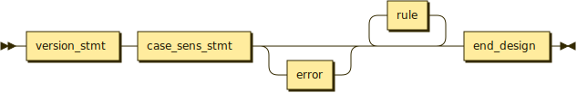

### `rule`

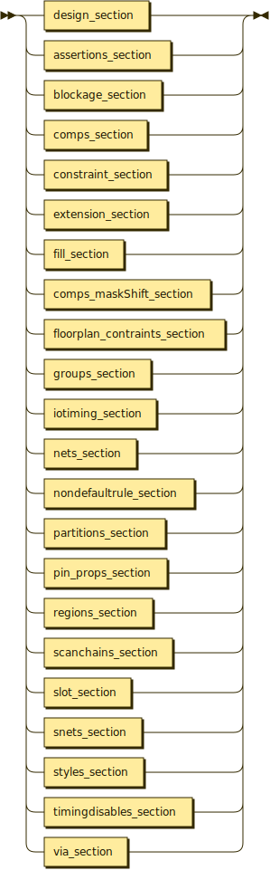

### `version_stmt`


### `case_sens_stmt`

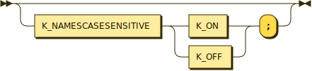

### `end_design`

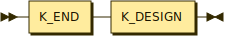

### `design_name`


### `tech_name`


### `history`

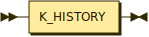

### `bus_bit_chars`


### `divider_char`


### `array_name`


### `floorplan_name`


## Design Attributes

### `design_section`

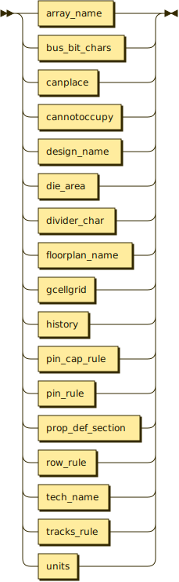

### `die_area`


### `units`


### `gcellgrid`


### `tracks_rule`


### `track_start`

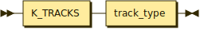

### `track_opts`

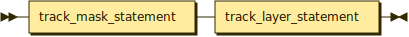

### `track_type`

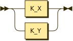

### `track_layer`

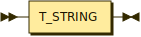

### `track_layer_statement`

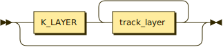

### `track_mask_statement`

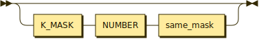

### `row_rule`

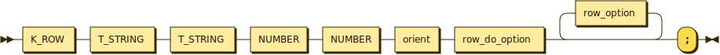

### `row_option`

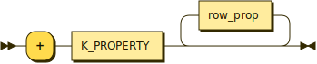

### `row_step_option`

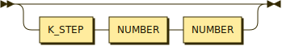

### `row_do_option`

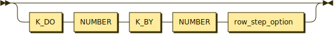

### `row_prop`


### `row_or_comp`

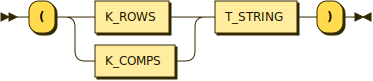

## Properties

### `prop_def_section`

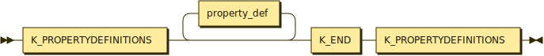

### `property_def`

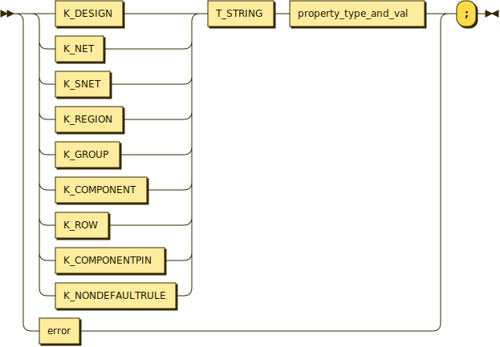

### `property_type_and_val`

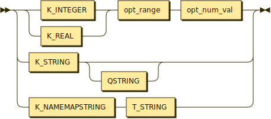

## Components

### `comps_section`

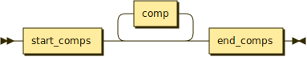

### `comps_maskShift_section`

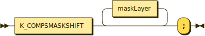

### `start_comps`


### `end_comps`

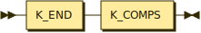

### `comp`

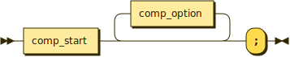

### `comp_start`

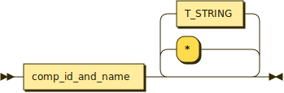

### `comp_id_and_name`

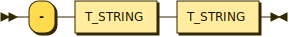

### `comp_name`


### `comp_option`

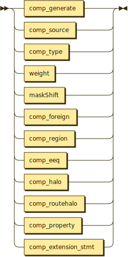

### `comp_type`

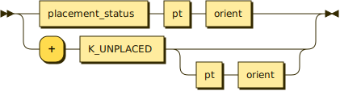

### `comp_source`

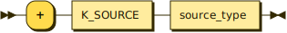

### `comp_eeq`

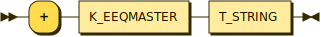

### `comp_foreign`

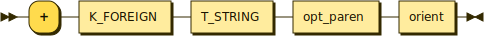

### `comp_generate`

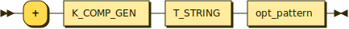

### `comp_halo`

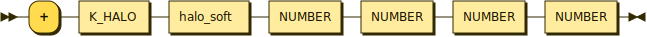

### `comp_routehalo`

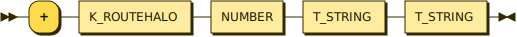

### `comp_region`

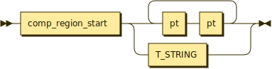

### `comp_region_start`

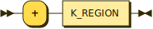

### `comp_extension_stmt`

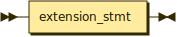

### `comp_prop`


### `comp_property`

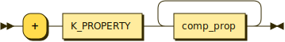

### `comp_blockage_rule`

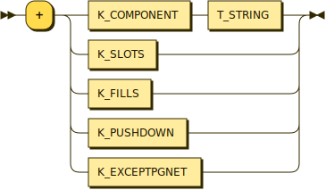

### `placement_comp_rule`

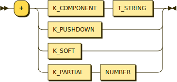

### `placement_status`

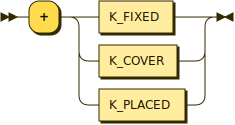

### `halo_soft`

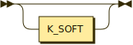

## Nets

### `nets_section`


### `start_nets`


### `end_nets`

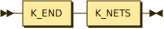

### `one_net`

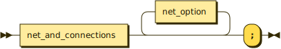

### `net_and_connections`

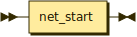

### `net_start`

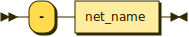

### `net_name`

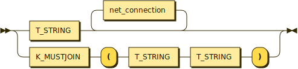

### `net_connection`

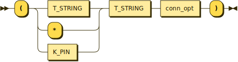

### `net_option`

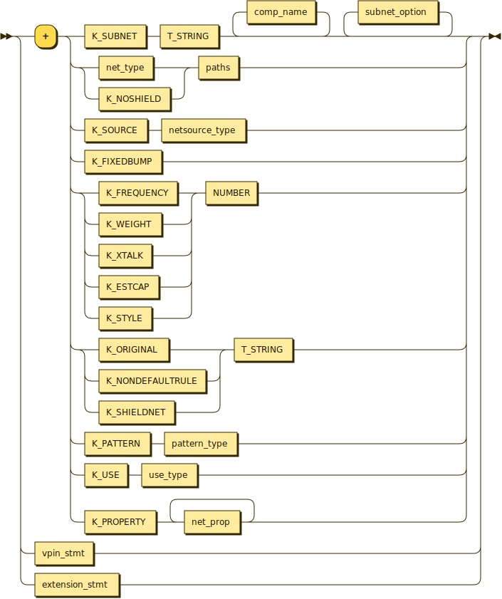

### `net_type`

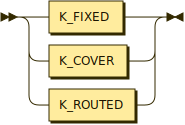

### `net_prop`


### `netsource_type`


### `conn_opt`


### `use_type`


### `source_type`


## Net Routing

### `paths`


### `path`


### `new_path`


### `path_item`


### `path_item_list`


### `path_pt`


### `opt_taper`


### `opt_taper_style`


### `opt_shape_style`


### `opt_style`


### `opt_pattern`


### `weight`


### `width`


### `shield_layer`


## Net Subnets

### `subnet_option`


### `subnet_type`


### `subnet_opt_syn`


### `opt_common_pins`


### `floating_pins`


### `ordered_pins`


### `one_floating_inst`


### `one_ordered_inst`


### `opt_pin`


## Special Nets

### `snets_section`


### `start_snets`


### `end_snets`


### `snet_rule`


### `snet_option`


### `snet_other_option`


### `snet_spacing`


### `snet_voltage`


### `snet_width`


### `snet_prop`


### `spaths`


### `spath`


### `snew_path`


### `geom_fill`


### `geom_slot`


## Pins

### `pin_rule`


### `start_pins`


### `end_pins`


### `pin_cap_rule`


### `pin_cap`


### `pin`


### `pin_option`


### `pin_layer_opt`


### `pin_layer_mask_opt`


### `pin_layer_spacing_opt`


### `pin_via_mask_opt`


### `pin_poly_mask_opt`


### `pin_poly_spacing_opt`


### `pin_oxide`


## Virtual Pins

### `vpin_stmt`


### `vpin_begin`


### `vpin_layer_opt`


### `vpin_options`


### `vpin_status`


## Pin Properties

### `pin_props_section`


### `begin_pin_props`


### `end_pin_props`


### `pin_prop_terminal`


### `pin_prop`


### `pin_prop_name_value`


## Blockages

### `blockage_section`


### `blockage_start`


### `blockage_end`


### `blockage_def`


### `blockage_rule`


### `layer_blockage_rule`


### `mask_blockage_rule`


### `comp_blockage_rule`


### `rectPoly_blockage`


### `rect_statement`


### `rect_pts`


## Regions

### `regions_section`


### `regions_start`


### `regions_stmt`


### `region_option`


### `region_type`


### `region_prop`


## Groups

### `groups_section`


### `groups_start`


### `groups_end`


### `start_group`


### `group_rule`


### `group_member`


### `group_option`


### `group_region`


### `group_soft_option`


### `group_prop`


## Via Definitions

### `via_section`


### `start_def_cap`


### `end_def_cap`


### `via`


### `via_declaration`


### `via_end`


### `layer_stmt`


### `layer_viarule_opts`


## Non-default Rules

### `nondefaultrule_section`


### `nondefault_start`


### `nondefault_end`


### `nondefault_def`


### `nondefault_option`


### `nondefault_layer_option`


### `nondefault_prop`


### `nondefault_prop_opt`


## Fills

### `fill_section`


### `fill_start`


### `fill_end`


### `fill_rule`


### `fill_def`


### `fill_layer_opc`


### `fill_mask`


### `fill_viaMask`


### `fill_via_opc`


### `fill_via_pt`


## Slots

### `slot_section`


### `slot_start`


### `slot_end`


### `slot_rule`


### `slot_def`


## Styles

### `styles_section`


### `styles_start`


### `styles_end`


### `styles_rule`


## IO Timing

### `iotiming_section`


### `start_iotiming`


### `iotiming_end`


### `iotiming_rule`


### `iotiming_member`


### `iotiming_frompin`


### `iotiming_parallel`


### `iotiming_drivecell_opt`


## Scan Chains

### `scanchains_section`


### `scanchain_start`


### `scanchain_end`


### `scan_rule`


### `scan_member`


### `td_macro_option`


## Timing Disables

### `timingdisables_section`


### `timingdisables_start`


### `timingdisables_end`


### `timingdisables_rule`


### `turnoff`


### `turnoff_hold`


### `turnoff_setup`


### `wiredlogic_rule`


## Partitions

### `partitions_section`


### `partitions_start`


### `partitions_end`


### `start_partition`


### `partition_rule`


### `partition_member`


### `partition_maxbits`


### `min_or_max_member`


### `minmaxpins`


## Constraints

### `constraint_section`


### `constraints_start`


### `constraints_end`


### `constraint_rules`


### `constraint_rule`


### `constraint_type`


### `constrain_what`


### `operand`


### `operand_rule`


### `delay_spec`


### `risefall`


### `risefallminmax1`


### `risefallminmax2`


## Assertions

### `assertions_section`


### `assertions_start`


### `assertions_end`


## Floorplan Constraints

### `floorplan_contraints_section`


### `fp_start`


### `fp_stmt`


### `canplace`


### `cannotoccupy`


## Extension

### `extension_section`


### `extension_stmt`


## Primitives

### `pt`


### `firstPt`


### `nextPt`


### `otherPts`


### `orient`


### `orient_pt`


### `virtual_pt`


### `virtual_statement`


### `opt_plus`


### `opt_semi`


### `opt_paren`


### `opt_num_val`


### `opt_range`


### `opt_snet_range`


### `h_or_v`


### `same_mask`


### `mask`


### `maskLayer`


### `maskShift`


### `opt_mask_opc`


### `opt_mask_opc_l`


### `pattern_type`


### `shape_type`


## Regenerating the diagrams

After editing `def.y`, re-run:

```shell
python3 src/odb/doc/generate_railroad_diagrams.py def
```

Java 11 or later must be on `PATH`.  The WAR tools are vendored in
`src/odb/doc/tools/` and are not downloaded at runtime.
