# LEF Grammar Railroad Diagrams

The LEF (Library Exchange Format) grammar defines the syntax for the
library description files read and written by OpenROAD's ODB module.  The grammar is
implemented as a Bison parser in
[`src/odb/src/lef/lef/lef.y`](../src/lef/lef/lef.y).

Railroad diagrams (also called syntax diagrams) give an at-a-glance visual
summary of each grammar rule.  The SVGs below are generated directly from
`lef.y` by [`generate_railroad_diagrams.py`](generate_railroad_diagrams.py)
and are regenerated automatically via CI whenever `lef.y` changes.

## Contents

- [File structure](#file-structure)
- [Units](#units)
- [Layers](#layers)
- [Vias](#vias)
- [Via Rules](#via-rules)
- [Spacing](#spacing)
- [Sites](#sites)
- [Macros](#macros)
- [Macro Pins](#macro-pins)
- [Non-default Rules](#non-default-rules)
- [Properties](#properties)
- [IRDrop](#irdrop)
- [Noise & Correction Tables](#noise-correction-tables)
- [Timing](#timing)
- [Arrays (Floorplan)](#arrays-floorplan)
- [Antenna Rules](#antenna-rules)
- [Dielectric & Minfeature](#dielectric-minfeature)
- [Primitives](#primitives)

## File structure

### `lef_file`

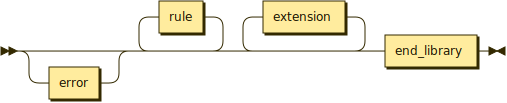

### `rule`

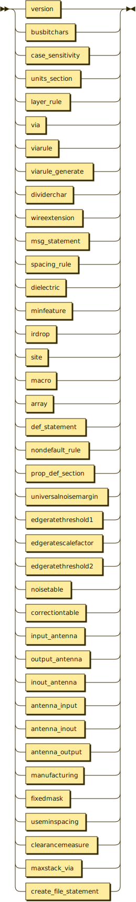

### `version`


### `end_library`


### `busbitchars`


### `dividerchar`


### `case_sensitivity`

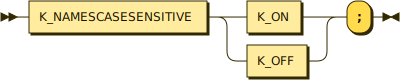

### `wireextension`

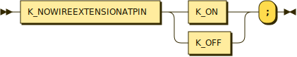

### `fixedmask`


### `manufacturing`


### `useminspacing`


### `clearancemeasure`


### `clearance_type`

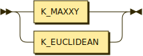

### `spacing_type`

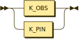

### `spacing_value`

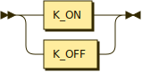

### `maxstack_via`

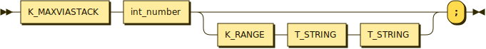

### `create_file_statement`


### `extension`


### `def_statement`

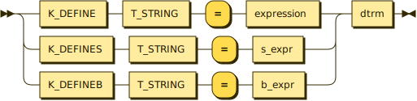

### `msg_statement`


## Units

### `units_section`

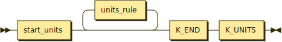

### `start_units`


### `units_rule`

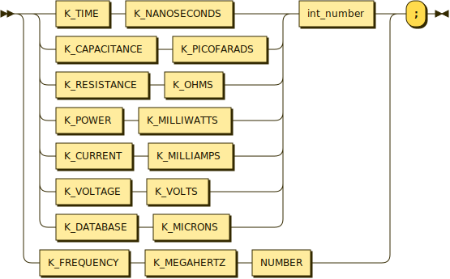

## Layers

### `layer_rule`

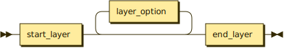

### `start_layer`


### `end_layer`


### `layer_option`

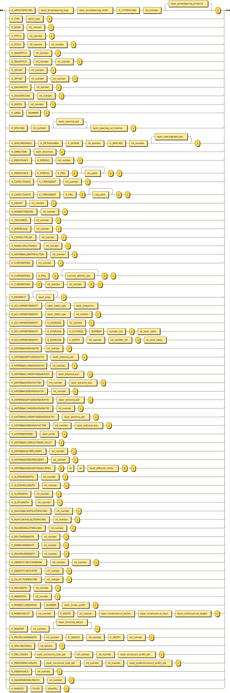

### `layer_type`

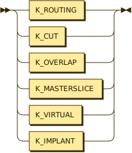

### `layer_direction`

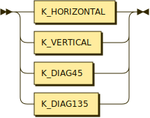

### `layer_name`


### `layer_prop`

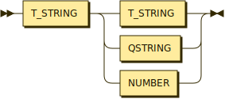

### `layer_spacing`

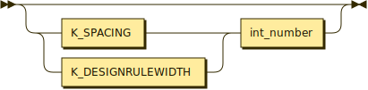

### `layer_spacing_cut_routing`

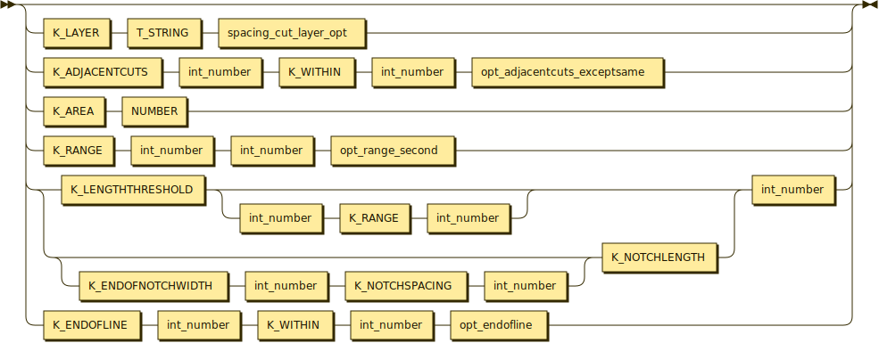

### `layer_spacing_opt`

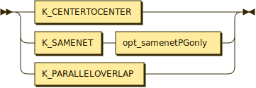

### `layer_spacingtable_opt`


### `layer_enclosure_type_opt`

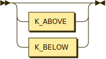

### `layer_enclosure_width_opt`

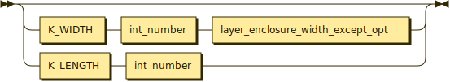

### `layer_enclosure_width_except_opt`


### `layer_preferenclosure_width_opt`


### `layer_minimumcut_within`


### `layer_minimumcut_from`

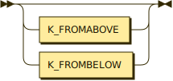

### `layer_minimumcut_length`


### `layer_minstep_option`

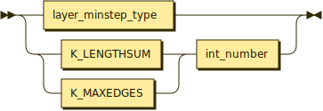

### `layer_minstep_type`

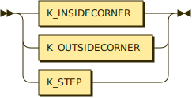

### `layer_minen_width`


### `layer_oxide`


### `layer_exceptpgnet`


### `layer_arraySpacing_long`


### `layer_arraySpacing_width`


### `layer_arraySpacing_arraycut`


### `layer_sp_parallel_width`


### `layer_sp_TwoWidth`


### `layer_sp_TwoWidthsPRL`


### `layer_sp_influence_width`


### `layer_antenna_duo`


### `layer_antenna_pwl`

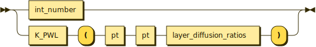

### `layer_diffusion_ratio`


### `layer_diffusion_ratios`

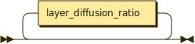

### `layer_table_type`

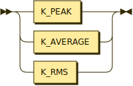

### `layer_frequency`


### `ac_layer_table_opt`

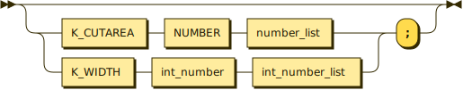

### `dc_layer_table`


### `sp_options`

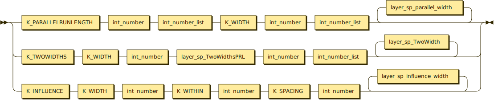

### `res_point`


### `cap_point`


### `current_density_pwl`


### `spacing_cut_layer_opt`


## Vias

### `via`


### `via_keyword`


### `start_via`

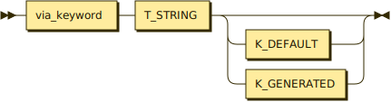

### `end_via`


### `via_option`

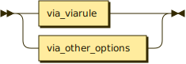

### `via_other_options`


### `via_other_option`

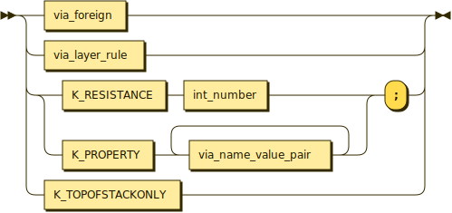

### `via_viarule`

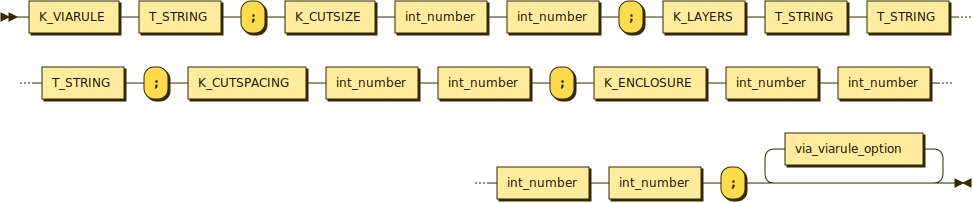

### `via_viarule_option`

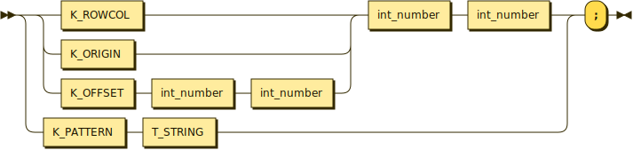

### `via_foreign`


### `start_foreign`


### `via_layer_rule`

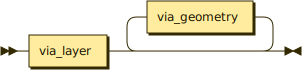

### `via_layer`


### `via_geometry`

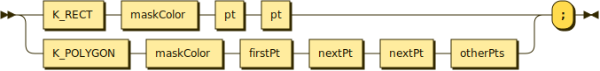

### `via_placement`

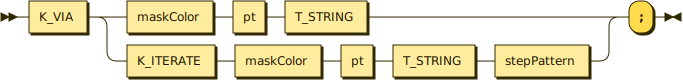

### `via_name`


### `via_name_value_pair`


## Via Rules

### `viarule`

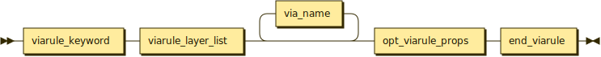

### `viarule_generate`


### `viarule_keyword`


### `viarule_generate_default`


### `viarule_layer_list`


### `viarule_layer`

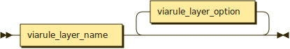

### `viarule_layer_name`


### `viarule_layer_option`

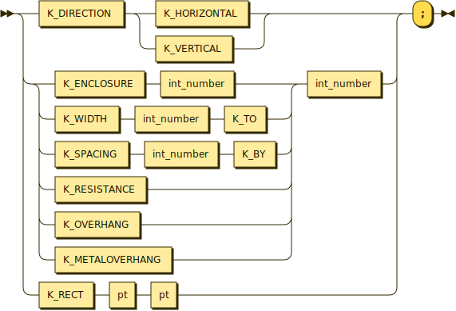

### `viarule_prop`

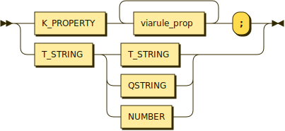

### `opt_viarule_props`

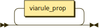

## Spacing

### `spacing_rule`

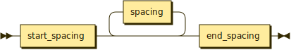

### `start_spacing`


### `end_spacing`


### `spacing`

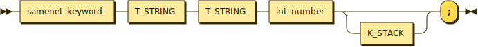

### `samenet_keyword`


### `opt_samenetPGonly`


### `opt_adjacentcuts_exceptsame`


### `opt_endofline`


### `opt_endofline_twoedges`


### `opt_range_second`

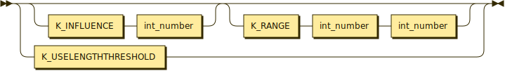

### `opt_def_value`


### `opt_def_range`


### `opt_def_dvalue`


## Sites

### `site`


### `start_site`


### `end_site`


### `site_option`

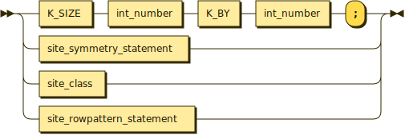

### `site_class`

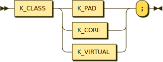

### `site_symmetry`


### `site_symmetry_statement`

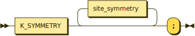

### `site_word`


### `site_rowpattern`


### `site_rowpattern_statement`

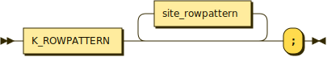

### `sitePattern`

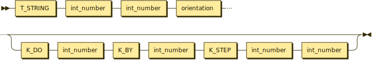

### `core_type`


### `pad_type`


### `endcap_type`


## Macros

### `macro`


### `start_macro`


### `end_macro`


### `macro_option`


### `macro_class`


### `macro_source`


### `macro_symmetry`


### `macro_symmetry_statement`


### `macro_size`


### `macro_origin`


### `macro_foreign`


### `macro_eeq`


### `macro_leq`


### `macro_generator`


### `macro_generate`


### `macro_clocktype`


### `macro_power`


### `macro_fixedMask`


### `macro_density`


### `density_layer`


### `density_layer_rect`


## Macro Pins

### `macro_pin`


### `start_macro_pin`


### `end_macro_pin`


### `macro_pin_option`


### `macro_pin_use`


### `macro_scan_use`


### `macro_port_class_option`


### `macro_site`


### `macro_site_word`


### `start_macro_port`


### `macro_obs`


### `start_macro_obs`


### `pin_shape`


### `pin_layer_oxide`


### `pin_name_value_pair`


### `geometries`


### `geometry`


### `maskColor`


## Non-default Rules

### `nondefault_rule`


### `end_nd_rule`


### `nd_hardspacing`


### `nd_rule`


### `nd_layer`


### `nd_layer_stmt`


### `nd_prop`


### `usevia`


### `useviarule`


### `mincuts`


## Properties

### `prop_def_section`


### `prop_define`


### `prop_stmt`


### `relop`


## IRDrop

### `irdrop`


### `start_irdrop`


### `end_irdrop`


### `ir_table`


### `ir_tablename`


### `ir_table_value`


## Noise & Correction Tables

### `noisetable`


### `end_noisetable`


### `noise_table_entry`


### `correctiontable`


### `end_correctiontable`


### `correction_table_item`


### `corr_victim`


### `victim`


### `universalnoisemargin`


### `edgeratethreshold1`


### `edgeratescalefactor`


### `edgeratethreshold2`


## Timing

### `timing`


### `start_timing`


### `end_timing`


### `timing_option`


### `slew_spec`


### `delay_or_transition`


### `risefall`


### `unateness`


### `electrical_direction`


### `one_pin_trigger`


### `two_pin_trigger`


### `from_pin_trigger`


### `to_pin_trigger`


### `table_entry`


### `output_list`


### `output_resistance_entry`


### `one_cap`


### `then`


### `else`


### `b_expr`


### `s_expr`


### `expression`


### `dtrm`


## Arrays (Floorplan)

### `array`


### `start_array`


### `end_array`


### `array_rule`


### `gcellPattern`


### `trackPattern`


### `sitePattern`


### `stepPattern`


### `floorplan_start`


### `floorplan_element`


## Antenna Rules

### `input_antenna`


### `output_antenna`


### `inout_antenna`


### `antenna_input`


### `antenna_inout`


### `antenna_output`


## Dielectric & Minfeature

### `dielectric`


### `minfeature`


## Primitives

### `pt`


### `firstPt`


### `nextPt`


### `otherPts`


### `orientation`


### `int_number`


### `int_number_list`


### `number_list`


### `opt_layer_name`


### `req_layer_name`


## Regenerating the diagrams

After editing `lef.y`, re-run:

```shell
python3 src/odb/doc/generate_railroad_diagrams.py lef
```

Java 11 or later must be on `PATH`.  The WAR tools are vendored in
`src/odb/doc/tools/` and are not downloaded at runtime.
