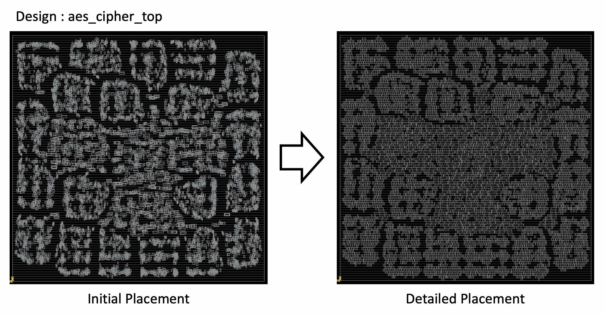

# OpenDP
*OpenDP: Open Source Detailed Placement Engine*

|  | 
|:--:| 
| *Visualized detailed placement result using aes_cipher_top design with innovus initial placement; OpenDP_sample.jpg* |

### Verified/supported Technologies
* TSMC 65 (GP/LP)
* ST FDSOI 28
* TSMC 16 (9T)

The `detailed_placement` command does detailed placement of instances
to legal locations after global placement.

```
set_padding -global [-left pad_left] [-right pad_right]
legalize_placement

```

The `set_padding` command sets left and right padding in multiples of
the row site width. Use the `set_padding` command before legalizing
placement to leave room for routing.

```
place_fillers filler_masters
```

THe `place_fillers` command fills gaps between detail placed instances
to connect the power and ground rails in the rows. `filler_masters` is
a list of master/macro names to use for filling the gaps. Wildcard matching
is supported, so `FILL*` will match `FILLCELL_X1 FILLCELL_X16 FILLCELL_X2 FILLCELL_X32 FILLCELL_X4 FILLCELL_X8`.

### License
* BSD-3-clause License [[Link]](LICENSE)

### Authors
- SangGi Do and Mingyu Woo (respective Ph. D. advisors: Seokhyeong Kang, Andrew B. Kahng).
- Rewrite and port to OpenDB/OpenROAD by James Cherry, Parallax Software
- Paper reference: S. Do, M. Woo and S. Kang, "Fence-Region-Aware Mixed-Height Standard Cell Legalization", Proc. Great Lakes Symposium on VLSI, 2019, pp. 259-262. [(link)](https://dl.acm.org/citation.cfm?id=3318012)

### Features
- Fence region and multi-height cells. (ICCAD 2017 Contest benchmarks)
- Fragmented ROWs.
- Macro orientations.
