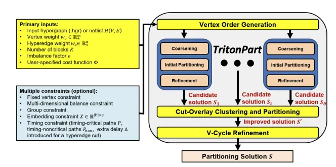

# Partition Manager

The partitioning module (`par`) is based on TritonPart, an open-source 
constraints-driven partitioner. `par` can be used 
to partition a hypergraph or a gate-level netlist.

## Highlights
- Start of the art multiple-constraints driven partitioning “multi-tool”
- Optimizes cost function based on user requirement
- Permissive open-source license
- Solves multi-way partitioning with following features:
  - Multidimensional real-value weights on vertices and hyperedges
  - Multilevel coarsening and refinement framework
  - Fixed vertices constraint
  - Timing-driven partitioning framework 
  - Group constraint: Groups of vertices need to be in same block
  - Embedding-aware partitioning
  
## Dependency

We use Google OR-Tools as our ILP solver. 

Our recommendation is to follow the OpenROAD [DependencyInstaller](../etc/DependencyInstaller.sh) for installation of this requirement.

Alternatively, you may also install Google OR-Tools 
following these [instructions](https://developers.google.com/optimization/install).

```{warning}
Due to a build issue, TritonPart is not supported for macOS. Stay tuned to this page for updates!
```

## Main Algorithm

An overview of the TritonPart algorithm is shown below. It takes as inputs 
- Hypergraph $H(V,E)$ in `.hgr` format.
- Vertex weight $w_v \in \mathcal{R}_+^m$
- Hyperedge weight $w_e \in \mathcal{R}_+^n$
- Number of blocks $K$.
- Imbalance factor $\epsilon$.
- User-specified cost function $\phi$.

There are five main steps in the main algorithm,
mainly 1) constraints-driven coarsening,
2) initial partitioning, 3) refinement, 4) cut-overlay clustering and
partitioning (COCP), and 5) V-cycle refinement. The steps for the 
timing-aware algorithm may be found in the next [section](#timing-aware-algorithm). 

1. Constraints-Driven Coarsening

The first step involves multilevel coarsening. Specifically, at each level,
clusters of vertices are identified, and the merged and represented
as a single vertex in the resulting coarser hypergraph. In this algorithm,
the First-Choice scheme is used, which traverses the vertices in the 
hypergraph according to a given ordering and merges pairs of vertices with
high connectivity. The connectivity between a pair of vertices $(u,v)$
is measured as follows:

$$r(u, v) = \sum_{e\in \{I(v)\cap I(u)\}} \frac{\langle \alpha, w_e\rangle}{|e|-1}$$

To efficiently manage multiple constraints, the following enhancements are 
made to the coarsening scheme above:

- **Fixed Vertex Constraint**: Fixed vertices that belong to the same partitioning block are merged into a single vertex. 
- **Grouping Constraint**: Vertices that belong to the same group are merged into a single vertex.
- **Embedding Constraint**: The embedding information is incorporated into the heavy-edge rating function. The new connectivity is updated as follows:

$$\hat{r}(u, v) = r(u, v) + \rho\frac{1}{||X_u - X_v||_2}$$

where $\rho$ is a normalization factor set to the average distance between two
vertex embeddings. When vertices $v_1, ... , v_t$ are merged into a single
vertex $v_{coarse}$, the corresponding vertex embedding $X_{v_{coarse}}$
is defined as the *center of gravity* of $t$ vertices:

$$X_{v_{coarse}} = \sum_{j=1}^{t} \frac{||w_{v_j}||}{M} X_{v_j},\ where\ M= \sum_{j=1}^t ||w_{v_j}|| $$

- **Community Guidance**: Only vertices within the same community are
  considered for merging.
- **Tie-breaking mechanism**: If multiple neighbor pairs have the same rating
  score, combine the lexicographically first unmatched vertex to break ties.

2. Initial Partitioning

After completing the coarsening process, an initial partitioning solution for
the coarsest hypergraph $H_c$ is derived. Two sub-steps are involved in this:
the best partitioning solution from random and VILE partitioning is chosen
from $\eta = 50$ runs as a warm-start to the ILP-based partitioner. The
optimization is based on only the cut size rather than the cost function
$\phi$ to keep the runtime reasonable.

3. Refinement

After a feasible solution $H_{c_\xi}$ is obtained by initial partitioning,
uncoarsening and move-based refinement is performed to improve the
partitioning solution. Three refinement heuristics are applied in sequence:
- **$K$-way pairwise FM (PM)**: This addresses multi-way partitioning
  as concurrent bi-partitioning problems in a restricted version of K-way
  Fiduccia–Mattheyses (FM) algorithm. First, $\lfloor K/2\rfloor $ pairs of
  blocks are obtained, with refinement-specific vertex movements restricted
  to associated paired blocks. Next, two-way FM is concurrently performed on
  all the block pairs. finally, a new configuration of block pairs is computed
  at the end of the PM.
- **Direct $K$-way FM**: Using $K$ priority queues, for each block $V_i$,
  establish a priority queue that stores the vertices that can be potentially
  moved from the current block to block $V_i$. This queue is ordered according
  to the gain of the vertices. Gain is defined as the reduction in cost
  function from the movement of the vertex from the current block to $V_i$.
  Next, after a vertex move, each priority queue is updated independently, thus
  enabling parallel updates via multi-threading. Next, early-stop is implemented
  by limiting the maximum number of vertices moved to 100 per pass. Finally,
  the *corking effect* is mitigated by traversing the priority queue belonging
  to the vertex with the highest gain and identifying a feasible vertex move.
- **Greedy Hyperedge Refinement (HER)**: First, randomly visit all
  hyperedges. For each hyperedge $e$ that crosses the partition boundary,
  determine whether a subset of vertices in $e$ can be moved without violating
  the multi-dimensional balance constraints. The objective is to make $e$
  entirely constrained in a block.

4. Cut-Overlay Clustering and Partitioning (COCP)

Cut-overlay Clustering and Partitioning (COCP) is a mechanism to
combine multiple good-quality partitioning solutions to generate an
improved solution. To begin, the sets of hyperedges cut in the $\theta$
candidate solutions are denoted as $E_1,..., E_\theta \subset E$.  First,
$\cup_{i=1}^\theta E_i$ is removed from the hypergraph $H(V, E)$, resulting in
a number of connected components. Next, all vertices within each connected
component are merged to form a coarser hypergraph $H_{overlay}$. If the
number of vertices in $H_{overlay}$ is less than $thr_{ilp}$, ILP-based
partitioning is performed. If not, a single round of constraints-driven
coarsening is conducted to further reduce the size of $H_{overlay}$
and generate a coarser hypergraph $H_{overlay}^{'}$. Finally, multilevel
refinement is performed to further improve the partitioning solution at
each level of the hierarchy and return the improved solution $S^{'}$.

5. V-Cycle Refinement

Cut-overlay clustering and partitioning produces a high-quality partitioning
solution $S^{'}$. To improve it, there are three phases similar to *hMETIS*,
namely multilevel coarsening, ILP-based partitioning, and refinement.
Firstly, in multilevel partitioning, $S^{'}$ is used as a community guidance
for the constraints-driven coarsening. Only vertices within the same block
are permitted to be merged to ensure that the current solution $S^{'}$
is preserved in the coarsest hypergraph $H_{c_\xi}$. In the ILP-based
partitioning phase, if the number of vertices in $H_{c_\xi}$ does not exceed
$thr_{ilp}$, run ILP-based partitioning to improve $S^{'}$. Otherwise,
continue with $S^{'}$ in successive iterations of these two steps (default
set to 2). The refinement phase is conducted as per step 3.

<center>TritonPart algorithm at a glance</center>

## Timing Aware Algorithm

`par` can also be used as a timing-aware partitioning framework. A slack
propagation methodology is used that optimizes cuts for both timing-critical
and timing-noncritical paths.

1. Extraction of Timing Paths and Slack Information

First, the top $P$ timing-critical paths and the slack information of each
hyperedge using the wireload model (WLM) is obtained from *OpenSTA*. The
timing cost of each path is then calculated:

$$t_p = (1- \frac{slack_p - \Delta}{clock\_period})^\mu$$

where a fixed extra delay $\Delta$ is introduced for timing guardband,
and $\mu$ (default 2) is the exponent.

The snaking factor of a path $SF(p)$ is defined as the maximum number
of block reentries along the path $p$. The timing cost of a hyperedge is
computed using the timing weight corresponding to hyperedge slack $slack_e$
and the accumulated timing cost of all paths traversing the hyperedge.

$$t_e = (1- \frac{slack_e -\Delta}{clock\_period})^\mu + \sum_{\{p|e\in p\}}t_p$$

2. Timing-aware Coarsening

The timing-aware feature is achieved by adding a timing cost of hyperedge
$t_e$ to the connectivity score earlier mentioned. If vertices $(u,v)$
are associated with multiple critical paths, then they are more likely to
be merged. This is reflected in the update score function:

$$r_t(u,v) = \hat{r}(u,v) + \sum_{e\in\{I(v) \cap I(u)\}} \frac{\beta t_e}{|e| - 1}$$

3. Timing-aware Refinement

Timing-aware refinement is based on a similar cost function as the main
algorithm. Instead, an additional slack propagation step is performed at
the end of each PM/FM/HER pass.

## Commands

```{note}
- Parameters in square brackets `[-param param]` are optional.
- Parameters without square brackets `-param2 param2` are required.
```

### Partition Hypergraph Netlist 

This command performs hypergraph netlist partitioning.

```tcl
triton_part_hypergraph
    -hypergraph_file hypergraph_file  
    -num_parts num_parts  
    -balance_constraint balance_constraint 
    [-base_balance base_balance]
    [-scale_factor scale_factor]
    [-seed seed] 
    [-vertex_dimension vertex_dimension] 
    [-hyperedge_dimension hyperedge_dimension] 
    [-placement_dimension placement_dimension] 
    [-fixed_file fixed_file] 
    [-community_file community_file] 
    [-group_file group_file] 
    [-placement_file placement_file] 
    [-e_wt_factors e_wt_factors] 
    [-v_wt_factors <v_wt_factors>] 
    [-placement_wt_factors <placement_wt_factors>]
    [-thr_coarsen_hyperedge_size_skip thr_coarsen_hyperedge_size_skip] 
    [-thr_coarsen_vertices thr_coarsen_vertices] 
    [-thr_coarsen_hyperedges thr_coarsen_hyperedges] 
    [-coarsening_ratio coarsening_ratio] 
    [-max_coarsen_iters max_coarsen_iters] 
    [-adj_diff_ratio adj_diff_ratio] 
    [-min_num_vertices_each_part min_num_vertices_each_part] 
    [-num_initial_solutions num_initial_solutions] 
    [-num_best_initial_solutions num_best_initial_solutions] 
    [-refiner_iters refiner_iters] 
    [-max_moves max_moves] 
    [-early_stop_ratio early_stop_ratio] 
    [-total_corking_passes total_corking_passes] 
    [-v_cycle_flag v_cycle_flag ] 
    [-max_num_vcycle max_num_vcycle] 
    [-num_coarsen_solutions num_coarsen_solutions] 
    [-num_vertices_threshold_ilp num_vertices_threshold_ilp] 
    [-global_net_threshold global_net_threshold] 
```

#### Options

| Switch Name | Description | 
| ----- | ----- |
| `-num_parts` | Number of partitions. The default value is `2`, and the allowed values are integers `[0, MAX_INT]`. |
| `-balance_constraint` | Allowed imbalance between blocks. The default value is `1.0`, and the allowed values are floats. |
| `-base_balance` | Tcl list of baseline imbalance between partitions. The default value is `{1.0}`, and the allowed values are floats that sum up to `1.0`. |
| `-scale_factor` | KIV. The default value is `{1.0}`, and the allowed values are floats that sum up to `1.0`. |
| `-seed` | Random seed. The default value is `0`, and the allowed values are integers `[-MAX_INT, MAX_INT]`. |
| `-vertex_dimension` | Number of vertices in the hypergraph. The default value is `1`, and the allowed values are integers `[0, MAX_INT]`. |
| `-hyperedge_dimension` | Number of hyperedges in hypergraph. The default value is `1`, and the allowed values are integers `[0, MAX_INT]`. |
| `-placement_dimension` | Number of dimensions for canvas if placement information is provided. The default value is `0`, and the allowed values are integers `[0, MAX_INT]`. |
| `-hypergraph_file` | Path to hypergraph file. |
| `-fixed_file` | Path to fixed vertices constraint file. |
| `-community_file` | Path to `community` attributes file to guide the partitioning process. |
| `-group_file` | Path to `stay together` attributes file. |
| `-placement_file` | Placement information file, each line corresponds to a group fixed vertices, community, and placement attributes following the [hMETIS](https://course.ece.cmu.edu/~ee760/760docs/hMetisManual.pdf) format. |
| `-e_wt_factors` | Hyperedge weight factor. |
| `-v_wt_factors` | Vertex weight factors. |
| `-placement_wt_factors` | Placement weight factors. |
| `-thr_coarsen_hyperedge_size_skip` | Threshold for ignoring large hyperedge (default 200, integer). |
| `-thr_coarsen_vertices` | Number of vertices of coarsest hypergraph (default 10, integer). |
| `-thr_coarsen_hyperedges` | Number of vertices of coarsest hypergraph (default 50, integer). |
| `-coarsening_ratio` | Coarsening ratio of two adjacent hypergraphs (default 1.6, float). |
| `-max_coarsen_iters` | Number of iterations (default 30, integer). |
| `-adj_diff_ratio` | Minimum difference of two adjacent hypergraphs (default 0.0001, float). |
| `-min_num_vertices_each_part` | Minimum number of vertices in each partition (default 4, integer). |
| `-num_initial_solutions` | Number of initial solutions (default 50, integer). |
| `-num_best_initial_solutions` | Number of top initial solutions to filter out (default 10, integer). |
| `-refiner_iters` | Refinement iterations (default 10, integer). |
| `-max_moves` | The allowed moves for each Fiduccia-Mattheyes (FM) algorithm pass or greedy refinement (default 60, integer). |
| `-early_stop_ratio` | Describes the ratio $e$ where if the $n_{moved vertices} > n_{vertices} * e$, the tool exits the current FM pass. The intention behind this is that most of the gains are achieved by the first few FM moves. (default 0.5, float). |
| `-total_corking_passes` | Maximum level of traversing the buckets to solve the "corking effect" (default 25, integer). |
| `-v_cycle_flag` | Disables v-cycle is used to refine partitions (default true, bool). |
| `-max_num_vcycle` | Maximum number of `vcycles` (default 1, integer). |
| `-num_coarsen_solutions` | Number of coarsening solutions with different randoms seed (default 3, integer). |
| `-num_vertices_threshold_ilp` | Describes threshold $t$, the number of vertices used for integer linear programming (ILP) partitioning. if $n_{vertices} > t$, do not use ILP-based partitioning.(default 50, integer). |
| `-global_net_threshold` | If the net is larger than this, it will be ignored by TritonPart (default 1000, integer). |

### Evaluate Hypergraph Partition

This command evaluates hypergraph partition.

```tcl
evaluate_hypergraph_solution
  -num_parts num_parts
  -balance_constraint balance_constraint
  -hypergraph_file hypergraph_file
  -solution_file solution_file
  [-base_balance base_balance]
  [-scale_factor scale_factor]
  [-vertex_dimension vertex_dimension]
  [-hyperedge_dimension hyperedge_dimension]
  [-fixed_file fixed_file]
  [-group_file group_file]
  [-e_wt_factors e_wt_factors]
  [-v_wt_factors v_wt_factors] 
```

#### Options

| Switch Name | Description | 
| ----- | ----- |
| `-num_parts` | Number of partitions. The default value is `2`, and the allowed values are integers `[0, MAX_INT]`. |
| `-balance_constraint` | Allowed imbalance between blocks. The default value is `1.0`, and the allowed values are floats. |
| `-vertex_dimension` | Number of vertices in the hypergraph. The default value is `1`, and the allowed values are integers `[0, MAX_INT]`. |
| `-hyperedge_dimension` | Number of hyperedges in hypergraph. The default value is `1`, and the allowed values are integers `[0, MAX_INT]`. |
| `-hypergraph_file` | Path to hypergraph file. |
| `-solution_file` | Path to solution file. |
| `-base_balance` | Tcl list of baseline imbalance between partitions. The default value is `{1.0}`, and the allowed values are floats that sum up to `1.0`. |
| `-scale_factor` | KIV. The default value is `{1.0}`, and the allowed values are floats that sum up to `1.0`. |
| `-fixed_file` | Path to fixed vertices constraint file. |
| `-group_file` | Path to `stay together` attributes file. |
| `-e_wt_factors` | Hyperedge weight factor. |
| `-v_wt_factors` | Vertex weight factor. |


### Partition Netlist 

This command partitions the design netlist. Note that design must be loaded in memory.

```tcl
triton_part_design
    [-num_parts num_parts]
    [-balance_constraint balance_constraint]
    [-base_balance base_balance]
    [-scale_factor scale_factor]
    [-seed seed]
    [-timing_aware_flag timing_aware_flag]
    [-top_n top_n]
    [-placement_flag placement_flag]
    [-fence_flag fence_flag]
    [-fence_lx fence_lx]
    [-fence_ly fence_ly]
    [-fence_ux fence_ux]
    [-fence_uy fence_uy]
    [-fixed_file fixed_file]
    [-community_file community_file]
    [-group_file group_file]
    [-solution_file solution_file]
    [-net_timing_factor net_timing_factor]
    [-path_timing_factor path_timing_factor]
    [-path_snaking_factor path_snaking_factor]
    [-timing_exp_factor timing_exp_factor]
    [-extra_delay extra_delay]
    [-guardband_flag guardband_flag]
    [-e_wt_factors e_wt_factors]
    [-v_wt_factors v_wt_factors]
    [-placement_wt_factors placement_wt_factors]
    [-thr_coarsen_hyperedge_size_skip thr_coarsen_hyperedge_size_skip]
    [-thr_coarsen_vertices thr_coarsen_vertices]
    [-thr_coarsen_hyperedges thr_coarsen_hyperedges]
    [-coarsening_ratio coarsening_ratio]
    [-max_coarsen_iters max_coarsen_iters]
    [-adj_diff_ratio adj_diff_ratio]
    [-min_num_vertices_each_part min_num_vertices_each_part]
    [-num_initial_solutions num_initial_solutions]
    [-num_best_initial_solutions num_best_initial_solutions]
    [-refiner_iters refiner_iters]
    [-max_moves max_moves]
    [-early_stop_ratio early_stop_ratio]
    [-total_corking_passes total_corking_passes]
    [-v_cycle_flag v_cycle_flag ]
    [-max_num_vcycle max_num_vcycle]
    [-num_coarsen_solutions num_coarsen_solutions]
    [-num_vertices_threshold_ilp num_vertices_threshold_ilp]
    [-global_net_threshold global_net_threshold]
```

#### Options

| Switch Name | Description |
| ----- | ----- |
| `-num_parts` | Number of partitions. The default value is `2`, and the allowed values are integers `[0, MAX_INT]`. |
| `-balance_constraint` | Allowed imbalance between blocks. The default value is `1.0`, and the allowed values are floats. |
| `-base_balance` | Tcl list of baseline imbalance between partitions. The default value is `{1.0}`, and the allowed values are floats that sum up to `1.0`. |
| `-scale_factor` | KIV. The default value is `{1.0}`, and the allowed values are floats that sum up to `1.0`. |
| `-seed` | Random seed. The default value is `1`, and the allowed values are integers `[-MAX_INT, MAX_INT]`. |
| `-timing_aware_flag` | Enable timing-driven mode. The default value is `true`, and the allowed values are booleans. |
| `-top_n` | Extract the top n critical timing paths. The default value is `1000`, and the allowed values are integers `[0, MAX_INT`. |
| `-placement_flag` | Enable placement driven partitioning. The default value is `false`, and the allowed values are booleans. |
| `-fence_flag ` | Consider fences in the partitioning. The default value is `false`, and the allowed values are booleans. |
| `-fence_lx ` | Fence lower left x in microns. The default value is `0.0`, and the allowed values are floats. |
| `-fence_ly ` | Fence lower left y in microns. The default value is `0.0`, and the allowed values are floats. |
| `-fence_ux ` | Fence upper right x in microns. The default value is `0.0`, and the allowed values are floats. |
| `-fence_uy ` | Fence upper right y in microns. The default value is `0.0`, and the allowed values are floats. |
| `-fixed_file` | Path to fixed vertices constraint file |
| `-community_file` | Path to `community` attributes file to guide the partitioning process. |
| `-group_file` | Path to `stay together` attributes file. |
| `-solution_file` | Path to solution file. |
| `-net_timing_factor` | Hyperedge timing weight factor (default 1.0, float). |
| `-path_timing_factor` | Cutting critical timing path weight factor (default 1.0, float). |
| `-path_snaking_factor` | Snaking a critical path weight factor (default 1.0, float). |
| `-timing_exp_factor` | Timing exponential factor for normalized slack (default 1.0, float). |
| `-extra_delay` | Extra delay introduced by a cut (default 1e-9, float). |
| `-guardband_flag` | Enable timing guardband option (default false, bool). |
| `-e_wt_factors` | Hyperedge weight factor. |
| `-v_wt_factors` | Vertex weight factor. |
| `-placement_wt_factors` | Placement weight factor. |
| `-thr_coarsen_hyperedge_size_skip` | Threshold for ignoring large hyperedge. The default value is `1000`, and the allowed values are integers `[0, MAX_INT]`. |
| `-thr_coarsen_vertices` | Number of vertices of coarsest hypergraph. The default value is `10`, and the allowed values are integers `[0, MAX_INT]`. |
| `-thr_coarsen_hyperedges` | Number of vertices of the coarsest hypergraph. The default value is `50`, and the allowed values are integers `[0, MAX_INT]`. |
| `-coarsening_ratio` | Coarsening ratio of two adjacent hypergraphs. The default value is `1.5`, and the allowed values are floats. |
| `-max_coarsen_iters` | Number of iterations. The default value is `30`, and the allowed values are integers `[0, MAX_INT]`. |
| `-adj_diff_ratio` | Minimum ratio difference of two adjacent hypergraphs. The default value is `0.0001`, and the allowed values are floats. |
| `-min_num_vertices_each_part` | Minimum number of vertices in each partition. The default value is `4`, and the allowed values are integers `[0, MAX_INT]`. |
| `-num_initial_solutions` | Number of initial solutions. The default value is `100`, and the allowed values are integers `[0, MAX_INT]`. |
| `-num_best_initial_solutions` | Number of top initial solutions to filter out. The default value is `10`, and the allowed values are integers `[0, MAX_INT]`. |
| `-refiner_iters` | Refinement iterations. The default value is `10`, and the allowed values are integers `[0, MAX_INT]`. |
| `-max_moves` | The allowed moves for each Fiduccia-Mattheyes (FM) algorithm pass or greedy refinement. The default value is `100`, and the allowed values are integers `[0, MAX_INT]`. |
| `-early_stop_ratio` | Describes the ratio $e$ where if the $n_{moved vertices} > n_{vertices} * e$, the tool exists the current FM pass. The intention behind this is that most of the gains are achieved by the first few FM moves. The default value is `0.5`, and the allowed values are floats. |
| `-total_corking_passes` | Maximum level of traversing the buckets to solve the "corking effect". The default value is `25`, and the allowed values are integers `[0, MAX_INT]`. |
| `-v_cycle_flag` | Disables v-cycle is used to refine partitions. The default value is `true`, and the allowed values are booleans. |
| `-max_num_vcycle` | Maximum number of vcycles. The default value is `1`, and the allowed values are integers `[0, MAX_INT]`. |
| `-num_coarsen_solutions` | Number of coarsening solutions with different randoms seed. The default value is `4`, and the allowed values are integers `[0, MAX_INT]`. |
| `-num_vertices_threshold_ilp` | Describes threshold $t$, the number of vertices used for integer linear programming (ILP) partitioning. if $n_{vertices} > t$, do not use ILP-based partitioning. The default value is `50`, and the allowed values are integers `[0, MAX_INT]`. |
| `-global_net_threshold` | If the net is larger than this, it will be ignored by TritonPart. The default value is `1000`, and the allowed values are integers `[0, MAX_INT]`. |

### Evaluate Netlist Partition

This command evaluates partition design solution.

```tcl
evaluate_part_design_solution
    [-num_parts num_parts]
    [-balance_constraint balance_constraint]
    [-base_balance base_balance]
    [-scale_factor scale_factor]
    [-timing_aware_flag timing_aware_flag]
    [-top_n top_n]
    [-fence_flag fence_flag]
    [-fence_lx fence_lx]
    [-fence_ly fence_ly]
    [-fence_ux fence_ux]
    [-fence_uy fence_uy]
    [-fixed_file fixed_file]
    [-community_file community_file]
    [-group_file group_file]
    [-hypergraph_file hypergraph_file]
    [-hypergraph_int_weight_file hypergraph_int_weight_file]
    [-solution_file solution_file]
    [-net_timing_factor net_timing_factor]
    [-path_timing_factor path_timing_factor]
    [-path_snaking_factor path_snaking_factor]
    [-timing_exp_factor timing_exp_factor]
    [-extra_delay extra_delay]
    [-guardband_flag guardband_flag]
    [-e_wt_factors e_wt_factors]
    [-v_wt_factors v_wt_factors]
```

#### Options

| Switch Name | Description |
| ----- | ----- |
| `-num_parts` | Number of partitions. The default value is `2`, and the allowed values are integers `[0, MAX_INT]`. |
| `-balance_constraint` | Allowed imbalance between blocks. The default value is `1.0`, and the allowed values are floats. |
| `-base_balance` | Tcl list of baseline imbalance between partitions. The default value is `{1.0}`, and the allowed values are floats that sum up to `1.0`. |
| `-scale_factor` | KIV. The default value is `{1.0}`, and the allowed values are floats that sum up to `1.0`. |
| `-timing_aware_flag` | Enable timing-driven mode. The default value is `true`, and the allowed values are booleans. |
| `-top_n` | Extract the top n critical timing paths. The default value is `1000`, and the allowed values are integers `[0, MAX_INT]`. |
| `-fence_flag ` | Consider fences in the partitioning. The default value is `false`, and the allowed values are booleans. |
| `-fence_lx ` | Fence lower left x in microns. The default value is `0.0`, and the allowed values are floats. |
| `-fence_ly ` | Fence lower left y in microns. The default value is `0.0`, and the allowed values are floats. |
| `-fence_ux ` | Fence upper right x in microns. The default value is `0.0`, and the allowed values are floats. |
| `-fence_uy ` | Fence upper right y in microns. The default value is `0.0`, and the allowed values are floats. | 
| `-fixed_file` | Path to fixed vertices constraint file. |
| `-community_file` | Path to `community` attributes file to guide the partitioning process. |
| `-group_file` | Path to `stay together` attributes file. |
| `-hypergraph_file` | Path to hypergraph file. |
| `-hypergraph_int_weight_file` | Path to `hMETIS` format integer weight file. |
| `-solution_file` | Path to solution file. |
| `-net_timing_factor` | Hyperedge timing weight factor. The default value is `1.0`, and the allowed values are floats. |
| `-path_timing_factor` | Cutting critical timing path weight factor. The default value is `1.0`, and the allowed values are floats. |
| `-path_snaking_factor` | Snaking a critical path weight factor. The default value is `1.0`, and the allowed values are floats. |
| `-timing_exp_factor` | Timing exponential factor for normalized slack. The default value is `1.0`, and the allowed values are floats. |
| `-extra_delay` | Extra delay introduced by a cut. The default value is `1e-9`, and the allowed values are floats. |
| `-guardband_flag` | Enable timing guardband option. The default value is 1`false`, and the allowed values are booleans. |
| `-e_wt_factors` | Hyperedge weight factors. |
| `-v_wt_factors` | Vertex weight factors. |

### Write Partition to Verilog

This command writes the partition result to verilog.

```tcl
write_partition_verilog
    [-port_prefix prefix]
    [-module_suffix suffix]
    [-partitioning_id part_id]
    [file]
```

#### Options

| Switch Name | Description |
| ----- | ----- |
| `-port_prefix` | Port name prefix. |
| `-module_suffix` | Module name suffix. |
| `file` | Filename to write partition verilog to. |

### Read the Partition file

This command reads the partition file into design.

```tcl
read_partitioning
    -read_file name
    [-instance_map_file file_path]
```

| Switch Name | Description |
| ----- | ----- |
| `-read_file` | Read partitioning file (usually with the extension `.part`). The file format must match the same format as the output of `write_partition_verilog`. |
| `-instance_map_file` | Instance mapping file. |

## Example Scripts

## How to partition a hypergraph in the way you would using hMETIS (min-cut partitioning)

```
triton_part_hypergraph -hypergraph_file des90.hgr -num_parts 5 -balance_constraint 2 -seed 2
```
You can also check the provided example [here](./examples/min-cut-partitioning/run_openroad.tcl).

## How to perform the embedding-aware partitioning

```
set num_parts 2
set balance_constraint 2
set seed 0
set design sparcT1_chip2
set hypergraph_file "${design}.hgr"
set placement_file "${design}.hgr.ubfactor.2.numparts.2.embedding.dat"
set solution_file "${design}.hgr.part.${num_parts}"

triton_part_hypergraph  -hypergraph_file $hypergraph_file -num_parts $num_parts \
                        -balance_constraint $balance_constraint \
                        -seed $seed  \
                        -placement_file ${placement_file} -placement_wt_factors { 0.00005 0.00005 } \
                        -placement_dimension 2

```

You can find the provided example [here](./examples/embedding-aware-partitioning/run_placement_aware_flow.tcl).


## How to partition a netlist

```
# set technology information
set ALL_LEFS “list_of_lefs”
set ALL_LIBS “list_of_libs”
# set design information
set design “design_name”
set top_design “top_design”
set netlist “netlist.v”
set sdc “timing.sdc”
foreach lef_file ${ALL_LEFS} {
  read_lef $lef_file
}
foreach lib_file ${ALL_LIBS} {
  read_lib $lib_file
}
read_verilog $netlist
link_design $top_design
read_sdc $sdc

set num_parts 5
set balance_constraint 2
set seed 0
set top_n 100000
# set the extra_delay_cut to 20% of the clock period
# the extra_delay_cut is introduced for each cut hyperedge
set extra_delay_cut 9.2e-10  
set timing_aware_flag true
set timing_guardband true
set part_design_solution_file "${design}_part_design.hgr.part.${num_parts}"

##############################################################################################
## TritonPart with slack progagation
##############################################################################################
puts "Start TritonPart with slack propagation"
# call triton_part to partition the netlist
triton_part_design -num_parts $num_parts -balance_constraint $balance_constraint \
                   -seed $seed -top_n $top_n \
                   -timing_aware_flag $timing_aware_flag -extra_delay $extra_delay_cut \
                   -guardband_flag $timing_guardband \
                   -solution_file $part_design_solution_file 
```

You can find the provided example [here](./examples/timing-aware-partitioning/run_timing_aware_flow.tcl).

## Regression tests

There are a set of regression tests in `./test`. For more information, refer to this [section](../../README.md#regression-tests). 

Simply run the following script: 

```shell
./test/regression
```

## References
1. Bustany, I., Kahng, A. B., Koutis, I., Pramanik, B., & Wang, Z. (2023). K-SpecPart: A Supervised Spectral Framework for Multi-Way Hypergraph Partitioning Solution Improvement. arXiv preprint arXiv:2305.06167. [(.pdf)](https://arxiv.org/pdf/2305.06167)
1. Bustany, I., Gasparyan, G., Kahng, A. B., Koutis, I., Pramanik, B., & Wang, Z. (2023). "An Open-Source Constraints-Driven General Partitioning Multi-Tool for VLSI Physical Design", Proc. ACM/IEEE International Conference of Computer-Aided Design 2023,[(.pdf)](https://vlsicad.ucsd.edu/Publications/Conferences/401/c401.pdf).


## License

BSD 3-Clause License. See [LICENSE](../../LICENSE) file.