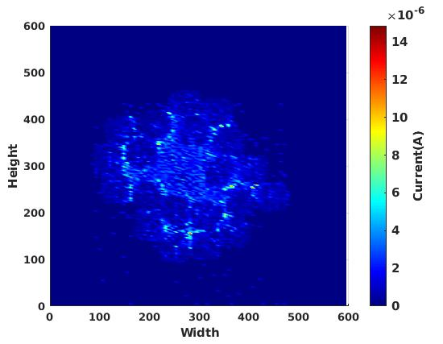
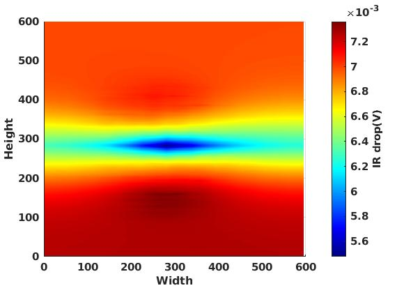

# PDNSim

[](https://opensource.org/licenses/BSD-3-Clause)

PDNSim is an open-source static IR analyzer.

Features:

-   Report worst IR drop.
-   Report worst current density over all nodes and wire segments in the
    power distribution network, given a placed and PDN-synthesized design.
-   Check for floating PDN stripes on the power and ground nets.
-   Spice netlist writer for power distribution network wire segments.





## Commands

```
set_pdnsim_net_voltage -net <net_name> -voltage <voltage_value>
check_power_grid -net <net_name>
analyze_power_grid -vsrc <voltage_source_location_file> \
                   -net <net_name> \
                   [-outfile <filename>] \
                   [-enable_em] \
                   [-em_outfile <filename>]
                   [-dx]
                   [-dy]
                   [-em_outfile <filename>]
write_pg_spice -vsrc <voltage_source_location_file> -outfile <netlist.sp> -net <net_name>
```

Options description:
- ``vsrc``: (optional) file to set the location of the power C4 bumps/IO pins. [Vsrc_aes.loc file](https://github.com/The-OpenROAD-Project/PDNSim/blob/master/test/aes/Vsrc.loc) for an example with a description specified [here](https://github.com/The-OpenROAD-Project/PDNSim/blob/master/doc/Vsrc_description.md).
- ``dx,dy``: (optional) these arguments set the bump pitch to decide the voltage source location in the absence of a vsrc file. Default bump pitch of 140um used in absence of these arguments and vsrc
- ``net``: (mandatory) is the name of the net to analyze, power or ground net name
- ``enable_em``: (optional) is the flag to report current per power grid segment
- ``outfile``: (optional) filename specified per-instance voltage written into file
- ``em_outfile``: (optional) filename to write out the per segment current values into a file, can be specified only if enable_em is flag exists
- ``voltage``: Sets the voltage on a specific net. If this command is not run, the voltage value is obtained from operating conditions in the liberty.

## Example scripts

See the file [Vsrc_aes.loc file](test/Vsrc_aes_vdd.loc) for an example
with a description specified [here](doc/Vsrc_description.md).

## Regression tests

## Limitations

## FAQs

Check out [GitHub discussion](https://github.com/The-OpenROAD-Project/OpenROAD/discussions/categories/q-a?discussions_q=category%3AQ%26A+psm+in%3Atitle)
about this tool.


## Cite this Work

If you find PDNSim useful, please use the following `bibtex` to cite it:

```
@misc{pdnsim,
author = "V. A. Chhabria and S. S. Sapatnekar",
title={{PDNSim}},
note= "\url{https://github.com/The-OpenROAD-Project/OpenROAD/tree/master/src/PDNSim}"
}
```

## License

BSD 3-Clause License. See [LICENSE](LICENSE) file.
