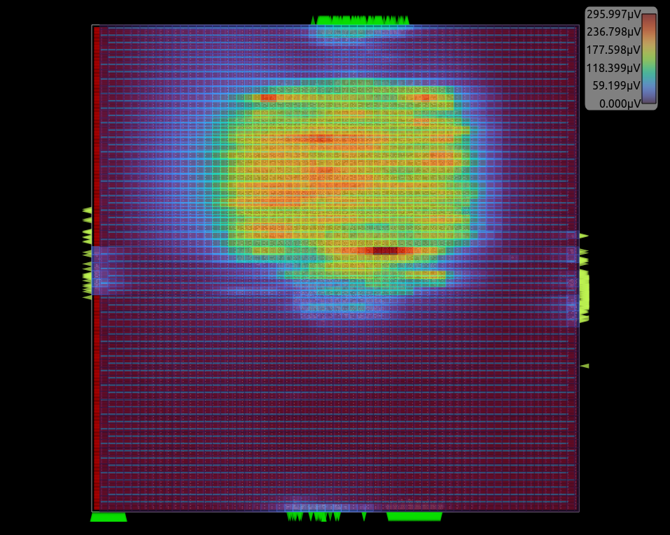
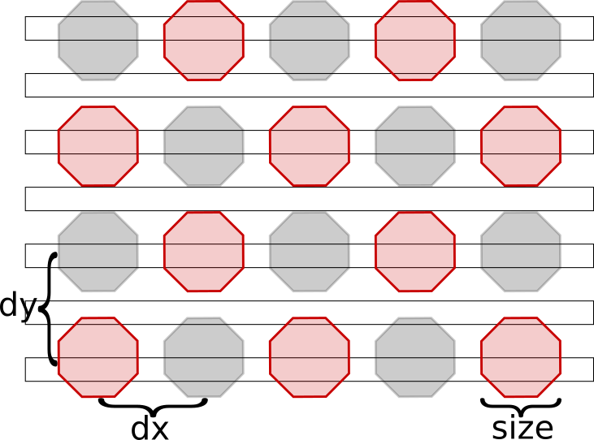
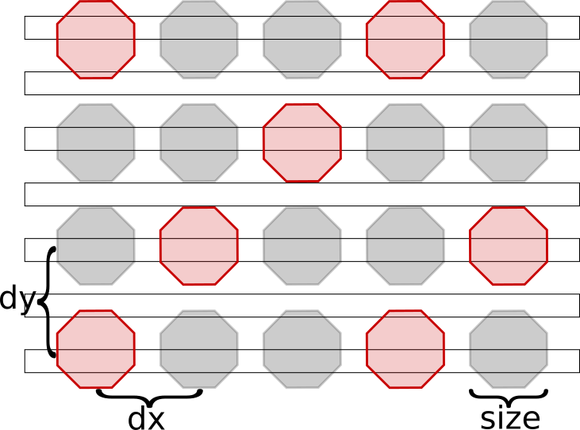
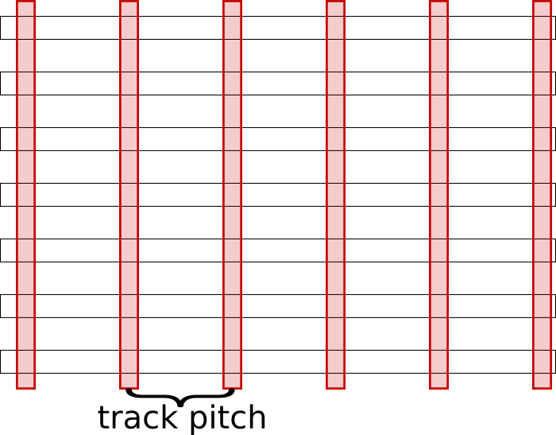

# IR Drop Analysis

The IR Drop Analysis module in OpenROAD (`psm`) is based on PDNSim,
an open-source static IR analyzer.

Features:

- Report worst IR drop.
- Report worst current density over all nodes and wire segments in the
  power distribution network, given a placed and PDN-synthesized design.
- Check for floating PDN stripes on the power and ground nets.
- Spice netlist writer for power distribution network wire segments.



## Commands

```{note}
- Parameters in square brackets `[-param param]` are optional.
- Parameters without square brackets `-param2 param2` are required.
```

### Analyze Power Grid

This command analyzes power grid.

```tcl
analyze_power_grid
    -net net_name
    [-corner corner]
    [-error_file error_file]
    [-voltage_file voltage_file]
    [-enable_em]
    [-em_outfile em_file]
    [-vsrc voltage_source_file]
    [-source_type FULL|BUMPS|STRAPS]
```

#### Options

| Switch Name | Description |
| ----- | ----- |
| `-net` | Name of the net to analyze, power or ground net name. |
| `-corner` | Corner to use for analysis. |
| `-error_file` | File to write power grid error to. |
| `-vsrc` | File to set the location of the power C4 bumps/IO pins. [Vsrc_aes.loc file](test/Vsrc_aes_vdd.loc) for an example with a description specified [here](doc/Vsrc_description.md). |
| `-enable_em` | Report current per power grid segment. |
| `-em_outfile` | Write the per-segment current values into a file. This option is only available if used in combination with `-enable_em`. |
| `-voltage_file` | Write per-instance voltage into the file. |
| `-source_type` | Indicate the type of voltage source grid to [model](#source-grid-options). FULL uses all the nodes on the top layer as voltage sources, BUMPS will model a bump grid array, and STRAPS will model power straps on the layer above the top layer. |

### Check Power Grid

This command checks power grid.

```tcl
check_power_grid
    -net net_name
    [-floorplanning]
    [-error_file error_file]
```

#### Options

| Switch Name | Description |
| ----- | ----- |
| `-net` | Name of the net to analyze. Must be a power or ground net name. |
| `-floorplanning` | Ignore non-fixed instances in the power grid, this is useful during floorplanning analysis when instances may not be properly placed. |
| `-error_file` | File to write power grid errors to. |

### Write Spice Power Grid

This command writes the `spice` file for power grid.

```tcl
write_pg_spice
    -net net_name
    [-vsrc vsrc_file]
    [-corner corner]
    [-source_type FULL|BUMPS|STRAPS]
    spice_file
```

#### Options

| Switch Name | Description |
| ----- | ----- |
| `-net` | Name of the net to analyze. Must be a power or ground net name. |
| `-vsrc` | File to set the location of the power C4 bumps/IO pins. See [Vsrc_aes.loc file](test/Vsrc_aes_vdd.loc) for an example and its [description](doc/Vsrc_description.md). |
| `-corner` | Corner to use for analysis. |
| `-source_type` | Indicate the type of voltage source grid to [model](#source-grid-options). FULL uses all the nodes on the top layer as voltage sources, BUMPS will model a bump grid array, and STRAPS will model power straps on the layer above the top layer. |
| `spice_file` | File to write spice netlist to. |

### Set PDNSim Net voltage

This command sets PDNSim net voltage.

```tcl
set_pdnsim_net_voltage
    -net net_name
    -voltage volt
    [-corner corner]
```

#### Options

| Switch Name | Description |
| ----- | ----- |
| `-net` | Name of the net to analyze. It must be a power or ground net name. |
| `-voltage` | Sets the voltage on a specific net. If this option is not given, the Liberty file's voltage value is obtained from operating conditions. |
| `-corner` | Corner to use this voltage. If not specified, this voltage applies to all corners. |

### Set PDNSim Instance power

This command sets PDNSim instance power.
This should only be used when needing to override the computed power.

```tcl
set_pdnsim_inst_power
    -inst inst_name
    -power power
    [-corner corner]
```

#### Options

| Switch Name | Description |
| ----- | ----- |
| `-inst` | Name of the instance to set the power dor. |
| `-power` | Sets the power on a specific instance. |
| `-corner` | Corner to use this power. If not specified, this power applies to all corners. |

### Set PDNSim Power Source Settings

Set PDNSim power source setting.

```tcl
set_pdnsim_source_settings
    [-bump_dx pitch]
    [-bump_dy pitch]
    [-bump_size size]
    [-bump_interval interval]
    [-strap_track_pitch pitch]
```

#### Options

| Switch Name | Description |
| ----- | ----- |
| `-bump_dx`,`-bump_dy` | Set the bump pitch to decide the voltage source location. The default bump pitch is 140um. |
| `-bump_size` | Set the bump size. The default bump size is 70um. |
| `-bump_interval` | Set the bump population interval, this is used to depopulate the bump grid to emulate signals and other power connections. The default bump pitch is 3. |
| `-strap_track_pitch` | Sets the track pitck to use for moduling voltage sources as straps. The default is 10x. |

### Insert Decap Cells
The `insert_decap` command inserts decap cells in the areas with the highest
IR Drop. The number of decap cells inserted will be limited to the target
capacitance defined in the `-target_cap` option. `list_of_decap_with_cap`
is a list of even size of decap master cells and their capacitances,
e.g., `<cell1> <decap_of_cell1> <cell2> <decap_of_cell2> ...`. To insert decap
cells in the IR Drop of a specific net (power or ground) use `-net <net_name>`,
if not defined the default power net will be used.
To use this command, you must first execute the `analyze_power_grid` command
with the net to have the IR Drop information.

```tcl
insert_decap -target_cap target_cap [-net net_name] -cells list_of_decap_with_cap
```

#### Options
| Switch Name | Description |
| ----- | ----- |
| `-target_cap` | Target capacitance to insert os decap cells. |
| `-net` | Power or ground net name. The decap cells will be inserted near the IR Drops of the net. |
| `-cells` | List of even size of decap master cells and their capacitances. |

## Source grid options

The source grid models how power is going be delivered to the power grid.
The image below illustrate how they can be modeled, the red elements are the source models, the black horizontal boxes represent the top metal layer of the power grid, and the gray boxes indicate these are not used in the modeling.

| Bumps with 2x interval | Bumps with 3x interval | Straps | Full |
| - | - | - | - |
|  |  |  |  |


## Useful Developer Commands

If you are a developer, you might find these useful. More details can be found in the [source file](./src/pdnsim.cpp) or the [swig file](./src/pdnsim.i).

| Command Name | Description |
| ----- | ----- |
| `find_net` | Get a reference to net name. |

## Example scripts

Example scripts demonstrating how to run PDNSim on a sample design on `aes` as follows:

```
./test/aes_test_vdd.tcl
./test/aes_test_vss.tcl
```

## Regression tests

There are a set of regression tests in `./test`. For more information, refer to this [section](../../README.md#regression-tests).

Simply run the following script:

```shell
./test/regression
```

## Limitations

## FAQs

Check out [GitHub discussion](https://github.com/The-OpenROAD-Project/OpenROAD/discussions/categories/q-a?discussions_q=category%3AQ%26A+psm+in%3Atitle)
about this tool.

## References

1. PDNSIM [documentation](doc/PDNSim-documentation.pdf)
1. Chhabria, V.A. and Sapatnekar, S.S. (no date) The-openroad-project/pdnsim: Power Grid Analysis, GitHub. Available at: https://github.com/The-OpenROAD-Project/PDNSim (Accessed: 24 July 2023). [(link)](https://github.com/The-OpenROAD-Project/PDNSim)

## License

BSD 3-Clause License. See [LICENSE](LICENSE) file.
