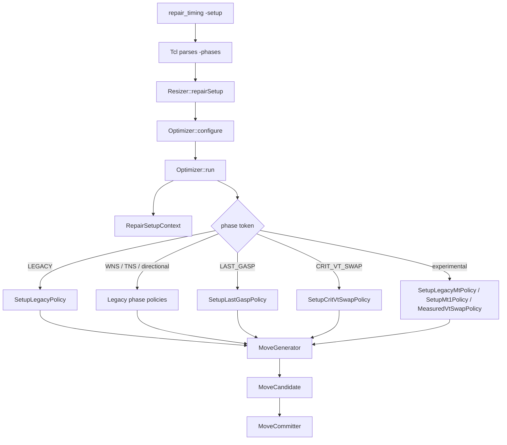
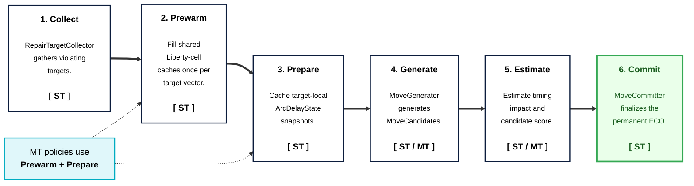

# Resizer Optimization Architecture

## Table Of Contents

1. [Summary](#summary)
2. [Top-Level Flow](#top-level-flow)
3. [Phase UI](#phase-ui)
4. [Core Data Model](#core-data-model)
5. [Policy Model](#policy-model)
6. [Prewarm Stage](#prewarm-stage)
7. [Prepare Stage](#prepare-stage)
8. [Delay Estimator And Reporter](#delay-estimator-and-reporter)
9. [Generator And Candidate Model](#generator-and-candidate-model)
10. [Threading Model](#threading-model)
11. [File Changes](#file-changes)
12. [Future Work](#future-work)

## Summary

Rearchitected `repair_setup` around a policy-driven optimizer.

| Area | Change |
|---|---|
| Move implementation | Replaced monolithic `*Move` classes with `MoveGenerator` + `MoveCandidate` pairs. |
| Phase policy | Added `OptimizationPolicy` and concrete setup-repair phase policies. `repair_timing -phases` selects the ordered phase pipeline. |
| MT support | Added common `utl::ThreadPool` and MT-capable policies/generators. |
| Prewarm stage | Added policy-level Liberty-cell and driver-cache warmup before target preparation. Required to complete lazy updates and ensure thread safety. |
| Prepare stage | Added per-target `ArcDelayState` caching for expensive STA-derived data before MT generation/estimation. Required to reduce redundant computations in MT policies. |
| Delay estimator | Added path-window delay estimation for MT size-up/VT-swap scoring, with optional STA slew-bias sampling. |
| Estimator reporter | Added a diagnostic command that compares estimator predictions against ECO-journaled STA measurements. |
| Scope | The new architecture targets `repair_setup` only. It can be extended to `repair_design`, `repair_hold`, and `recover_power` later. |
| Compatibility | `SetupLegacyPolicy` is the default path and is kept close to legacy repair behavior. The QoR goal is ORFS design parity. |
| Target model | `Target` exposes path-driver and instance view bits so generators can share one target representation. New views will be added later. |

**Overall repair_setup flow**

```
[Optimizer::run()]
  resizer_.runRepairSetupPreamble()
  create shared RepairSetupContext
  phases = parseTokens(-phases or "LEGACY LAST_GASP CRIT_VT_SWAP")
  for each phase:
    policy = makePolicyForPhase(phase)
    policy->start()
    while (!policy.converged()):
      policy.iterate()
  last_policy->finalizeAndReport()


[OptimizationPolicy::iterate()]

LEGACY / SetupLegacyPolicy:
  select legacy target -> generate -> estimate -> commit first accepted move      <- [ST]

MEASURED_VT_SWAP / MeasuredVtSwapPolicy (EXPERIMENTAL):
  select target -> generate candidates -> measure by ECO journal -> commit best   <- [ST]

LEGACY_MT / SetupLegacyMtPolicy (EXPERIMENTAL):
  select legacy target
  prewarm target vector                 <- [ST] Liberty/driver-cache warmup
  prepared_target = prepareTarget(t)    <- [ST] target ArcDelayState build
  candidates = generate(prepared)       <- [ST] legacy-order generation
  estimates = estimate(candidates)      <- [MT] only for VtSwap/SizeUp candidates
  commit(first_or_best_candidate)       <- [ST] apply

MT1 / SetupMt1Policy (EXPERIMENTAL):
  select target batch
  prewarm(targets)                      <- [ST] Liberty/driver-cache warmup
  prepareTargets(targets)               <- [ST] target ArcDelayState build
  for each target                       <- [ST] target-level scheduling
    candidates = generate(prepared)     <- [MT] parallel move-type fanout
    estimates = estimate(candidates)    <- [MT] parallel candidate scoring
  commit(best_candidates)               <- [ST] sequential apply
```

**Key components**

```text
Optimizer
  Owns one repair_setup run
  Owns MoveCommitter
  Parses phase tokens and creates one OptimizationPolicy per phase

OptimizationPolicy (interface)
  SetupLegacyPolicy     : Reproduces legacy repair-setup behavior
  SetupWnsPolicy        : Legacy WNS phase
  SetupTnsPolicy        : Legacy TNS phase
  SetupDirectionalPolicy: Legacy endpoint-fanin / startpoint-fanout phases
  SetupLastGaspPolicy   : Legacy last-gasp phase
  SetupCritVtSwapPolicy : Legacy critical-VT-swap phase
  SetupLegacyMtPolicy   : Legacy phase flow with MT scoring for selected moves
  MeasuredVtSwapPolicy  : Single-threaded VT-swap-only with measured estimate
  SetupMt1Policy        : Batched multi-threaded VT-swap + size-up policy

MoveGenerator / MoveCandidate
  Own move-local legality and ECO plan
  Decides how to optimize
  MoveGenerator.isApplicable(): Check if the move is applicable quickly
  MoveGenerator.generate(): Generate move candidates
  MoveCandidate.estimate(): Estimate legality and score
  MoveCandidate.apply(): Apply the move

MoveCommitter
  Owns journal checkpoints, commit/rollback, and move accounting
  Bridges policy/candidate events to MoveTracker reporting
```

## Top-Level Flow



`Optimizer` is the top-level driver for one `repair_setup` call.

```cpp
OptimizerRunConfig config;
config.sequence = sequence;
config.phases = phases != nullptr ? phases : "";

rsz::Optimizer optimizer(this);
optimizer.configure(config);
return optimizer.run();
```

| Step | Owner | Purpose |
|---|---|---|
| Configure | `Resizer::repairSetup()` | Freeze Tcl/API options into `OptimizerRunConfig`. |
| Parse phases | `Optimizer::run()` | Tokenize `config.phases`, or use the default `LEGACY LAST_GASP CRIT_VT_SWAP`. |
| Create policy | `Optimizer::makePolicyForPhase()` | Map one phase token to one concrete `OptimizationPolicy`. |
| Run policy | `OptimizationPolicy` | Select targets, prewarm/prepare data, generate candidates, estimate, commit, and decide convergence. |
| Final report | `OptimizationPolicy` | Emit final progress, move tracker reports, and repair summary after the last phase. |

The optimizer does not implement move logic directly. Repair behavior belongs to policies and move implementations.

## Phase UI

`repair_timing -phases` is the public UI for selecting the setup-repair phase
pipeline. The older spellings `-policy` and `-policies` are accepted aliases
with identical semantics, but only `-phases` is listed in command help.

Only one of `-phases`, `-policy`, and `-policies` may be supplied in a single
command. Tokens are whitespace-separated and matched exactly as shown below. If
none is supplied, the default pipeline is:

```tcl
repair_timing -setup -phases "LEGACY LAST_GASP CRIT_VT_SWAP"
```

Examples:

```tcl
# Default setup repair pipeline.
repair_timing -setup

# Explicit default pipeline.
repair_timing -setup -phases "LEGACY LAST_GASP CRIT_VT_SWAP"

# Run selected legacy-compatible phases.
repair_timing -setup -phases "WNS TNS LAST_GASP"

# Experimental top-level policies are accepted as phase tokens.
repair_timing -setup -phases "LEGACY_MT"
repair_timing -setup -phases "MT1"

# Alias spelling; prefer -phases for new scripts.
repair_timing -setup -policy "LEGACY"
```

Public phase tokens:

| Token | Policy | Purpose |
|---|---|---|
| `LEGACY` | `SetupLegacyPolicy` | Main legacy-compatible setup repair loop. |
| `WNS`, `WNS_PATH` | `SetupWnsPolicy` | Legacy WNS path phase. |
| `WNS_CONE` | `SetupWnsPolicy` | Legacy WNS cone phase. |
| `TNS` | `SetupTnsPolicy` | Legacy TNS phase. |
| `ENDPOINT_FANIN` | `SetupDirectionalPolicy` | Legacy endpoint-fanin phase. |
| `STARTPOINT_FANOUT` | `SetupDirectionalPolicy` | Legacy startpoint-fanout phase. |
| `LAST_GASP` | `SetupLastGaspPolicy` | Legacy last-gasp repair phase. |
| `CRIT_VT_SWAP` | `SetupCritVtSwapPolicy` | Legacy critical VT-swap post phase. |

Experimental tokens are accepted but intentionally not listed in the user-facing
error message: `LEGACY_MT`, `MT1`, and `MEASURED_VT_SWAP`.

`-phases` controls phase/policy ordering. `-sequence` still controls the move
ordering inside legacy-style phases.

## Core Data Model

The optimizer shares a small set of typed data structures between policies,
generators, candidates, and the committer.  `MoveType` identifies the move
family, while `Target` captures the selected timing object plus any prepared
per-target data needed by MT-safe generators.

### Move Type

`MoveType` is the single enum for setup-repair move kinds.

```cpp
enum class MoveType : uint8_t
{
  kBuffer,
  kClone,
  kSizeUp,
  kSizeUpMatch,
  kSizeDown,
  kSwapPins,
  kVtSwap,
  kUnbuffer,
  kSplitLoad,
  kCount
};
```

### Target

`Target` is the policy-selected object that generators operate on. A target may
expose multiple **views**. For example, a path-driver target also exposes an
instance view when its driver pin belongs to a standard-cell instance.

```cpp
using TargetViewMask = uint8_t;

inline constexpr TargetViewMask kPathDriverView = 1u << 0;
inline constexpr TargetViewMask kInstanceView = 1u << 1;

struct Target
{
  TargetViewMask views{kPathDriverView};

  // Output-side pin that identifies the move target.
  sta::Pin* driver_pin{nullptr};

  // Path-driver view fields.
  const sta::Path* endpoint_path{nullptr};
  int path_index{-1};
  const sta::Path* driver_path{nullptr};
  int fanout{0};
  sta::Slack slack{0.0};
  const sta::Scene* scene{nullptr};

  // Prepared data for MT generation/estimation.
  std::optional<ArcDelayState> arc_delay;

  bool canBePathDriver() const;
  bool canBeInstance() const;
  bool isPrepared(PrepareCacheMask mask) const;
};
```

| View bit | Meaning | Typical use |
|---|---|---|
| `kPathDriverView` | Driver stage on a timing path | Buffer, clone, size, swap pins, unbuffer, split load |
| `kInstanceView` | Target instance output pin | Instance-level VT-swap style flows |

Currently, `Target` points the target instance or path-driver pin to be
optimized. It can be extended to represent a net or a sub-graph in the future.
New prepared attributes can also be added to support new move types.

## Policy Model

`OptimizationPolicy` is the abstract base for setup-repair strategies.

```cpp
class OptimizationPolicy
{
 public:
  virtual bool start();
  virtual void iterate() = 0;

 protected:
  void buildMoveGenerators(...);
  void prepareTargets(std::vector<Target>& targets) const;
  Target prepareTarget(const Target& target) const;
};
```

Each phase policy receives the same `RepairSetupContext`, `MoveCommitter`, and
run configuration. `OptimizationPolicy::start()` returns `false` only when the full
optimizer run should stop before any iteration. Otherwise, `iterate()` is called
until `converged()` becomes true.

```cpp
const std::vector<std::string> phase_names = sta::parseTokens(token_list);
const int phase_count = phase_names.size();
RepairSetupContext setup_context(resizer_);
for (int i = 0; i < phase_count; ++i) {
  setup_context.phase_index = i;
  std::unique_ptr<OptimizationPolicy> policy
      = makePolicyForPhase(phase_names[i], setup_context);
  if (!policy->start()) {
    return false;
  }
  while (!policy->converged()) {
    policy->iterate();
  }
  last_policy = std::move(policy);
}
return last_policy->finalizeAndReport(setup_context.initial_design_area);
```

Phase selection:

| Phase token | Policy | Comment |
|---|---|---|
| `LEGACY` | `SetupLegacyPolicy` | Default main setup-repair phase; single-threaded legacy-compatible target and move ordering. |
| `WNS`, `WNS_PATH` | `SetupWnsPolicy` | Legacy WNS path phase. |
| `WNS_CONE` | `SetupWnsPolicy` | Legacy WNS cone phase. |
| `TNS` | `SetupTnsPolicy` | Legacy TNS phase. |
| `ENDPOINT_FANIN` | `SetupDirectionalPolicy` | Legacy endpoint-fanin phase. |
| `STARTPOINT_FANOUT` | `SetupDirectionalPolicy` | Legacy startpoint-fanout phase. |
| `LAST_GASP` | `SetupLastGaspPolicy` | Legacy last-gasp phase. |
| `CRIT_VT_SWAP` | `SetupCritVtSwapPolicy` | Legacy critical VT-swap post phase. |
| `LEGACY_MT` | `SetupLegacyMtPolicy` | Experimental legacy ordering with MT candidate scoring for selected moves. |
| `MT1` | `SetupMt1Policy` | Experimental batched MT policy for `VtSwap` and `SizeUp`. |
| `MEASURED_VT_SWAP` | `MeasuredVtSwapPolicy` | Experimental VT-swap policy that measures candidate impact by ECO journal and STA update. |

Multiple policies are implemented to show how to implement new policies.
> NOTE: New policies except for `LEGACY` are not production quality yet.


### Legacy vs. LegacyMt vs. Mt1

| Policy | Target ordering | Move ordering | MT usage |
|---|---|---|---|
| `SetupLegacyPolicy` | Endpoint-by-endpoint, path-driver targets | Legacy sequence; first accepted move commits | None |
| `SetupLegacyMtPolicy` | Same as `SetupLegacyPolicy` | Same as `SetupLegacyPolicy` | Prewarm/prepare support plus parallel candidate scoring for `VtSwap` and `SizeUp`; generation and other move types stay serial |
| `SetupMt1Policy` | Batched worst-endpoint path-driver targets per iteration | `VtSwapMt` and `SizeUpMt` only | Target loop is serial; move-type fanout and candidate estimation use the shared thread pool; commit stays serial |


### Stage Pipeline



## Prewarm Stage

The prewarm stage fills shared lazy caches before per-target generation starts.
It is intentionally separate from `prepareTargets()` because these caches are
owned by `Resizer` / `dbNetwork`, not by individual `Target` objects.

| Prewarm data | Used by | Main reason |
|---|---|---|
| Swappable-cell cache | SizeUp and SizeUpMt candidate selection | Avoid repeated `getSwappableCells()` and VT metadata work. |
| VT-equivalent-cell cache | VtSwap and VtSwapMt candidate selection | Avoid repeated `getVTEquivCells()` and VT metadata work. |
| Driver-pin cache | MT max-cap checks | Force `dbNetwork::drivers()` lazy cache population on the caller thread before worker-side checks. |

The prewarm stage is a pragmatic guard for experimental MT policies. Some APIs
look read-only from the caller but can populate internal caches on first use.
Prewarming keeps that mutation on the main thread.

Future direction:

> Prewarm stage can be reduced or removed if STA provides easier warmup (complete all lazy updates) API to ensure thread safety before parallel operations.


## Prepare Stage

The prepare stage computes expensive target-local data once before MT-safe
generation/estimation.

```cpp
// Batch path used by SetupMt1Policy.
PrepareCacheMask mask = accumulatePrepareRequirements();
for (Target& target : targets) {
  prepareTarget(target, mask);
}
```

Generators declare per-target data requirements with mask constants:

```cpp
PrepareCacheMask prepareRequirements() const override
{
  return kArcDelayStateCache;
}
```

Current prepare masks:

| Mask | Cached data | Main reason |
|---|---|---|
| `kNoPrepareCache` | none | Default for generators that do not read prepared target fields. |
| `kArcDelayStateCache` | `Target::arc_delay` | Snapshot timing arc, input slew, load cap, current delay. `DelayEstimator` requires it. |


### Why prepare stage is needed

- Some STA state-read APIs include non-trivial computation.
- Calling those APIs repeatedly from candidate generation/estimation adds computational overhead.
- The prepare stage caches such data for fast worker access in parallel.
- Prepare stage can also be used to avoid the use of non-thread-safe APIs by threads if such non-safe APIs exist.

For example, retrieving load capacitance via STA API is not cheap as follows:

```text
OptimizationPolicy::prepareTargets()
  or OptimizationPolicy::prepareTarget(const Target&)
  -> OptimizationPolicy::prepareTarget(target, mask)
     -> OptimizationPolicy::prepareArcDelayState()
        -> DelayEstimator::buildContext()
           -> GraphDelayCalc::loadCap(driver_pin, scene, min_max)   // STA API
              -> for RiseFall::range():
                 -> GraphDelayCalc::loadCap(driver_pin, rf, scene, min_max)
                    -> GraphDelayCalc::loadCap(..., pin_cap, wire_cap)
                       -> graph_->pinDrvrVertex(driver_pin)
                       -> GraphDelayCalc::multiDrvrNet(driver_vertex)
                       -> GraphDelayCalc::parasiticLoad(...)
                          -> scene->parasitics(min_max)
                          -> GraphDelayCalc::netCaps(...)
                             -> Sdc::connectedCap(...)
                                -> Sdc::netCaps(...)
                                   -> network_->visitConnectedPins(driver_pin, FindNetCaps)
                                      -> FindNetCaps::operator()(pin)
                                         -> Sdc::pinCaps(...)
                                            -> Sdc::portCapacitance(...)
                                               -> Sdc::pvt(inst, min_max)
                                               -> LibertyPort::scenePort(scene, min_max)
                                               -> Sdc::operatingConditions(min_max)
                                               -> LibertyPort::capacitance(...)
                          -> ArcDelayCalc::findParasitic(driver_pin, rf, scene, min_max)
                          -> Parasitics::capacitance(parasitic)
              -> ArcDelayCalc::finishDrvrPin()
```

This is a graph/parasitic/SDC traversal, not a trivial field read. Caching it in `Target::arc_delay.load_cap` avoids repeating the same work for every MT candidate.

Future direction:

> If STA state read APIs become cheaper and clearly thread-safe, this prepare stage will be reduced or removed.


## Delay Estimator And Reporter

`DelayEstimator` is a stateless helper split into main-thread context
construction and worker-safe candidate scoring.

| API | Threading | Purpose |
|---|---|---|
| `DelayEstimator::buildContext()` | Main thread | Read STA/OpenDB state and build `ArcDelayState` for one target. |
| `DelayEstimator::estimate(context, candidate_cell)` | Worker-safe after prepare | Read `ArcDelayState` and Liberty tables to estimate one replacement cell. |
| `DelayEstimator::estimate(..., trace)` | Diagnostic | Return the same estimate and append one `StageEvaluation` per evaluated stage. |
| `DelayEstimator::estimate(SelectedArc, ...)` | Worker-safe | Single-stage table lookup used by simpler candidate paths and tests. |

`ArcDelayState` contains the target timing stage plus an optional path window:

```text
delay_levels = 0  -> target stage only
delay_levels = N  -> up to N valid fanin stages + target + up to N valid fanout stages
```

The prepared state includes the selected Liberty arc, input slew, load cap,
current model delay/slew, STA graph delay/slew, output-slew merge arcs, and
optional STA slew-bias samples.

Current estimator approximations:

| Item | Handling |
|---|---|
| Target cell | Re-evaluated with the candidate Liberty cell. |
| Fanin neighbor load | Adjusted by the target input capacitance delta. |
| Fanout input slew | Propagated from the estimated upstream output slew. |
| Interconnect slew | Preserves the current receiver/driver slew ratio; it does not recalculate full RC waveform degradation. |
| Arc matching | Exact match is preferred; the target candidate can use relaxed port/RF matching when needed. |
| STA slew bias | `RSZ_MT_SLEW_BIAS > 0` enables three-point load-dependent sampling on the main thread and interpolation in workers. |

`DelayEstimatorReporter` is a diagnostic layer, not part of the MT contract. It
is used by Tcl command `report_delay_estimator_accuracy` to compare
estimator prediction against a measured STA result:

```tcl
report_delay_estimator_accuracy \
  -inst u1 -lib_cell BUF_X4 -estimator delay_estimator -delay_levels 1

report_delay_estimator_accuracy \
  -inst u1 -lib_cell BUF_X4 -estimator legacy
```

Supported estimator names are `legacy`, `delay_estimator`, `legacy_mt`, and
`mt`; `legacy_mt` and `mt` are aliases for `delay_estimator`. `-delay_levels`
accepts `0`, `1`, or `2` for non-legacy estimators. The reporter runs on the
main thread, finds the worst setup target for the instance, builds the requested
estimator profile, applies the candidate cell inside an ECO journal, updates
timing, records the STA "golden" result, and restores the original design.

## Generator And Candidate Model

Each move type is split into two classes.

| Role | Class | Responsibility |
|---|---|---|
| Generator | `MoveGenerator` derived class | Decide applicability and create candidate objects for one target. |
| Candidate | `MoveCandidate` derived class | Estimate one concrete ECO proposal and apply it if selected. |

`MoveGenerator::isApplicable()` first checks whether the `Target` provides the
views required by that generator, then derived classes add move-specific cheap
checks.

```cpp
virtual bool isApplicable(const Target& target) const
{
  const TargetViewMask views = requiredViews();
  return ((views & kPathDriverView) != 0 && target.canBePathDriver())
         || ((views & kInstanceView) != 0 && target.canBeInstance());
}

protected:
  virtual TargetViewMask requiredViews() const { return kPathDriverView; }
```

Most generators use the default `kPathDriverView`. `VtSwapGenerator` overrides
`requiredViews()` to accept both `kPathDriverView` and `kInstanceView`.

Minimal flow:

```cpp
if (generator->isApplicable(target)) {
  CandidateVector candidates = generator->generate(target);
  for (const std::unique_ptr<MoveCandidate>& candidate : candidates) {
    Estimate estimate = candidate->estimate();
  }
}
```

Candidate lifecycle:

```text
generate()
  -> estimate()      // No OpenDB mutation; MT policies may run this in workers
  -> apply()         // OpenDB/STA mutation under MoveCommitter ECO journal
```

Current generator/candidate families:

| Move type | Generator | Candidate |
|---|---|---|
| Buffer | `BufferGenerator` | `BufferCandidate` |
| Clone | `CloneGenerator` | `CloneCandidate` |
| SizeUp | `SizeUpGenerator`, `SizeUpMtGenerator` | `SizeUpCandidate`, `SizeUpMtCandidate` |
| SizeUpMatch | `SizeUpMatchGenerator` | `SizeUpMatchCandidate` |
| SizeDown | `SizeDownGenerator` | `SizeDownCandidate` |
| SwapPins | `SwapPinsGenerator` | `SwapPinsCandidate` |
| VtSwap | `VtSwapGenerator`, `VtSwapMtGenerator` | `VtSwapCandidate`, `VtSwapMtCandidate` |
| Unbuffer | `UnbufferGenerator` | `UnbufferCandidate` |
| SplitLoad | `SplitLoadGenerator` | `SplitLoadCandidate` |
| MeasuredVtSwap | `MeasuredVtSwapGenerator` | `MeasuredVtSwapCandidate` |

- Currently, only VtSwap and SizeUp moves have simple multi-threading versions, which should be enhanced further.
- MeasuredVtSwap calculates delay impact by using expensive network editing and undo. It is added for test purposes to compare measured VT-swap impact with `DelayEstimator` results.

## Threading Model

`utl::ThreadPool` was added as a common utility, not an rsz-local class.

```cpp
std::unique_ptr<utl::ThreadPool> OptimizationPolicy::makeWorkerThreadPool() const
{
  const int thread_count = static_cast<int>(resizer_.staState()->threadCount());
  const int worker_thread_count = std::max(0, thread_count - 1);
  return std::make_unique<utl::ThreadPool>(worker_thread_count);
}
```

`ThreadPool` exposes both value-returning and void batch APIs:

```cpp
thread_pool_->parallelMap(items, [](const Item& item) -> Result { ... });
thread_pool_->parallelFor(items, [](const Item& item) { ... });
```

When the pool has zero workers, `submit()` executes the task immediately on the
caller thread. This keeps policy code uniform while preserving deterministic
single-thread behavior (no additional code for single-thread run).

Threading rules:

| Rule | Reason |
|---|---|
| Keep the main thread for orchestration and commit | ECO journal, OpenDB mutation, and STA update are serialized. |
| Use worker threads for prepared or prewarmed MT work | Candidate generation/estimation should prefer prepared target data; experimental MT paths also rely on explicit prewarm for lazy cache safety. |
| Support zero worker threads | `ThreadPool::submit()` runs tasks inline when no workers exist, so callers can still use `parallelMap()` / `parallelFor()` without a separate serial branch. |
| Support nested `parallelMap()` / `parallelFor()` | Worker threads waiting on child tasks help drain the same pool, so nested fork-join work does not self-deadlock. |

Parallelization currently used by policy implementation:

```text
SetupLegacyMtPolicy:
  one target at a time
    -> selected candidate scoring for VtSwap/SizeUp in parallel

SetupMt1Policy:
  targets are iterated serially
    -> move generators for one target run through ThreadPool
       -> candidate estimates for that target run through ThreadPool
```


## File Changes

| Status | File(s) | Replacement / Purpose |
|---|---|---|
| Removed | `BaseMove.cc`, `BaseMove.hh` | Shared helpers moved into `Resizer`, `MoveCommitter`, `DelayEstimator`, and generator/candidate classes. |
| Removed | `RepairSetup.cc`, `RepairSetup.hh` | Replaced by `Optimizer`, `policy/OptimizationPolicy`, `policy/SetupLegacyBase`, `policy/SetupLegacyPolicy`, and derived policies. |
| Removed | `BufferMove.cc`, `BufferMove.hh` | Replaced by `move/BufferGenerator.*`, `move/BufferCandidate.*`. |
| Removed | `CloneMove.cc`, `CloneMove.hh` | Replaced by `move/CloneGenerator.*`, `move/CloneCandidate.*`. |
| Removed | `SizeUpMove.cc`, `SizeUpMove.hh` | Replaced by `move/SizeUpGenerator.*`, `move/SizeUpCandidate.*`, `move/SizeUpMt*`, `move/SizeUpMatch*`. |
| Removed | `SizeDownMove.cc`, `SizeDownMove.hh` | Replaced by `move/SizeDownGenerator.*`, `move/SizeDownCandidate.*`. |
| Removed | `SwapPinsMove.cc`, `SwapPinsMove.hh` | Replaced by `move/SwapPinsGenerator.*`, `move/SwapPinsCandidate.*`. |
| Removed | `VTSwapMove.cc`, `VTSwapMove.hh` | Replaced by `move/VtSwapGenerator.*`, `move/VtSwapCandidate.*`, `move/VtSwapMt*`, `move/MeasuredVtSwap*`. |
| Removed | `UnbufferMove.cc`, `UnbufferMove.hh` | Replaced by `move/UnbufferGenerator.*`, `move/UnbufferCandidate.*`. |
| Removed | `SplitLoadMove.cc`, `SplitLoadMove.hh` | Replaced by `move/SplitLoadGenerator.*`, `move/SplitLoadCandidate.*`. |
| Renamed/refactored | `ViolatorCollector.*` -> `RepairTargetCollector.*` | Setup-repair target and violator collection. |
| Added | `Optimizer.cc`, `Optimizer.hh` | Top-level repair setup driver and phase sequencing. |
| Added | `policy/OptimizationPolicy.cc`, `policy/OptimizationPolicy.hh` | Abstract policy base and shared setup helpers. |
| Added | `RepairSetupContext.hh` | Shared per-run setup state passed across phase policies. |
| Added | `policy/SetupLegacyBase.cc`, `policy/SetupLegacyBase.hh` | Shared legacy setup-repair implementation used by legacy phase policies. |
| Added | `policy/SetupLegacyPolicy.*`, `policy/SetupWnsPolicy.*`, `policy/SetupTnsPolicy.*`, `policy/SetupDirectionalPolicy.*`, `policy/SetupLastGaspPolicy.*`, `policy/SetupCritVtSwapPolicy.*` | Legacy-compatible repair setup phase policies. |
| Added | `policy/SetupLegacyMtPolicy.cc`, `policy/SetupLegacyMtPolicy.hh` | Hybrid legacy policy with MT scoring for selected move types. |
| Added | `policy/SetupMt1Policy.cc`, `policy/SetupMt1Policy.hh` | Experimental batched MT policy. |
| Added | `policy/MeasuredVtSwapPolicy.cc`, `policy/MeasuredVtSwapPolicy.hh` | Experimental measured VT-swap policy. |
| Modified | `rsz/Resizer.hh` | Owns the shared `MoveType` enum used by legacy and optimizer code. |
| Added | `OptimizerTypes.cc`, `OptimizerTypes.hh` | Shared target, estimate, config, message IDs, move labels, and prepare-stage data structures. |
| Added | `DelayEstimator.cc`, `DelayEstimator.hh` | Arc delay state construction and candidate delay estimation helpers. |
| Added | `DelayEstimatorReporter.cc`, `DelayEstimatorReporter.hh` | Diagnostic command implementation for comparing estimator predictions with measured STA ECO results. |
| Added | `MoveCommitter.cc`, `MoveCommitter.hh` | ECO journal, commit, rollback, accounting, and MoveTracker interface. |
| Added | `src/rsz/src/move/MoveGenerator.cc`, `src/rsz/src/move/MoveGenerator.hh` | Base generator interface and shared generator helpers. |
| Added | `src/rsz/src/move/*Generator.*` | Move-specific target-to-candidate expansion. |
| Added | `src/rsz/src/move/*Candidate.*` | Move-specific estimate/apply implementation. |
| Added | `src/utl/include/utl/env.h` | Common environment-variable parsing helpers. |
| Added | `src/utl/include/utl/ThreadPool.h`, `src/utl/src/ThreadPool.cpp` | Common nested-safe thread pool used by MT policies. |

## Future Work

1. Architecture
    a. Apply review feedback
    b. Consider moving `MoveTracker` out of `MoveCommitter` for detailed tracking
2. UI
    a. Keep `-phases` as the public spelling
    b. Document experimental phase tokens only after they become production-ready
3. Enhance setup optimization QoR and runtime
    a. Enhance VtSwap & SizeUp moves w/ MT
    b. Develop a score metric for fair comparison among different moves
    c. Ensure thread safety of APIs
    d. Better delay estimation
    e. Better optimization policy
4. Support DRC / hold / power optimization
5. Global optimization (e.g., Lagrangian relaxation)
