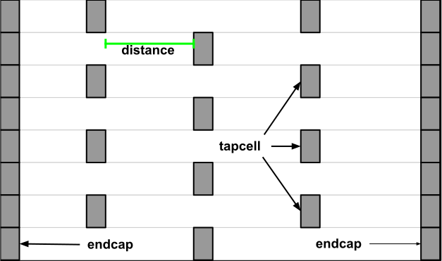
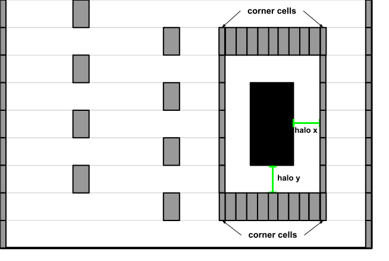

# Tapcell

Tapcell and endcap insertion.

## Commands

```{note}
- Parameters in square brackets `[-param param]` are optional.
- Parameters without square brackets `-param2 param2` are required.
```

### Add Tapcell/Endcap

This command inserts tapcells or endcaps.

The figures below show two examples of tapcell insertion. When only the 
`-tapcell_master` and `-endcap_master` masters are given, the tapcell placement
is similar to Figure 1. When the remaining masters are give, the tapcell
placement is similar to Figure 2.

|  |  |
|:--:|:--:|
| Figure 1: Tapcell insertion representation | Figure 2:  Tapcell insertion around macro representation |


```tcl
tapcell 
    [-cnrcap_nwin_master cnrcap_nwin_master]
    [-cnrcap_nwout_master cnrcap_nwout_master]
    [-disallow_one_site_gaps]
    [-distance dist]
    [-endcap_cpp endcap_cpp]
    [-endcap_master endcap_master]
    [-endcap_prefix endcap_prefix]
    [-halo_width_x halo_x]
    [-halo_width_y halo_y]
    [-incnrcap_nwin_master incnrcap_nwin_master]
    [-incnrcap_nwout_master incnrcap_nwout_master]
    [-no_cell_at_top_bottom]
    [-row_min_width min_width]
    [-tap_nwin2_master tap_nwin2_master]
    [-tap_nwin3_master tap_nwin3_master]
    [-tap_nwintie_master tap_nwintie_master]
    [-tap_nwout2_master tap_nwout2_master]
    [-tap_nwout3_master tap_nwout3_master]
    [-tap_nwouttie_master tap_nwouttie_master]
    [-tap_prefix tap_prefix]
    [-tapcell_master tapcell_master]
    [-tbtie_cpp tbtie_cpp]
```

#### Options

| Switch Name | Description |
| ----- | ----- |
| `[-cnrcap_nwin_master]` | Macro cell placed at the corners the core area according the row orientation. |
| `[-cnrcap_nwout_master]` | Macro cell placed at the corners the core area according the row orientation. |
| `[-disallow_one_site_gaps]` | KIV. |
| `[-distance]` | Distance (in microns) between each tapcell in the checkerboard. |
| `[-endcap_cpp]` | Option is deprecated. |
| `[-endcap_master]` | Master used as an endcap. |
| `[-endcap_prefix]` | Prefix for the endcaps instances. The default value is `PHY_`. |
| `[-halo_width_x]` | Horizontal halo size (in microns) around macros during cut rows. |
| `[-halo_width_y]` | Vertical halo size (in microns) around macros during cut rows. |
| `[-incnrcap_nwin_master]` | Master cell placed at the corners of macros, according the row orientation. |
| `[-incnrcap_nwout_master]` | Master cell placed at the corners of macros, according the row orientation. |
| `[-no_cell_at_top_bottom]` | Option is deprecated. |
| `[-row_min_width]` | Minimum width (in microns) that a row must have during cut rows. |
| `[-tap_nwin2_master]` | Master cell placed at the top and bottom of macros and the core area according the row orientation. This master should be smaller than `tap_nwintie_master` |
| `[-tap_nwin3_master]` | Master cell placed at the top and bottom of macros and the core area according the row orientation. This master should be smaller than `tap_nwin2_master`. |
| `[-tap_nwintie_master]` | Master cell placed at the top and bottom of macros and the core area according the row orientation. |
| `[-tap_nwout2_master]` | Master cell placed at the top and bottom of macros and the core area according the row orientation. This master should be smaller than `tap_nwouttie_master`. |
| `[-tap_nwout3_master]` | Master cell placed at the top and bottom of macros and the core area according the row orientation. This master should be smaller than `tap_nwout2_master`. |
| `[-tap_nwouttie_master]` | Master cell placed at the top and bottom of macros and the core area according the row orientation. |
| `[-tap_prefix]` | Prefix for the tapcell instances. The default value is `TAP_`. |
| `[-tapcell_master]` | Master used as a tapcell. |
| `[-tbtie_cpp]` | Option is deprecated. |

### Cut Rows

This command cuts rows.

```tcl
cut_rows 
    [-endcap_master endcap_master]
    [-halo_width_x halo_x]
    [-halo_width_y halo_y]
    [-row_min_width min_width]
```

#### Options

| Switch Name | Description |
| ----- | ----- |
| `[-endcap_master]` | Master used as an endcap. |
| `[-halo_width_x]` | Horizontal halo size (in microns) around macros during cut rows. |
| `[-halo_width_y]` | Vertical halo size (in microns) around macros during cut rows. |
| `[-row_min_width]` | Minimum width (in microns) that a row must have during cut rows. |

### Only adding boundary/endcap cells

Place endcaps into the design, the naming for the arguments to `place_endcaps` is based on the 
LEF58 `CLASS` specification foe endcaps.

```tcl
place_endcaps
    [-bottom_edge masters]
    [-corner master]
    [-edge_corner master]
    [-endcap masters]
    [-endcap_horizontal masters]
    [-endcap_vertical master]
    [-left_bottom_corner master]
    [-left_bottom_edge master]
    [-left_edge master]
    [-left_top_corner master]
    [-left_top_edge master]
    [-right_bottom_corner master]
    [-right_bottom_edge master]
    [-right_edge master]
    [-right_top_corner master]
    [-right_top_edge master]
    [-prefix prefix]
    [-top_edge masters]
```

#### Options

| Switch Name | Description |
| ----- | ----- |
| `[-bottom_edge]` | List of masters for the bottom row endcaps. (overrides `-endcap_horizontal`). |
| `[-corner]` | Master for the corner cells on the outer corners. |
| `[-edge_corner]` | Master for the corner cells on the inner corners. |
| `[-endcap]` | Master used as an endcap. |
| `[-endcap_horizontal]` | List of masters for the top and bottom row endcaps. (overrides `-endcap`). |
| `[-endcap_vertical]` | Master for the left and right row endcaps. (overrides `-endcap`). |
| `[-left_bottom_corner]` | Master for the corner cells on the outer bottom left corner. (overrides `-corner`). |
| `[-left_bottom_edge]` | Master for the corner cells on the inner bottom left corner. (overrides `-edge_corner`). |
| `[-left_edge]` | Master for the left row endcaps. (overrides `-endcap_vertical`). |
| `[-left_top_corner]` | Master for the corner cells on the outer top left corner. (overrides `-corner`). |
| `[-left_top_edge]` | Master for the corner cells on the inner top left corner. (overrides `-edge_corner`). |
| `[-right_bottom_corner]` | Master for the corner cells on the outer bottom right corner. (overrides `-corner`). |
| `[-right_bottom_edge]` | Master for the corner cells on the inner bottom right corner. (overrides `-edge_corner`). |
| `[-right_edge]` | Master for the right row endcaps. (overrides `-endcap_vertical`). |
| `[-right_top_corner]` | Master for the corner cells on the outer top right corner. (overrides `-corner`). |
| `[-right_top_edge]` | Master for the corner cells on the inner top right corner. (overrides `-edge_corner`). |
| `[-prefix]` | Prefix to use for the boundary cells. The default value is `PHY_`. |
| `[-top_edge]` | List of masters for the top row endcaps. (overrides `-endcap_horizontal`). |

### Only adding Tapcells

This command is used for tapcell placement only.

```tcl
place_tapcells
    -distance dist
    -master tapcell_master
```

#### Options

| Switch Name | Description |
| ----- | ----- |
| `-distance` | Distance between tapcells. |
| `-master` | Master to use for the tapcells. |


### Remove Tapcells/Endcaps

This command is used for removing tapcells or endcaps based on their prefix.

```tcl
tapcell_ripup
    [-endcap_prefix endcap_prefix]
    [-tap_prefix tap_prefix]
```

#### Options

| Switch Name | Description |
| ----- | ----- |
| `[-endcap_prefix]` | Remove endcaps with said prefix. The default value is `PHY_`. |
| `[-tap_prefix]` | Remove tapcells with said prefix. The default value is `TAP_`. |

## Example scripts

You can find script examples for both 45nm and 14nm in `./etc/scripts`

```
./etc/scripts/example_14nm.tcl
./etc/scripts/example_45nm.tcl
```

## Regression tests

There are a set of regression tests in `./test`. For more information, refer to this [section](../../README.md#regression-tests).

Simply run the following script:

```shell
./test/regression
```

## Limitations

## FAQs

Check out [GitHub discussion](https://github.com/The-OpenROAD-Project/OpenROAD/discussions/categories/q-a?discussions_q=category%3AQ%26A+tap+in%3Atitle)
about this tool.

## License

BSD 3-Clause License. See [LICENSE](LICENSE) file.
