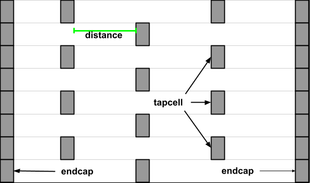

# Tapcell

Tapcell and endcap insertion.

## Commands

```
tapcell [-tapcell_master tapcell_master]
        [-endcap_master endcap_master]
        [-distance dist]
        [-halo_width_x halo_x]
        [-halo_width_y halo_y]
        [-tap_nwin2_master tap_nwin2_master]
        [-tap_nwin3_master tap_nwin3_master]
        [-tap_nwout2_master tap_nwout2_master]
        [-tap_nwout3_master tap_nwout3_master]
        [-tap_nwintie_master tap_nwintie_master]
        [-tap_nwouttie_master tap_nwouttie_master]
        [-cnrcap_nwin_master cnrcap_nwin_master]
        [-cnrcap_nwout_master cnrcap_nwout_master]
        [-incnrcap_nwin_master incnrcap_nwin_master]
        [-incnrcap_nwout_master incnrcap_nwout_master]
        [-tap_prefix tap_prefix]
        [-endcap_prefix endcap_prefix]
```

- `-tapcell_master`. Specify the master used as a tapcell.
- `-endcap_master`. Specify the master used as an endcap.
- `-distance`. Specify the distance between each tapcell in the checkerboard.
- `-halo_width_x`. Specify the horizontal halo size around macros during cut rows.
- `-halo_width_y`. Specify the vertical halo size around macros during cut rows.
- `-tap_nwin2_master`, `-tap_nwin3_master`, `-tap_nwout2_master`,
`-tap_nwout3_master`, `-tap_nwintie_master`, `-tap_nwouttie_master`.
Specify the master cells placed at the top and bottom of macros and of the core area,
according the row orientation.
- `-incnrcap_nwin_master`, `-incnrcap_nwout_master`. Specify the master cells
placed at the corners of macros.
- `-cnrcap_nwin_master`, `-cnrcap_nwout_master`. Specify the macro cells placed
at the corners of the core area, according the row orientation.
- `-tap_prefix`. Specify the name prefix for the tapcell instances.
- `-endcap_prefix`. Specify the name prefix for the endcaps instances.

The figures below shows two examples of tapcell insertion. When only the 
`-tapcell_master` and `-endcap_master` masters are given, the tapcell placement
is similar to the Figure 1. When the remaining masters are give, the tapcell
placement is similar to the Figure 2.

|  |  |
|:--:|:--:|
| Figure 1: Tapcell insertion representation | Figure 2:  Tapcell insertion around macro representation |

## Example scripts

You can find script examples for both 45nm and 14nm in
`tap/etc/scripts`


## Limitations

## FAQs

Check out [GitHub discussion](https://github.com/The-OpenROAD-Project/OpenROAD/discussions/categories/q-a?discussions_q=category%3AQ%26A+tap+in%3Atitle)
about this tool.

## License

BSD 3-Clause License. See [LICENSE](LICENSE) file.
