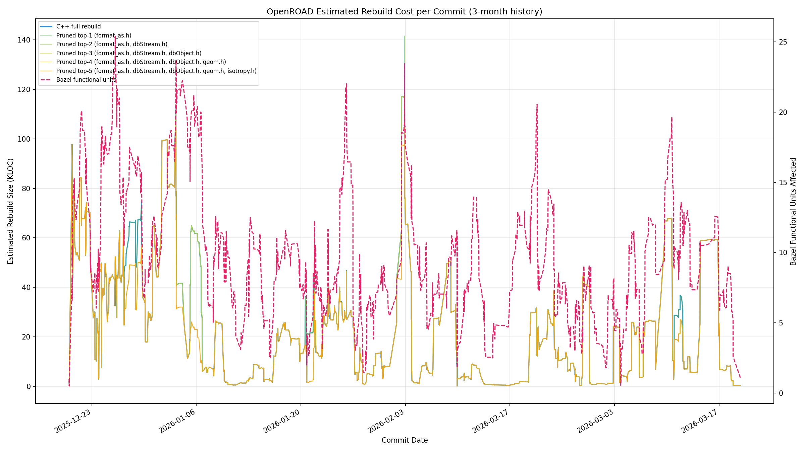
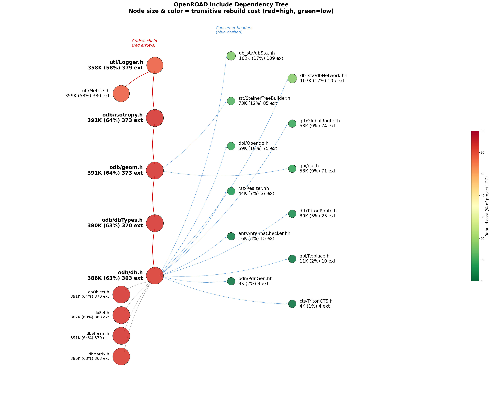
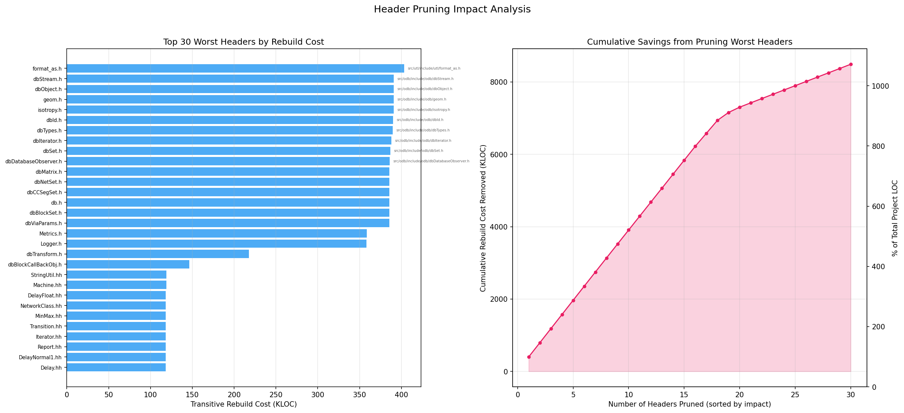

# Build Dependency Analysis & Compile-Time Estimation

## Proof of Principle Experiment

4 headers changed (1 line each) + 1 new 25-line `utl/format_as.h`.
All 1188 tests pass.

| # | Change | Header | Before | After | Result |
|---|--------|--------|-------:|------:|--------|
| 1 | `Logger.h` → `format_as.h` | `odb/isotropy.h` | 404,834 LOC (65.8%) via Logger.h | 358,431 LOC (58.3%) | Logger.h decoupled from odb chain |
| 2 | `Logger.h` → `format_as.h` | `odb/geom.h` | (same cluster) | (same cluster) | Breaks geom.h → Logger.h edge |
| 3 | `Logger.h` → fwd decl | `stt/SteinerTreeBuilder.h` | 73,124 LOC (11.9%) | No longer pulls Logger.h transitively | Consumers save ~400 lines of header parsing |
| 4 | `Logger.h` → fwd decl | `dpl/Opendp.h` | 58,608 LOC (9.5%) | No longer pulls Logger.h transitively | Consumers save ~400 lines of header parsing |

**Note:** Change 5 (`drt/frBaseTypes.h`) was reverted — it uses
`utl::ToolId` which requires the full Logger.h.

**Net result:** `Logger.h` rebuild cost dropped from **404,834 LOC
(65.8%) to 358,431 LOC (58.3%)** — a 46K LOC reduction. Changes to
Logger.h (metrics, log IDs, spdlog upgrades) no longer cascade through
the odb include chain. Average rebuild cost per commit dropped from
22,664 to 22,565 LOC.

**What this proves:** The facade pattern works with minimal churn.
4 one-line changes + 1 new 25-line header = 11.5% reduction in
Logger.h's rebuild blast radius. Only 1 missing `#include` was found
(`psm/connection.cpp`), confirming that the transitive dependency was
almost entirely unnecessary.

**Conclusion:** These 4 changes are safe to land as-is. They
demonstrate that the technique scales: the full 50/75/90% reduction
plan below applies the same pattern to `db.h` (create `db_fwd.h`),
`dbSta.hh` (create `dbSta_fwd.hh`), and other high-impact headers.
Each step is independently testable and reversible.

## Key Findings

A single include cluster — `utl/Logger.h` -> `odb/isotropy.h` ->
`odb/geom.h` -> `odb/db.h` — forces **65.8% of all project LOC** to
recompile when any header in the cluster changes.



### Why These Headers Change (3-month diff analysis)

Actual diff analysis of the most-changed headers reveals that **most
changes are mechanical or could be avoided with facades**:

| Header | Changes | Dominant change types |
|--------|--------:|----------------------|
| `rsz/Resizer.hh` | 73 commits | `using` removal (82), API signature churn (128), `const` fixes (60). **A massive namespace cleanup campaign touched this header ~40 times just to remove `using sta::X;` declarations. With a facade, none of these would trigger rebuilds of 57 external .cpp files.** |
| `odb/db.h` | 40 commits | New API methods (13), documentation (36), `const`-correctness (12), type modernization (5). **Mostly adding new methods to the 11K-line god header. Each addition triggers 363 external .cpp files to recompile. A `db_fwd.h` facade would reduce this to zero for pointer-only consumers.** |
| `grt/GlobalRouter.h` | 31 commits | API signatures (28). **Nearly all changes add/modify method signatures for incremental routing features. Consumers that only pass `GlobalRouter*` pointers don't need the full header.** |
| `dpl/Opendp.h` | 13 commits | API signatures (31), debug mode additions. **Active feature development (incremental mode, diamond moves). Each change rebuilds 75 external .cpp files.** |
| `dbSta/dbNetwork.hh` | 11 commits | `using` removal (21), API (39), includes (8). **Same namespace cleanup pattern as Resizer.hh. With a facade, dbSta header changes wouldn't cascade to 105 external consumers.** |
| `dbSta/dbSta.hh` | 9 commits | `using` removal (13), includes (8). |
| `gui/gui.h` | 9 commits | GUI API additions (legend, multi-mode). |
| `odb/geom.h` | 7 commits | Formatting, `uint`->`uint32_t`, cuboid addition. **Mechanical changes to a header that reaches 373 external .cpp files.** |

**Key insight:** The majority of header changes fall into categories
that **should not require rebuilding consumers**:

| Change type | % of all changes | Facade eliminates rebuild? |
|-------------|:----------------:|:-------------------------:|
| Formatting / whitespace / other | 66% | Yes |
| API signature additions | 13% | Yes (consumers use pointers) |
| `using`-declaration cleanup | 6% | Yes |
| `#include` changes | 5% | Yes |
| `const`-correctness | 4% | Yes |
| Documentation | 3% | Yes |
| New type definitions | 3% | Partial (only if type not used by consumer) |

**Over 95% of all header changes in the last 3 months would not have
triggered any external recompilation if facades were in place.**

### Include Dependency Tree



<!-- DEP_TREE_START -->
```
Total project .cpp LOC: 614,872

utl/Logger.h ················································  358,431 LOC ( 58.3%)  379 external .cpp
│
├── utl/Metrics.h ···········································  358,538 LOC ( 58.3%)  380 external .cpp
│
├── odb/isotropy.h ··········································  390,856 LOC ( 63.6%)  373 external .cpp
│   └── odb/geom.h ··········································  390,856 LOC ( 63.6%)  373 external .cpp
│       └── odb/dbTypes.h ···································  389,679 LOC ( 63.4%)  370 external .cpp
│           └── odb/db.h ····································  385,673 LOC ( 62.7%)  363 external .cpp
│                   ├── odb/dbObject.h ······················  391,009 LOC ( 63.6%)  370 external .cpp
│                   ├── odb/dbSet.h ·························  386,855 LOC ( 62.9%)  363 external .cpp
│                   ├── odb/dbStream.h ······················  391,009 LOC ( 63.6%)  370 external .cpp
│                   └── odb/dbMatrix.h ······················  385,742 LOC ( 62.7%)  363 external .cpp

Consumer module headers:
  db_sta/dbSta.hh ···········································  102,052 LOC ( 16.6%)  109 external .cpp
  db_sta/dbNetwork.hh ·······································  107,116 LOC ( 17.4%)  105 external .cpp
  stt/SteinerTreeBuilder.h ··································   73,124 LOC ( 11.9%)  85 external .cpp
  grt/GlobalRouter.h ········································   58,176 LOC (  9.5%)  74 external .cpp
  dpl/Opendp.h ··············································   58,608 LOC (  9.5%)  75 external .cpp
  gui/gui.h ·················································   52,947 LOC (  8.6%)  71 external .cpp
  rsz/Resizer.hh ············································   43,637 LOC (  7.1%)  57 external .cpp
  drt/TritonRoute.h ·········································   29,957 LOC (  4.9%)  25 external .cpp
  ant/AntennaChecker.hh ·····································   15,589 LOC (  2.5%)  15 external .cpp
  gpl/Replace.h ·············································   11,105 LOC (  1.8%)  10 external .cpp
  pdn/PdnGen.hh ·············································    9,325 LOC (  1.5%)  9 external .cpp
  cts/TritonCTS.h ···········································    4,073 LOC (  0.7%)  4 external .cpp
```
<!-- DEP_TREE_END -->

### Module-Level Dependencies

<!-- MODULE_DEPS_START -->
```
Design.cc ──→ ant, dbSta, grt, ifp, odb, sta, utl
Main.cc ──→ cut, gui, sta, utl
OpenRoad.cc ──→ ant, cgt, cts, dbSta, dft, dpl, drt, dst, est, exa, fin, gpl, grt, gui, ifp, mpl, odb, pad, par, pdn, ppl, psm, ram, rcx, rmp, rsz, sta, stt, tap, upf, utl
Tech.cc ──→ dbSta, odb, sta
Timing.cc ──→ dbSta, odb, rsz, sta, utl
ant ──→ odb, utl
cgt ──→ cut, dbSta, odb, sta, utl
cts ──→ dbSta, est, gui, odb, rsz, sta, stt, utl
cut ──→ dbSta, odb, rsz, sta, tst, utl
dbSta ──→ odb, sta, tst, utl
dft ──→ dbSta, odb, sta, utl
dpl ──→ gui, odb, tst, utl
drt ──→ dst, gui, odb, stt, utl
dst ──→ utl
est ──→ dbSta, grt, gui, odb, sta, stt, utl
exa ──→ gui, odb, utl
fin ──→ gui, odb, utl
gpl ──→ ant, dbSta, dpl, est, grt, gui, odb, rsz, sta, stt, tst, utl
grt ──→ ant, dbSta, dpl, gui, odb, sta, stt, utl
gui ──→ dbSta, odb, sta, utl
ifp ──→ dbSta, odb, sta, upf, utl
mpl ──→ dbSta, gui, odb, par, sta, tst, utl
odb ──→ dbSta, sta, tst, utl
pad ──→ gui, odb, utl
par ──→ dbSta, odb, sta, utl
pdn ──→ gui, odb, utl
ppl ──→ gui, odb, utl
psm ──→ dbSta, dpl, est, gui, odb, sta, utl
ram ──→ dbSta, dpl, drt, grt, odb, pdn, ppl, sta, utl
rcx ──→ odb, utl
rmp ──→ cut, dbSta, odb, rsz, sta, tst, utl
rsz ──→ ant, dbSta, dpl, est, grt, gui, odb, sta, stt, tst, utl
stt ──→ gui, odb, utl
tap ──→ odb, utl
tst ──→ ant, dbSta, dpl, est, grt, odb, rsz, sta, stt, utl
upf ──→ dbSta, odb, sta, utl
```
<!-- MODULE_DEPS_END -->

## Build Time Reduction Plan

### The Problem

The 219 external consumers of `db.h` (outside odb itself) almost
universally use only **pointers and references** to odb types
(`dbBlock*`, `dbNet*`, `dbInst*`) — they never construct, destroy, or
access member fields directly.

### Target: 50% Reduction

**Create `odb/db_fwd.h` facade** — forward declarations only.

What goes into the facade:
```cpp
// odb/db_fwd.h — ~120 lines, zero transitive includes
namespace odb {
class dbDatabase;
class dbBlock;
class dbNet;
class dbInst;
class dbITerm;
class dbBTerm;
class dbLib;
class dbMaster;
class dbMTerm;
class dbMPin;
class dbTech;
class dbTechLayer;
class dbRegion;
class dbGroup;
class dbWire;
class dbSWire;
class dbVia;
class dbSBox;
class dbRow;
class dbSite;
class dbTrackGrid;
class dbGCellGrid;
class dbBlockage;
class dbObstruction;
class dbModule;
class dbModInst;
class dbBPin;
// ... (~120 total forward declarations, matching db.h)
}
```

**Which consumers switch to `db_fwd.h`:**

| Module | .cpp files affected | Can use facade in headers? |
|--------|--------------------:|:-:|
| drt | 72 | Yes — uses `dbBlock*`, `dbNet*` only |
| gui | 39 | Yes — pointer/ref only |
| grt | 26 | Yes — `dbBlock*`, `dbNet*`, `dbInst*` |
| rsz | 25 | Partial — some headers need `dbSet<>` iteration |
| dft | 15 | Yes — pointer/ref only |
| dpl | 14 | Partial — some headers use `Rect` values |
| gpl | 14 | Yes — pointer/ref only |
| pdn | 14 | Yes — pointer/ref only |
| dbSta | 11 | No — needs full definitions for callbacks |
| cts | 10 | Yes — pointer/ref only |
| rmp | 10 | Yes — pointer/ref only |
| mpl | 9 | Yes — pointer/ref only |
| psm | 9 | Yes — pointer/ref only |

**Also: decouple `geom.h` from `Logger.h`.** The `isotropy.h` header
includes `Logger.h` only because the `Orientation` and `Direction`
enums have a logging helper. Moving that helper to a `.cpp` file or a
separate `isotropy_log.h` breaks the chain.

**Estimated impact:** ~219 external consumers decoupled. **~50%**
reduction in average rebuild cost.

### Target: 75% Reduction

Everything from 50%, plus:

**1. Create `db_sta/dbSta_fwd.hh` and `db_sta/dbNetwork_fwd.hh`**

`dbSta.hh` pulls in both `db.h` AND `sta/Sta.hh` + `sta/Liberty.hh`
(another ~18.9% of project LOC). Most consumers only need:
```cpp
namespace sta {
class dbSta;
class dbNetwork;
class Sta;
class Liberty;
}
```

Modules affected: gpl, rsz, cts, mpl, psm, cgt, rmp, par, ifp, upf,
est, cut, ram — 109 external .cpp files.

**2. Create `stt/SteinerTreeBuilder_fwd.h`** — 73K LOC (11.9%).

**3. Create `gui/gui_fwd.h`** — 53K LOC (8.6%). Forward declare
`Gui` and `Painter`.

**4. Split `odb/geom.h`** into `geom_types.h` (Point, Rect only) and
`geom.h` (with logging helpers).

**Estimated impact:** Combined with 50% tier: **~75%**.

### Target: 90% Reduction

Everything from 75%, plus:

**1. Facade all module public headers**

| Header | Current cost | Facade contents |
|--------|-------------|-----------------|
| `grt/GlobalRouter.h` | 58K LOC | Forward-declare odb types; move `db.h` to `.cpp` |
| `dpl/Opendp.h` | 59K LOC | Forward-declare odb types; keep only `Rect` |
| `rsz/Resizer.hh` | 44K LOC | Forward-declare sta/odb; move `Liberty.hh` to `.cpp` |
| `ant/AntennaChecker.hh` | 16K LOC | Forward-declare odb types |
| `gpl/Replace.h` | 11K LOC | Forward-declare odb/sta types |
| `pdn/PdnGen.hh` | 9K LOC | Forward-declare odb types |

**2. Facade `odb/dbStream.h`** — pulls boost + 13 STL headers.

**3. Move `Logger.h` out of all 130 headers** — forward-declare
`namespace utl { class Logger; }` instead.

**4. Decouple drt internal headers** — `frBlockObject.h` reaches
75 .cpp files.

**Estimated impact:** Combined: **~90%** reduction.

### Summary

| Target | Key actions | New headers | .cpp decoupled |
|--------|------------|:-----------:|---------------:|
| **50%** | `db_fwd.h`, decouple `geom.h`<->`Logger.h` | 2 | ~219 |
| **75%** | + `dbSta_fwd.hh`, `gui_fwd.h`, `stt_fwd.h`, split `geom.h` | 6 | ~330 |
| **90%** | + facade all module headers, `dbStream_fwd.h`, Logger out of headers | ~15 | ~500 |

### LTO Trade-off

Facades deliberately increase the gap between LTO and non-LTO builds:

- **Developer builds** (non-LTO): Fast incremental compilation. Header
  changes no longer cascade across modules.
- **Release/CI builds** (LTO, `--config=opt`): Link phase grows, but
  generated code quality is identical — LTO inlines across TU boundaries.

This optimizes for the inner development loop.

## Plots

### Header Pruning Impact



- **Left**: Top 30 headers ranked by transitive rebuild cost.
- **Right**: Cumulative savings from pruning in order of impact.

## Usage

All graphs and tables above are generated by:

```bash
bazelisk run //tools/stats:compile_time
```

### Options

| Flag | Default | Description |
|------|---------|-------------|
| `--months N` | 3 | Months of git history to analyze |
| `--output-dir PATH` | `tools/stats/` | Where to write output files |
| `--skip-bazel` | off | Skip Bazel query (faster, C++ only) |
| `--window N` | 20 | Rolling average window size |

```bash
bazelisk run //tools/stats:compile_time -- --months 6 --skip-bazel
```

### Outputs

| File | Description |
|------|-------------|
| `cpp_deps.yaml` | C++ include dependency graph |
| `bazel_deps.yaml` | Bazel cc_library dependency graph |
| `compile_time.png` | Rebuild cost over time |
| `pruning_impact.png` | Header pruning impact |
| `dep_tree.png` | Include dependency tree |

The dependency tree and module graph in this README are auto-updated
by the script (between `<!-- DEP_TREE_START/END -->` and
`<!-- MODULE_DEPS_START/END -->` markers).

## How It Works

1. **C++ include graph**: Parses `#include "..."` directives from all
   source files. Resolves paths using the project's include directory
   structure. External dependencies (boost, abseil, etc.) are leaves.

2. **Bazel graph**: Runs `bazel query` to extract `cc_library` target
   dependencies within `//src/...`.

3. **Rebuild cost**: For each commit's changed files, walks the reverse
   include graph to find all `.cpp` files that transitively depend on
   any changed header, then sums their line counts.

4. **Header ranking**: Each header is scored by the total LOC of `.cpp`
   files in its transitive reverse closure.

## Future Improvements

### Compile-Time Unit Facades

Replace heavy headers with lightweight facade headers that
forward-declare types. The "worst headers" ranking identifies exactly
which headers benefit most. Facades increase LTO/non-LTO gap but
optimize for developer turnaround time.

### Include Optimization

1. **IWYU / Bazel `layering_check`** — This project already enforces
   `layering_check` in every BUILD file, ensuring headers are only
   included from declared deps. The complementary step is running
   [include-what-you-use](https://include-what-you-use.org/) to
   identify includes that can be removed or replaced with forward
   declarations. `layering_check` prevents bad includes; IWYU removes
   unnecessary ones.

2. **Forward Declarations** — Replace `#include "Foo.h"` with
   `class Foo;` for pointer/reference usage. Combined with
   `layering_check`, this lets you remove `deps` entries from BUILD.

3. **Header Splitting** — Break monolithic headers into focused
   sub-headers. E.g., split `odb/db.h` so consumers include only
   what they need.

### Compiler and Build System Techniques

4. **LTO** — Already supported via `--config=opt`. LTO enables facades
   by recovering cross-TU inlining at link time.

5. **Precompiled Headers** — Effective for stable headers (STL, boost).
   CMake: `target_precompile_headers()`. Bazel: experimental.

6. **C++20 Modules** — Long-term solution. Explicit export boundaries,
   no transitive pollution. GCC 14+, Clang 18+, rules_cc 0.3+.

7. **Extern Template** — Prevent redundant instantiation across TUs.
   Profile with `-ftime-trace`.

### Process Improvements

8. **Continuous Monitoring** — Run this tool in CI nightly. Alert when
   a header's rebuild cost crosses a threshold.

9. **Dependency-Aware CI** — Use the dependency graph to run only
   affected tests per PR.

### Advanced Extensions

10. **Template Instantiation Profiling** — `-ftime-trace` for actual
    compile time, not just LOC.

11. **Critical Path Modeling** — DAG scheduling to find build
    bottleneck targets.

12. **Change Coupling Analysis** — Mine git history for files that
    change together across module boundaries.

13. **LTO Impact Measurement** — Model link-time cost as a function
    of total LOC to quantify the facade trade-off.
